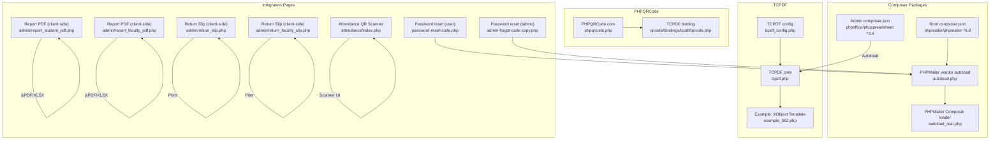
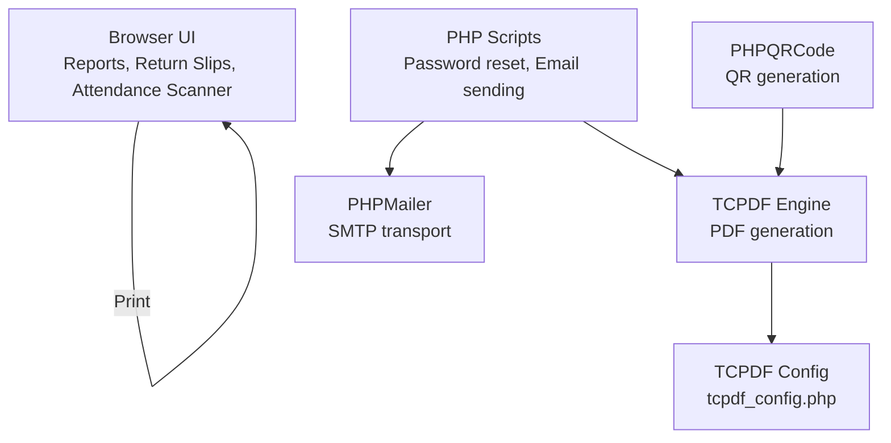
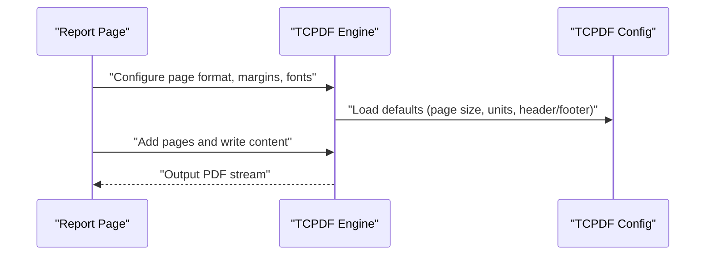
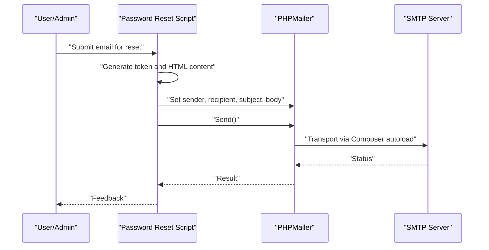
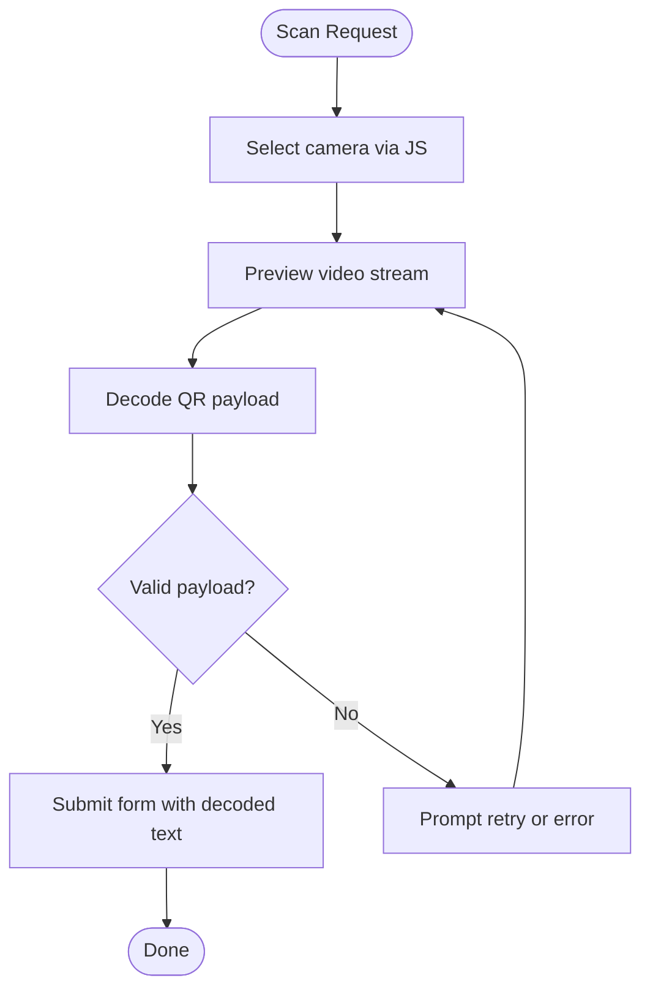
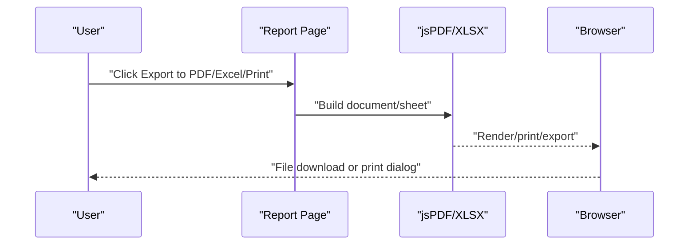
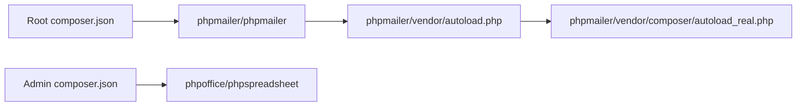

# API and Integration

<cite>
**Referenced Files in This Document**
- [composer.json](file://composer.json)
- [admin/composer.json](file://admin/composer.json)
- [phpmailer/composer.json](file://phpmailer/composer.json)
- [admin/tcpf/config/tcpf_config.php](file://admin/tcpdf/config/tcpdf_config.php)
- [admin/tcpdf/tcpdf.php](file://admin/tcpdf/tcpdf.php)
- [admin/tcpdf/examples/example_062.php](file://admin/tcpdf/examples/example_062.php)
- [phpmailer/vendor/autoload.php](file://phpmailer/vendor/autoload.php)
- [phpmailer/vendor/composer/autoload_real.php](file://phpmailer/vendor/composer/autoload_real.php)
- [phpqrcode/phpqrcode.php](file://phpqrcode/phpqrcode.php)
- [qrcode/bindings/tcpdf/qrcode.php](file://qrcode/bindings/tcpdf/qrcode.php)
- [password-reset-code.php](file://password-reset-code.php)
- [password-reset-otp-code.php](file://password-reset-otp-code.php)
- [admin-forgot-code copy.php](file://admin-forgot-code copy.php)
- [admin/report_student_pdf.php](file://admin/report_student_pdf.php)
- [admin/report_faculty_pdf.php](file://admin/report_faculty_pdf.php)
- [admin/return_slip.php](file://admin/return_slip.php)
- [admin/return_faculty_slip.php](file://admin/return_faculty_slip.php)
- [attendance/index.php](file://attendance/index.php)
</cite>

## Table of Contents
1. [Introduction](#introduction)
2. [Project Structure](#project-structure)
3. [Core Components](#core-components)
4. [Architecture Overview](#architecture-overview)
5. [Detailed Component Analysis](#detailed-component-analysis)
6. [Dependency Analysis](#dependency-analysis)
7. [Performance Considerations](#performance-considerations)
8. [Troubleshooting Guide](#troubleshooting-guide)
9. [Conclusion](#conclusion)
10. [Appendices](#appendices)

## Introduction
This document explains the external service integrations and third-party library usage in the project, focusing on:
- TCPDF integration for PDF generation, including template customization and batch-like workflows
- PHPMailer integration for email notifications, password resets, and administrative alerts
- PHPQRCode integration for QR code generation and scanning functionality
- Composer-based dependency management and update procedures
- Integration points with external services and API endpoints
- Configuration options and troubleshooting guidance

## Project Structure
The project organizes third-party integrations as follows:
- Composer-managed packages live under dedicated vendor directories and composer.json manifests
- TCPDF is included under admin/tcpdf with configuration and examples
- PHPMailer is included under phpmailer with Composer autoloading
- PHPQRCode is included under phpqrcode and qrcode with bindings for TCPDF
- Integration usage appears across pages for reporting, circulation, and password reset flows

**Diagram sources**
- [composer.json:1-6](file://composer.json#L1-L6)
- [admin/composer.json:1-6](file://admin/composer.json#L1-L6)
- [phpmailer/composer.json:1-6](file://phpmailer/composer.json#L1-L6)
- [admin/tcpdf/config/tcpdf_config.php:1-236](file://admin/tcpdf/config/tcpdf_config.php#L1-L236)
- [admin/tcpdf/tcpdf.php:1-200](file://admin/tcpdf/tcpdf.php#L1-L200)
- [admin/tcpdf/examples/example_062.php:1-143](file://admin/tcpdf/examples/example_062.php#L1-L143)
- [phpmailer/vendor/autoload.php:1-26](file://phpmailer/vendor/autoload.php#L1-L26)
- [phpmailer/vendor/composer/autoload_real.php:1-39](file://phpmailer/vendor/composer/autoload_real.php#L1-L39)
- [phpqrcode/phpqrcode.php:1-800](file://phpqrcode/phpqrcode.php#L1-L800)
- [qrcode/bindings/tcpdf/qrcode.php:30-66](file://qrcode/bindings/tcpdf/qrcode.php#L30-L66)
- [password-reset-code.php:77-114](file://password-reset-code.php#L77-L114)
- [admin-forgot-code copy.php:27-93](file://admin-forgot-code copy.php#L27-L93)
- [admin/report_student_pdf.php:123-160](file://admin/report_student_pdf.php#L123-L160)
- [admin/report_faculty_pdf.php:125-161](file://admin/report_faculty_pdf.php#L125-L161)
- [admin/return_slip.php:137-139](file://admin/return_slip.php#L137-L139)
- [admin/return_faculty_slip.php:137-139](file://admin/return_faculty_slip.php#L137-L139)
- [attendance/index.php:96-130](file://attendance/index.php#L96-L130)

**Section sources**
- [composer.json:1-6](file://composer.json#L1-L6)
- [admin/composer.json:1-6](file://admin/composer.json#L1-L6)
- [phpmailer/composer.json:1-6](file://phpmailer/composer.json#L1-L6)

## Core Components
- TCPDF: PDF engine with extensive configuration and example templates
- PHPMailer: Email transport with Composer autoloading and usage in password reset flows
- PHPQRCode: QR code generator with TCPDF binding for embedding codes into PDFs
- Composer: Dependency management across root and module-specific manifests

Key integration usage:
- Reporting pages embed client-side PDF generation via jsPDF and Excel export via XLSX
- Circulation return slips rely on browser print functionality
- Password reset pages send transactional emails using PHPMailer

**Section sources**
- [admin/tcpdf/config/tcpdf_config.php:1-236](file://admin/tcpdf/config/tcpdf_config.php#L1-L236)
- [admin/tcpdf/tcpdf.php:1-200](file://admin/tcpdf/tcpdf.php#L1-L200)
- [admin/tcpdf/examples/example_062.php:1-143](file://admin/tcpdf/examples/example_062.php#L1-L143)
- [phpmailer/vendor/autoload.php:1-26](file://phpmailer/vendor/autoload.php#L1-L26)
- [phpmailer/vendor/composer/autoload_real.php:1-39](file://phpmailer/vendor/composer/autoload_real.php#L1-L39)
- [phpqrcode/phpqrcode.php:1-800](file://phpqrcode/phpqrcode.php#L1-L800)
- [qrcode/bindings/tcpdf/qrcode.php:30-66](file://qrcode/bindings/tcpdf/qrcode.php#L30-L66)
- [admin/report_student_pdf.php:123-160](file://admin/report_student_pdf.php#L123-L160)
- [admin/report_faculty_pdf.php:125-161](file://admin/report_faculty_pdf.php#L125-L161)
- [admin/return_slip.php:137-139](file://admin/return_slip.php#L137-L139)
- [admin/return_faculty_slip.php:137-139](file://admin/return_faculty_slip.php#L137-L139)
- [password-reset-code.php:77-114](file://password-reset-code.php#L77-L114)
- [admin-forgot-code copy.php:27-93](file://admin-forgot-code copy.php#L27-L93)

## Architecture Overview
The integrations span three layers:
- Presentation layer: Browser-based PDF/Excel exports and print workflows
- Application layer: PHP scripts orchestrating email sending and QR scanning UI
- Library layer: TCPDF, PHPMailer, and PHPQRCode with Composer-managed dependencies

**Diagram sources**
- [admin/report_student_pdf.php:123-160](file://admin/report_student_pdf.php#L123-L160)
- [admin/report_faculty_pdf.php:125-161](file://admin/report_faculty_pdf.php#L125-L161)
- [admin/return_slip.php:137-139](file://admin/return_slip.php#L137-L139)
- [admin/return_faculty_slip.php:137-139](file://admin/return_faculty_slip.php#L137-L139)
- [password-reset-code.php:77-114](file://password-reset-code.php#L77-L114)
- [admin/tcpdf/config/tcpdf_config.php:1-236](file://admin/tcpdf/config/tcpdf_config.php#L1-L236)
- [admin/tcpdf/tcpdf.php:1-200](file://admin/tcpdf/tcpdf.php#L1-L200)
- [phpqrcode/phpqrcode.php:1-800](file://phpqrcode/phpqrcode.php#L1-L800)

## Detailed Component Analysis

### TCPDF Integration
- Purpose: PDF generation for reports and receipts
- Configuration: Centralized via tcpdf_config.php controlling page formats, margins, fonts, and image scaling
- Template customization: Example 062 demonstrates XObject Templates for reusable content blocks with alpha blending and repeated placement
- Batch-like processing: While no explicit batch API is shown, repeated template usage and multiple page generation are supported by the library’s methods

**Diagram sources**
- [admin/tcpdf/config/tcpdf_config.php:90-182](file://admin/tcpdf/config/tcpdf_config.php#L90-L182)
- [admin/tcpdf/examples/example_062.php:32-138](file://admin/tcpdf/examples/example_062.php#L32-L138)

**Section sources**
- [admin/tcpdf/config/tcpdf_config.php:1-236](file://admin/tcpdf/config/tcpdf_config.php#L1-L236)
- [admin/tcpdf/tcpdf.php:22464-22486](file://admin/tcpdf/tcpdf.php#L22464-L22486)
- [admin/tcpdf/examples/example_062.php:1-143](file://admin/tcpdf/examples/example_062.php#L1-L143)

### PHPMailer Integration
- Purpose: Transactional emails for password resets and administrative alerts
- Autoloading: Composer-generated autoloaders initialize PHPMailer classes
- Usage: Password reset flows construct HTML emails with dynamic content and send via SMTP

**Diagram sources**
- [password-reset-code.php:77-114](file://password-reset-code.php#L77-L114)
- [admin-forgot-code copy.php:27-93](file://admin-forgot-code copy.php#L27-L93)
- [phpmailer/vendor/autoload.php:1-26](file://phpmailer/vendor/autoload.php#L1-L26)
- [phpmailer/vendor/composer/autoload_real.php:1-39](file://phpmailer/vendor/composer/autoload_real.php#L1-L39)

**Section sources**
- [composer.json:1-6](file://composer.json#L1-L6)
- [phpmailer/composer.json:1-6](file://phpmailer/composer.json#L1-L6)
- [password-reset-code.php:77-114](file://password-reset-code.php#L77-L114)
- [admin-forgot-code copy.php:27-93](file://admin-forgot-code copy.php#L27-L93)
- [phpmailer/vendor/autoload.php:1-26](file://phpmailer/vendor/autoload.php#L1-L26)
- [phpmailer/vendor/composer/autoload_real.php:1-39](file://phpmailer/vendor/composer/autoload_real.php#L1-L39)

### PHPQRCode Integration
- Purpose: QR code generation and scanning
- Generation: PHPQRCode core provides encoding and output formats; a TCPDF binding enables embedding QR codes into PDFs
- Scanning: Attendance page integrates a JavaScript QR scanner to capture QR-encoded data

**Diagram sources**
- [attendance/index.php:96-130](file://attendance/index.php#L96-L130)

**Section sources**
- [phpqrcode/phpqrcode.php:1-800](file://phpqrcode/phpqrcode.php#L1-L800)
- [qrcode/bindings/tcpdf/qrcode.php:30-66](file://qrcode/bindings/tcpdf/qrcode.php#L30-L66)
- [attendance/index.php:96-130](file://attendance/index.php#L96-L130)

### Reporting and Print Workflows
- Client-side PDF/Excel export: Reports use jsPDF and XLSX libraries for browser-based exports
- Print workflows: Return slips rely on native browser print functionality

**Diagram sources**
- [admin/report_student_pdf.php:123-160](file://admin/report_student_pdf.php#L123-L160)
- [admin/report_faculty_pdf.php:125-161](file://admin/report_faculty_pdf.php#L125-L161)
- [admin/return_slip.php:137-139](file://admin/return_slip.php#L137-L139)
- [admin/return_faculty_slip.php:137-139](file://admin/return_faculty_slip.php#L137-L139)

**Section sources**
- [admin/report_student_pdf.php:123-160](file://admin/report_student_pdf.php#L123-L160)
- [admin/report_faculty_pdf.php:125-161](file://admin/report_faculty_pdf.php#L125-L161)
- [admin/return_slip.php:137-139](file://admin/return_slip.php#L137-L139)
- [admin/return_faculty_slip.php:137-139](file://admin/return_faculty_slip.php#L137-L139)

## Dependency Analysis
Composer manages dependencies centrally and per-module:
- Root composer.json requires phpmailer/phpmailer ^6.9
- Admin composer.json requires phpoffice/phpspreadsheet ^3.4
- PHPMailer vendor autoload initializes the library and Composer loader

**Diagram sources**
- [composer.json:1-6](file://composer.json#L1-L6)
- [admin/composer.json:1-6](file://admin/composer.json#L1-L6)
- [phpmailer/vendor/autoload.php:1-26](file://phpmailer/vendor/autoload.php#L1-L26)
- [phpmailer/vendor/composer/autoload_real.php:1-39](file://phpmailer/vendor/composer/autoload_real.php#L1-L39)

**Section sources**
- [composer.json:1-6](file://composer.json#L1-L6)
- [admin/composer.json:1-6](file://admin/composer.json#L1-L6)
- [phpmailer/vendor/autoload.php:1-26](file://phpmailer/vendor/autoload.php#L1-L26)
- [phpmailer/vendor/composer/autoload_real.php:1-39](file://phpmailer/vendor/composer/autoload_real.php#L1-L39)

## Performance Considerations
- TCPDF
  - Use XObject Templates to reduce repeated drawing overhead
  - Tune image scale ratio and font caching for large documents
  - Prefer server-side PDF generation for heavy content; leverage browser export for lightweight reports
- PHPMailer
  - Ensure SMTP credentials and timeouts are configured appropriately
  - Batch sends should reuse connections and minimize per-message overhead
- PHPQRCode
  - Disable cache and logging in production builds for performance
  - Limit QR code size and complexity for scanning speed

[No sources needed since this section provides general guidance]

## Troubleshooting Guide
Common integration issues and resolutions:
- PHPMailer errors
  - Verify SMTP host/port/authentication settings and error logs
  - Confirm Composer autoload is loaded before instantiating mailer classes
- TCPDF configuration
  - Validate page format, margins, and font paths
  - Ensure image paths and cache directories are writable
- PHPQRCode scanning
  - Confirm camera permissions and device availability
  - Validate QR payload format and submission handling

**Section sources**
- [password-reset-code.php:77-114](file://password-reset-code.php#L77-L114)
- [admin-forgot-code copy.php:27-93](file://admin-forgot-code copy.php#L27-L93)
- [admin/tcpdf/config/tcpdf_config.php:1-236](file://admin/tcpdf/config/tcpdf_config.php#L1-L236)
- [phpmailer/vendor/autoload.php:1-26](file://phpmailer/vendor/autoload.php#L1-L26)
- [phpmailer/vendor/composer/autoload_real.php:1-39](file://phpmailer/vendor/composer/autoload_real.php#L1-L39)
- [attendance/index.php:96-130](file://attendance/index.php#L96-L130)

## Conclusion
The project integrates TCPDF for robust PDF generation, PHPMailer for reliable email delivery, and PHPQRCode for QR-based workflows. Composer ensures consistent dependency management across modules. By leveraging XObject Templates, client-side exports, and print workflows, the system balances flexibility and performance.

[No sources needed since this section summarizes without analyzing specific files]

## Appendices

### Configuration Options Summary
- TCPDF
  - Page format, orientation, units, margins, fonts, image scale, header/footer settings
- PHPMailer
  - Sender, recipients, subject, HTML body, SMTP port/security
- PHPQRCode
  - Cache/logging toggles, mask selection, PNG size limits

**Section sources**
- [admin/tcpdf/config/tcpdf_config.php:90-182](file://admin/tcpdf/config/tcpdf_config.php#L90-L182)
- [password-reset-code.php:77-114](file://password-reset-code.php#L77-L114)
- [admin-forgot-code copy.php:27-93](file://admin-forgot-code copy.php#L27-L93)
- [phpqrcode/phpqrcode.php:107-126](file://phpqrcode/phpqrcode.php#L107-L126)