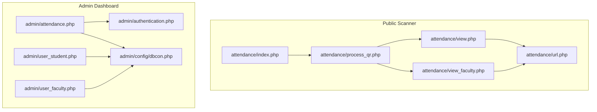
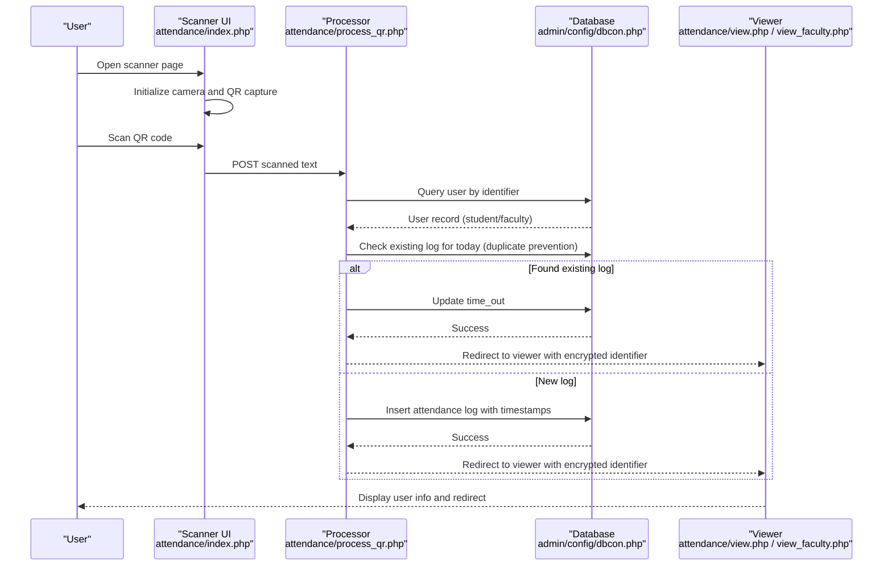
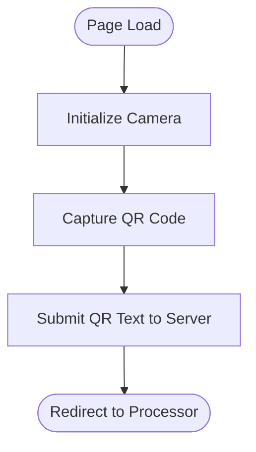
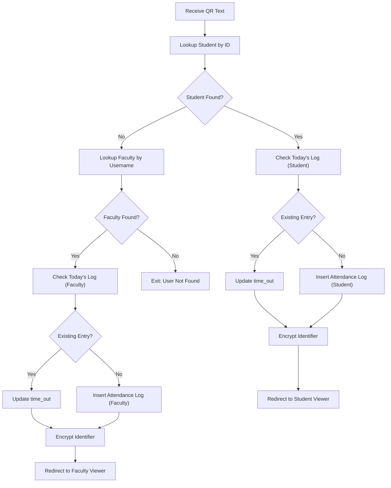
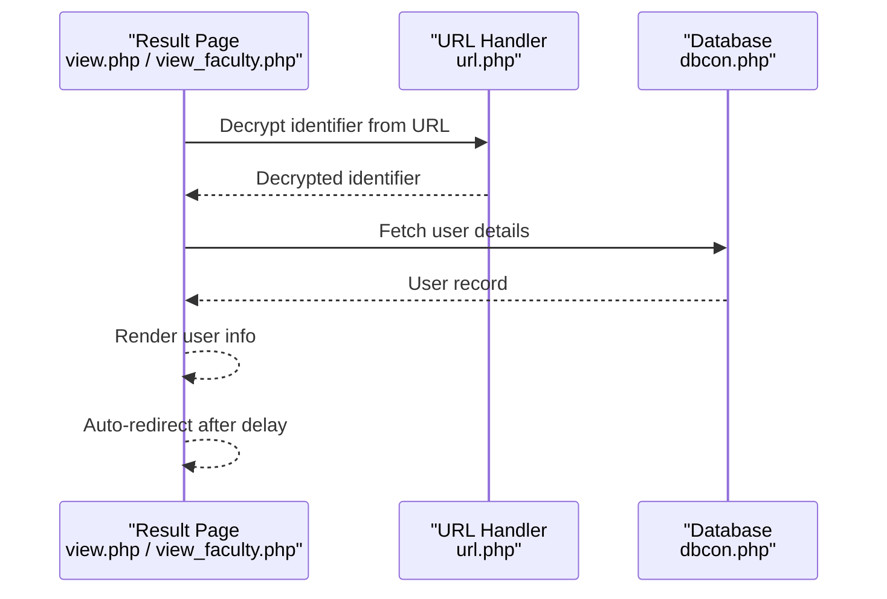
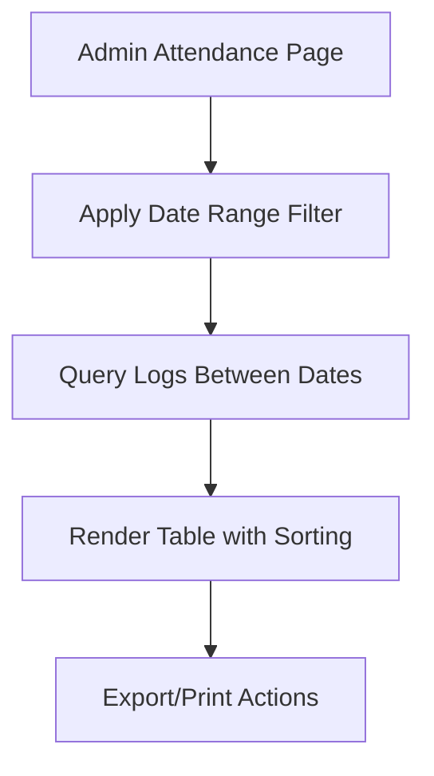
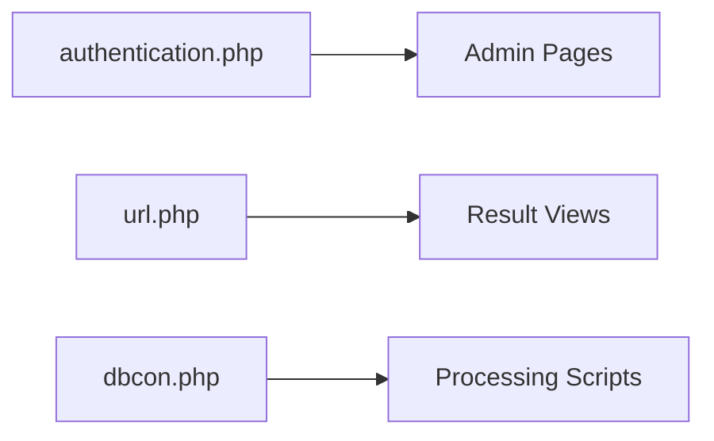
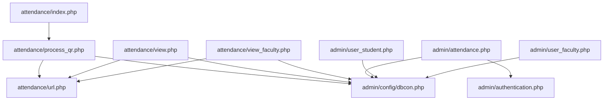

# Attendance Tracking System

<cite>
**Referenced Files in This Document**
- [index.php](file://attendance/index.php)
- [process_qr.php](file://attendance/process_qr.php)
- [view.php](file://attendance/view.php)
- [view_faculty.php](file://attendance/view_faculty.php)
- [url.php](file://attendance/url.php)
- [dbcon.php](file://admin/config/dbcon.php)
- [attendance.php](file://admin/attendance.php)
- [authentication.php](file://admin/authentication.php)
- [user_student.php](file://admin/user_student.php)
- [user_faculty.php](file://admin/user_faculty.php)
</cite>

## Table of Contents
1. [Introduction](#introduction)
2. [Project Structure](#project-structure)
3. [Core Components](#core-components)
4. [Architecture Overview](#architecture-overview)
5. [Detailed Component Analysis](#detailed-component-analysis)
6. [Dependency Analysis](#dependency-analysis)
7. [Performance Considerations](#performance-considerations)
8. [Troubleshooting Guide](#troubleshooting-guide)
9. [Conclusion](#conclusion)

## Introduction
This document describes a QR code-based attendance tracking system designed for students and faculty members within a library resource center environment. The system enables quick presence verification via QR scanning, logs attendance with timestamps, prevents duplicate entries for the same day, and provides administrative views for filtering and reporting. It also includes faculty-specific workflows and reporting capabilities, along with secure URL parameter handling for user identification.

## Project Structure
The attendance system spans two primary areas:
- Public-facing QR scanner and result viewers under the `attendance/` directory
- Administrative dashboards and reporting under the `admin/` directory

Key directories and files:
- `attendance/`: Scanner UI, QR processing, and user result displays
- `admin/`: Attendance listing, filtering, and reporting interfaces
- `admin/config/dbcon.php`: Database connection configuration
- `admin/authentication.php`: Session and access control enforcement
- `admin/user_student.php`, `admin/user_faculty.php`: User management for students and faculty

**Diagram sources**
- [index.php:1-179](file://attendance/index.php#L1-L179)
- [process_qr.php:1-133](file://attendance/process_qr.php#L1-L133)
- [view.php:1-110](file://attendance/view.php#L1-L110)
- [view_faculty.php:1-109](file://attendance/view_faculty.php#L1-L109)
- [url.php:1-22](file://attendance/url.php#L1-L22)
- [attendance.php:1-234](file://admin/attendance.php#L1-L234)
- [authentication.php:1-28](file://admin/authentication.php#L1-L28)
- [dbcon.php:1-19](file://admin/config/dbcon.php#L1-L19)
- [user_student.php:1-412](file://admin/user_student.php#L1-L412)
- [user_faculty.php:1-371](file://admin/user_faculty.php#L1-L371)

**Section sources**
- [index.php:1-179](file://attendance/index.php#L1-L179)
- [process_qr.php:1-133](file://attendance/process_qr.php#L1-L133)
- [view.php:1-110](file://attendance/view.php#L1-L110)
- [view_faculty.php:1-109](file://attendance/view_faculty.php#L1-L109)
- [url.php:1-22](file://attendance/url.php#L1-L22)
- [attendance.php:1-234](file://admin/attendance.php#L1-L234)
- [authentication.php:1-28](file://admin/authentication.php#L1-L28)
- [dbcon.php:1-19](file://admin/config/dbcon.php#L1-L19)
- [user_student.php:1-412](file://admin/user_student.php#L1-L412)
- [user_faculty.php:1-371](file://admin/user_faculty.php#L1-L371)

## Core Components
- QR Scanner UI: Initializes camera feed, captures QR codes, and submits scanned data to the server.
- QR Processing Engine: Validates scanned identifiers against student/faculty databases, enforces daily duplicate prevention, and logs attendance with timestamps.
- Result Views: Displays verified user information after successful scan for both students and faculty.
- Attendance Listing: Provides filtered attendance logs by date range and supports export/printing.
- Security Utilities: URL-safe encryption/decryption for passing identifiers securely in URLs.
- Authentication Layer: Enforces session-based access control for administrative pages.

**Section sources**
- [index.php:120-137](file://attendance/index.php#L120-L137)
- [process_qr.php:10-129](file://attendance/process_qr.php#L10-L129)
- [view.php:15-34](file://attendance/view.php#L15-L34)
- [view_faculty.php:15-34](file://attendance/view_faculty.php#L15-L34)
- [attendance.php:84-132](file://admin/attendance.php#L84-L132)
- [url.php:2-21](file://attendance/url.php#L2-L21)
- [authentication.php:1-28](file://admin/authentication.php#L1-L28)

## Architecture Overview
The system follows a client-server model:
- Client-side (scanner): Uses a JavaScript QR library to capture camera input and submit QR payload to the backend.
- Server-side (processing): Validates identity, checks for existing daily log, inserts or updates attendance, and redirects to appropriate result page.
- Admin-side (dashboard): Displays attendance logs with filtering and export capabilities.

**Diagram sources**
- [index.php:120-137](file://attendance/index.php#L120-L137)
- [process_qr.php:10-129](file://attendance/process_qr.php#L10-L129)
- [view.php:15-34](file://attendance/view.php#L15-L34)
- [view_faculty.php:15-34](file://attendance/view_faculty.php#L15-L34)
- [dbcon.php:1-19](file://admin/config/dbcon.php#L1-L19)

## Detailed Component Analysis

### QR Scanner Interface
- Camera initialization and QR capture using a JavaScript library.
- Submits captured QR text to the server via a hidden form.
- Displays live clock and branding for the scanner environment.

**Diagram sources**
- [index.php:120-137](file://attendance/index.php#L120-L137)

**Section sources**
- [index.php:120-137](file://attendance/index.php#L120-L137)

### QR Processing and Attendance Logging
- Accepts QR text and queries both student and faculty tables.
- Implements duplicate detection by checking for an open log entry for the current date.
- Inserts new attendance records with timestamps and roles, or updates existing records with time_out.
- Redirects to result viewers with encrypted identifiers.

**Diagram sources**
- [process_qr.php:10-129](file://attendance/process_qr.php#L10-L129)

**Section sources**
- [process_qr.php:10-129](file://attendance/process_qr.php#L10-L129)

### Result Viewers (Student and Faculty)
- Decrypts identifier from URL and retrieves user details.
- Displays user profile information and redirects back to scanner after a timeout.
- Different layouts for student and faculty result pages.

**Diagram sources**
- [view.php:15-34](file://attendance/view.php#L15-L34)
- [view_faculty.php:15-34](file://attendance/view_faculty.php#L15-L34)
- [url.php:2-21](file://attendance/url.php#L2-L21)
- [dbcon.php:1-19](file://admin/config/dbcon.php#L1-L19)

**Section sources**
- [view.php:15-34](file://attendance/view.php#L15-L34)
- [view_faculty.php:15-34](file://attendance/view_faculty.php#L15-L34)
- [url.php:2-21](file://attendance/url.php#L2-L21)
- [dbcon.php:1-19](file://admin/config/dbcon.php#L1-L19)

### Attendance Listing and Filtering
- Admin page lists attendance logs with date sorting and pagination.
- Supports filtering by date range with a form submission.
- Integrates with DataTables for export/printing and statistics.

**Diagram sources**
- [attendance.php:84-132](file://admin/attendance.php#L84-L132)

**Section sources**
- [attendance.php:84-132](file://admin/attendance.php#L84-L132)

### Security and Access Control
- Session-based authentication ensures only authorized users access admin pages.
- URL parameter encryption/decryption prevents tampering and improves privacy.
- Database credentials are centralized for secure connection management.

**Diagram sources**
- [authentication.php:1-28](file://admin/authentication.php#L1-L28)
- [url.php:2-21](file://attendance/url.php#L2-L21)
- [dbcon.php:1-19](file://admin/config/dbcon.php#L1-L19)

**Section sources**
- [authentication.php:1-28](file://admin/authentication.php#L1-L28)
- [url.php:2-21](file://attendance/url.php#L2-L21)
- [dbcon.php:1-19](file://admin/config/dbcon.php#L1-L19)

## Dependency Analysis
- Scanner UI depends on the processor endpoint and the encryption utility.
- Processor depends on database configuration and performs dual-table lookups.
- Result viewers depend on decryption and database retrieval.
- Admin dashboard depends on authentication and database connectivity.

**Diagram sources**
- [index.php:1-179](file://attendance/index.php#L1-L179)
- [process_qr.php:1-133](file://attendance/process_qr.php#L1-L133)
- [view.php:1-110](file://attendance/view.php#L1-L110)
- [view_faculty.php:1-109](file://attendance/view_faculty.php#L1-L109)
- [url.php:1-22](file://attendance/url.php#L1-L22)
- [dbcon.php:1-19](file://admin/config/dbcon.php#L1-L19)
- [attendance.php:1-234](file://admin/attendance.php#L1-L234)
- [authentication.php:1-28](file://admin/authentication.php#L1-L28)
- [user_student.php:1-412](file://admin/user_student.php#L1-L412)
- [user_faculty.php:1-371](file://admin/user_faculty.php#L1-L371)

**Section sources**
- [index.php:1-179](file://attendance/index.php#L1-L179)
- [process_qr.php:1-133](file://attendance/process_qr.php#L1-L133)
- [view.php:1-110](file://attendance/view.php#L1-L110)
- [view_faculty.php:1-109](file://attendance/view_faculty.php#L1-L109)
- [url.php:1-22](file://attendance/url.php#L1-L22)
- [dbcon.php:1-19](file://admin/config/dbcon.php#L1-L19)
- [attendance.php:1-234](file://admin/attendance.php#L1-L234)
- [authentication.php:1-28](file://admin/authentication.php#L1-L28)
- [user_student.php:1-412](file://admin/user_student.php#L1-L412)
- [user_faculty.php:1-371](file://admin/user_faculty.php#L1-L371)

## Performance Considerations
- Camera initialization and QR scanning occur client-side; server-side processing is lightweight but should handle concurrent requests efficiently.
- Database queries use prepared statements to mitigate injection risks and improve performance.
- Duplicate detection avoids unnecessary writes by checking for existing logs per day.
- Admin reports leverage DataTables with export/print capabilities; consider server-side pagination for very large datasets.

## Troubleshooting Guide
Common issues and resolutions:
- No cameras found: Verify device permissions and HTTPS deployment; the camera library requires secure contexts.
- Scan Error alerts: Occur when the scanned identifier does not match an approved student or faculty record; ensure user status is approved.
- Timeout notifications: Appear when an existing log is updated with time_out; confirm successful logout.
- Database connection failures: Check credentials and network connectivity in the database configuration file.
- Access denied errors: Ensure proper session and role-based authentication before accessing admin pages.

**Section sources**
- [index.php:123-131](file://attendance/index.php#L123-L131)
- [index.php:144-156](file://attendance/index.php#L144-L156)
- [index.php:162-175](file://attendance/index.php#L162-L175)
- [dbcon.php:1-19](file://admin/config/dbcon.php#L1-L19)
- [authentication.php:12-26](file://admin/authentication.php#L12-L26)

## Conclusion
The QR-based attendance system provides a streamlined solution for capturing presence with robust duplicate prevention, secure identifier handling, and integrated administrative reporting. Its modular design separates concerns between scanning, processing, viewing, and administration, enabling maintainability and scalability. Administrators can filter and export attendance logs, while faculty and students benefit from fast, reliable check-in/check-out experiences.