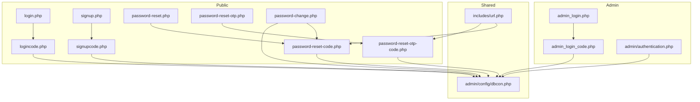
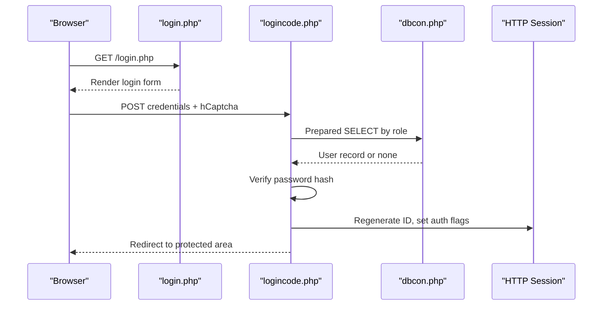
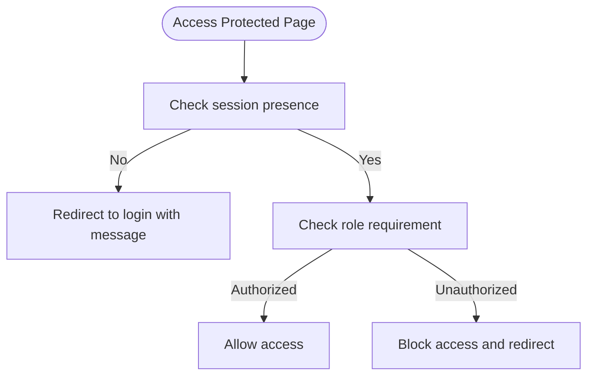
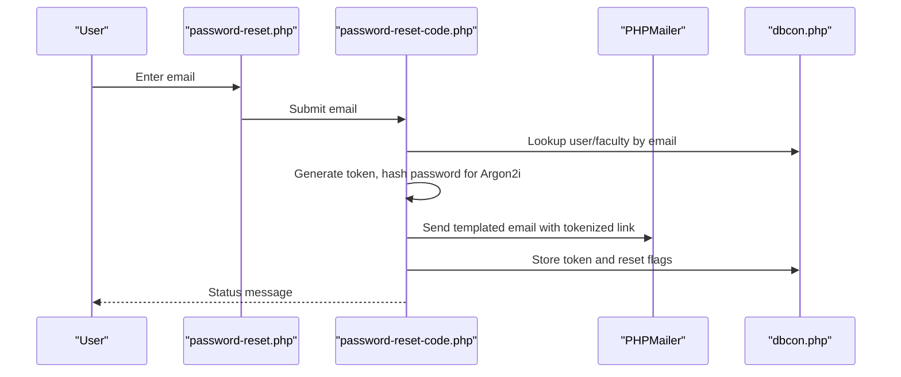
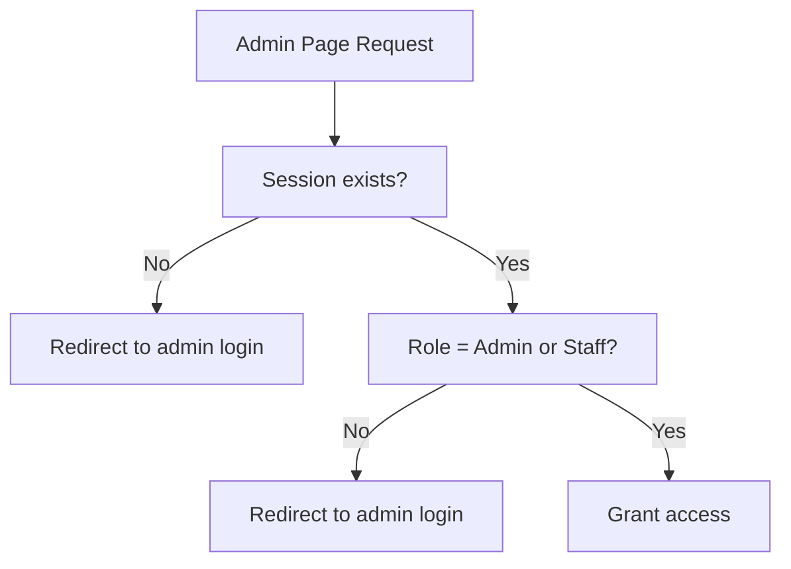
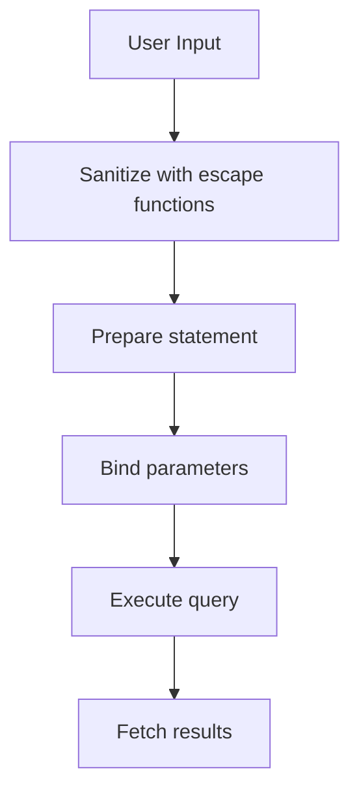
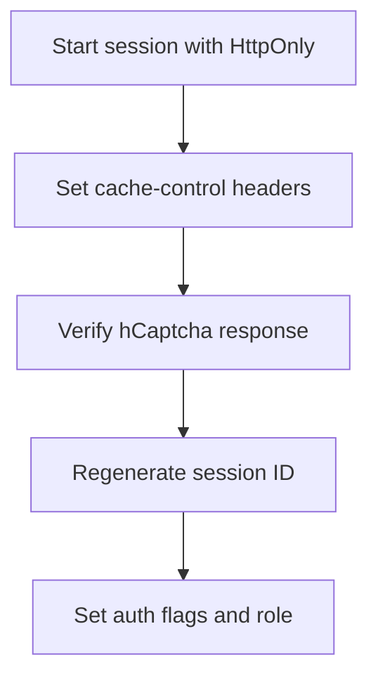
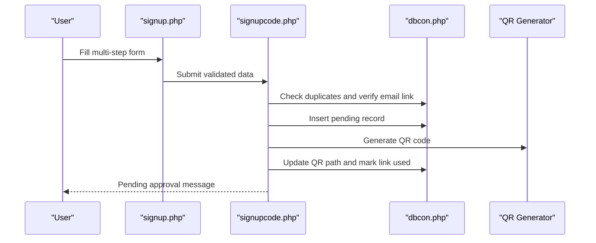
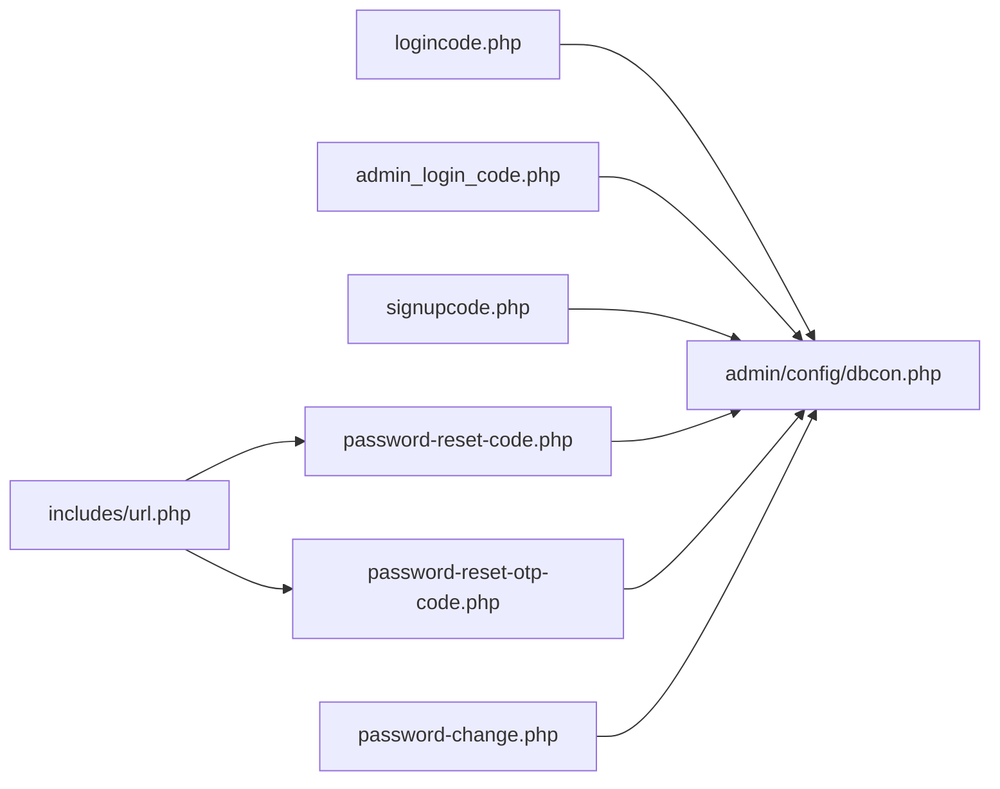

# Authentication and Security

<cite>
**Referenced Files in This Document**
- [login.php](file://login.php)
- [logincode.php](file://logincode.php)
- [admin_login.php](file://admin_login.php)
- [admin_login_code.php](file://admin_login_code.php)
- [admin/authentication.php](file://admin/authentication.php)
- [admin/config/dbcon.php](file://admin/config/dbcon.php)
- [password-reset.php](file://password-reset.php)
- [password-reset-code.php](file://password-reset-code.php)
- [password-reset-otp.php](file://password-reset-otp.php)
- [password-reset-otp-code.php](file://password-reset-otp-code.php)
- [password-change.php](file://password-change.php)
- [signup.php](file://signup.php)
- [signupcode.php](file://signupcode.php)
- [includes/url.php](file://includes/url.php)
</cite>

## Table of Contents
1. [Introduction](#introduction)
2. [Project Structure](#project-structure)
3. [Core Components](#core-components)
4. [Architecture Overview](#architecture-overview)
5. [Detailed Component Analysis](#detailed-component-analysis)
6. [Dependency Analysis](#dependency-analysis)
7. [Performance Considerations](#performance-considerations)
8. [Troubleshooting Guide](#troubleshooting-guide)
9. [Conclusion](#conclusion)

## Introduction
This document provides comprehensive authentication and security documentation for the Library Management System. It covers session-based authentication, role hierarchy, password security, access control, input validation, SQL injection prevention, session management, CSRF protection, and user registration with approval workflows. It also outlines best practices for administrators managing user accounts and system access.

## Project Structure
The authentication and security features span several modules:
- Public user login and registration flows
- Admin login and dashboard access control
- Password reset workflows (email token and OTP)
- Database connectivity and prepared statements
- Frontend validation and user feedback

**Diagram sources**
- [login.php:1-121](file://login.php#L1-L121)
- [logincode.php:1-137](file://logincode.php#L1-L137)
- [signup.php:1-800](file://signup.php#L1-L800)
- [signupcode.php:1-201](file://signupcode.php#L1-L201)
- [password-reset.php:1-131](file://password-reset.php#L1-L131)
- [password-reset-code.php:1-311](file://password-reset-code.php#L1-L311)
- [password-reset-otp.php:1-174](file://password-reset-otp.php#L1-L174)
- [password-reset-otp-code.php:1-376](file://password-reset-otp-code.php#L1-L376)
- [password-change.php:1-208](file://password-change.php#L1-L208)
- [admin_login.php:1-107](file://admin_login.php#L1-L107)
- [admin_login_code.php:1-104](file://admin_login_code.php#L1-L104)
- [admin/authentication.php:1-28](file://admin/authentication.php#L1-L28)
- [admin/config/dbcon.php:1-19](file://admin/config/dbcon.php#L1-L19)
- [includes/url.php](file://includes/url.php)

**Section sources**
- [login.php:1-121](file://login.php#L1-L121)
- [admin_login.php:1-107](file://admin_login.php#L1-L107)
- [admin/config/dbcon.php:1-19](file://admin/config/dbcon.php#L1-L19)

## Core Components
- Session-based authentication with role-aware session storage
- Role hierarchy: administrator, staff, student, faculty
- Password hashing using industry-standard algorithms
- Two-factor-like flows: email token and OTP-based resets
- Prepared statements for SQL injection prevention
- Input validation and sanitization
- Admin-only access control for administrative pages
- Registration workflow with pending approval and QR code generation

**Section sources**
- [logincode.php:62-86](file://logincode.php#L62-L86)
- [admin_login_code.php:48-65](file://admin_login_code.php#L48-L65)
- [password-reset-code.php:181-258](file://password-reset-code.php#L181-L258)
- [password-reset-otp-code.php:188-293](file://password-reset-otp-code.php#L188-L293)
- [signupcode.php:80-142](file://signupcode.php#L80-L142)

## Architecture Overview
The system enforces authentication and authorization at multiple layers:
- UI entry points for user/admin login
- Backend login handlers with CAPTCHA verification and rate limiting
- Centralized session management and role checks
- Protected admin pages requiring session and role validation
- Password reset flows with secure token handling
- Registration pipeline with email verification and pending status

**Diagram sources**
- [login.php:62-113](file://login.php#L62-L113)
- [logincode.php:20-130](file://logincode.php#L20-L130)
- [admin/config/dbcon.php:1-19](file://admin/config/dbcon.php#L1-L19)

## Detailed Component Analysis

### Session-Based Authentication and Role Hierarchy
- Sessions are initialized with HttpOnly cookies and anti-cache headers.
- Roles are enforced via session variables and middleware-style guards.
- Successful logins set role-specific session arrays for user/admin contexts.
- Admin-only pages require a specific role and redirect unauthenticated or unauthorized users.

**Diagram sources**
- [admin/authentication.php:12-26](file://admin/authentication.php#L12-L26)

**Section sources**
- [admin/authentication.php:1-28](file://admin/authentication.php#L1-L28)
- [logincode.php:62-86](file://logincode.php#L62-L86)
- [admin_login_code.php:48-65](file://admin_login_code.php#L48-L65)

### Password Security Implementation
- Hashing: Argon2i for email-token reset; bcrypt/default for direct login.
- Password reset via email token: generates cryptographically random token, stores hashed token, sends templated email with a secure link.
- OTP-based reset: generates numeric OTP, emails OTP, validates OTP before allowing password change.
- Strong password policy enforced during reset (length, uppercase, lowercase, digit, special character).
- Token usage tracking prevents replay attacks.

**Diagram sources**
- [password-reset.php:74-98](file://password-reset.php#L74-L98)
- [password-reset-code.php:103-174](file://password-reset-code.php#L103-L174)
- [admin/config/dbcon.php:1-19](file://admin/config/dbcon.php#L1-L19)

**Section sources**
- [password-reset-code.php:16-101](file://password-reset-code.php#L16-L101)
- [password-reset-code.php:177-311](file://password-reset-code.php#L177-L311)
- [password-change.php:23-52](file://password-change.php#L23-L52)
- [password-reset-otp.php:74-98](file://password-reset-otp.php#L74-L98)
- [password-reset-otp-code.php:111-180](file://password-reset-otp-code.php#L111-L180)
- [password-reset-otp-code.php:184-312](file://password-reset-otp-code.php#L184-L312)

### Access Control and Role-Specific Navigation
- Admin-only pages enforce role checks and redirect unauthorized users.
- Navigation menus are role-aware; protected pages rely on session and role flags.
- Admin dashboard requires Admin or Staff roles.

**Diagram sources**
- [admin/authentication.php:18-26](file://admin/authentication.php#L18-L26)

**Section sources**
- [admin/authentication.php:1-28](file://admin/authentication.php#L1-L28)

### Input Validation and SQL Injection Prevention
- All database queries use prepared statements with bound parameters.
- Input values are sanitized using escape functions before binding.
- Frontend validation provides immediate feedback; backend validation ensures robustness.
- Rate limiting via login attempt counters and temporary lockouts.

**Diagram sources**
- [logincode.php:50-58](file://logincode.php#L50-L58)
- [signupcode.php:45-66](file://signupcode.php#L45-L66)

**Section sources**
- [logincode.php:50-130](file://logincode.php#L50-L130)
- [signupcode.php:8-66](file://signupcode.php#L8-L66)

### Session Management and CSRF Protection
- Session cookie configured with HttpOnly flag.
- Anti-caching headers applied to admin pages to mitigate cached access risks.
- Session regeneration after successful authentication.
- hCaptcha integration provides bot mitigation and reduces CSRF vectors for form submissions.

**Diagram sources**
- [logincode.php:2-63](file://logincode.php#L2-L63)
- [admin_login_code.php:2-49](file://admin_login_code.php#L2-L49)
- [admin_login.php:84-87](file://admin_login.php#L84-L87)

**Section sources**
- [logincode.php:2-63](file://logincode.php#L2-L63)
- [admin_login_code.php:2-49](file://admin_login_code.php#L2-L49)
- [admin_login.php:22-52](file://admin_login.php#L22-L52)

### User Registration Workflow with Approval and Activation
- Multi-step registration form collects personal, demographic, and account details.
- Email verification via a controlled link (ms_account) before enabling registration.
- Duplicate detection for student ID, username, and email across relevant tables.
- On successful registration, user status is set to pending; QR code generated and stored.
- Admin approval workflow is implied by pending status and subsequent admin controls.

**Diagram sources**
- [signup.php:363-652](file://signup.php#L363-L652)
- [signupcode.php:7-194](file://signupcode.php#L7-L194)

**Section sources**
- [signup.php:1-800](file://signup.php#L1-L800)
- [signupcode.php:1-201](file://signupcode.php#L1-L201)

### Best Practices for Administrators Managing Accounts
- Enforce role-based access for admin pages.
- Monitor login attempts and lockout thresholds.
- Review pending registrations and approve/reject accordingly.
- Rotate secrets and credentials regularly.
- Audit session usage and token lifecycles.
- Ensure secure transport (HTTPS) and proper server hardening.

[No sources needed since this section provides general guidance]

## Dependency Analysis
Authentication and security depend on:
- Database connection module for all persistence operations
- Shared URL utilities for tokenized links
- PHPMailer for secure email delivery
- QR code library for identity generation

**Diagram sources**
- [logincode.php](file://logincode.php#L4)
- [admin_login_code.php](file://admin_login_code.php#L4)
- [signupcode.php](file://signupcode.php#L4)
- [password-reset-code.php](file://password-reset-code.php#L6)
- [password-reset-otp-code.php](file://password-reset-otp-code.php#L5)
- [password-change.php](file://password-change.php#L5)
- [admin/config/dbcon.php:1-19](file://admin/config/dbcon.php#L1-L19)
- [includes/url.php](file://includes/url.php)

**Section sources**
- [admin/config/dbcon.php:1-19](file://admin/config/dbcon.php#L1-L19)
- [includes/url.php](file://includes/url.php)

## Performance Considerations
- Prepared statements improve query performance and reduce parsing overhead.
- Session regeneration occurs only on successful authentication to minimize overhead.
- Avoid excessive database round-trips by batching checks (e.g., union checks for email uniqueness).
- Use CDN-backed static assets to reduce server load during authentication flows.

[No sources needed since this section provides general guidance]

## Troubleshooting Guide
Common issues and resolutions:
- Login failures due to CAPTCHA: Verify hCaptcha secret key and network connectivity.
- Incorrect credentials: Check password hashing algorithm compatibility and role-specific queries.
- Email-based reset failures: Confirm SMTP settings and PHPMailer configuration; validate token storage and expiration.
- OTP verification errors: Ensure OTP is fresh and not reused; verify database updates for token_used flags.
- Registration errors: Validate file uploads, size limits, and duplicate checks; confirm email verification link usage.

**Section sources**
- [logincode.php:37-48](file://logincode.php#L37-L48)
- [admin_login_code.php:22-33](file://admin_login_code.php#L22-L33)
- [password-reset-code.php:16-101](file://password-reset-code.php#L16-L101)
- [password-reset-otp-code.php:15-109](file://password-reset-otp-code.php#L15-L109)
- [signupcode.php:80-124](file://signupcode.php#L80-L124)

## Conclusion
The Library Management System implements a layered authentication and security model featuring session-based login, role-aware access control, robust password handling, and validated registration workflows. By leveraging prepared statements, input sanitization, CAPTCHA verification, and secure session management, the system mitigates common vulnerabilities while maintaining usability. Administrators should monitor logs, enforce approvals, and maintain secure configurations to uphold system integrity.