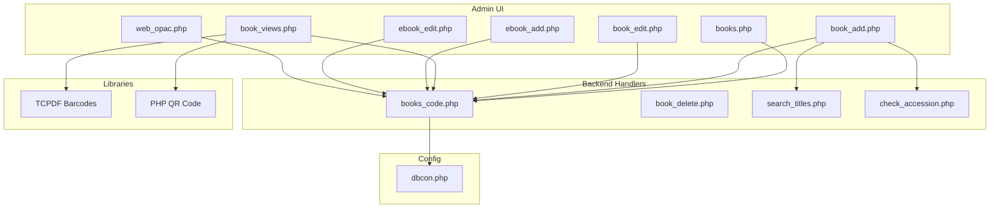
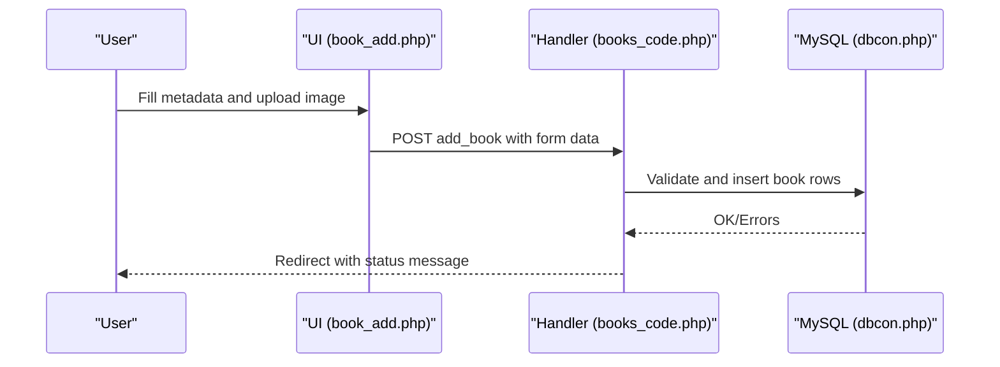
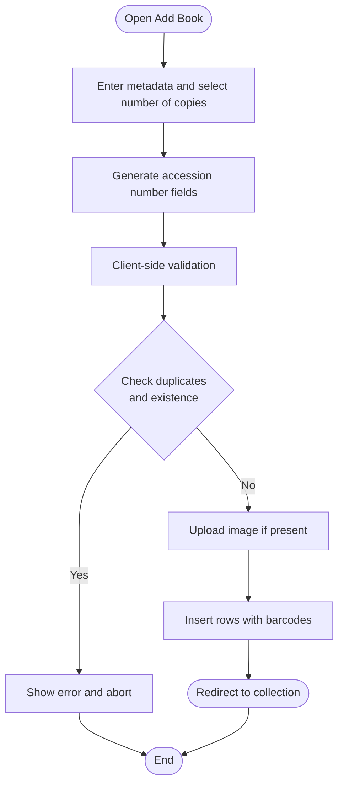
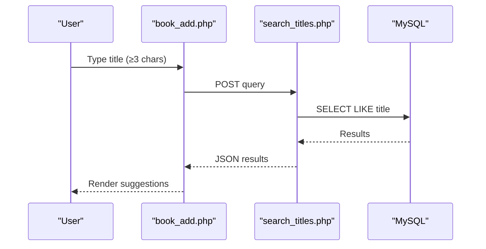
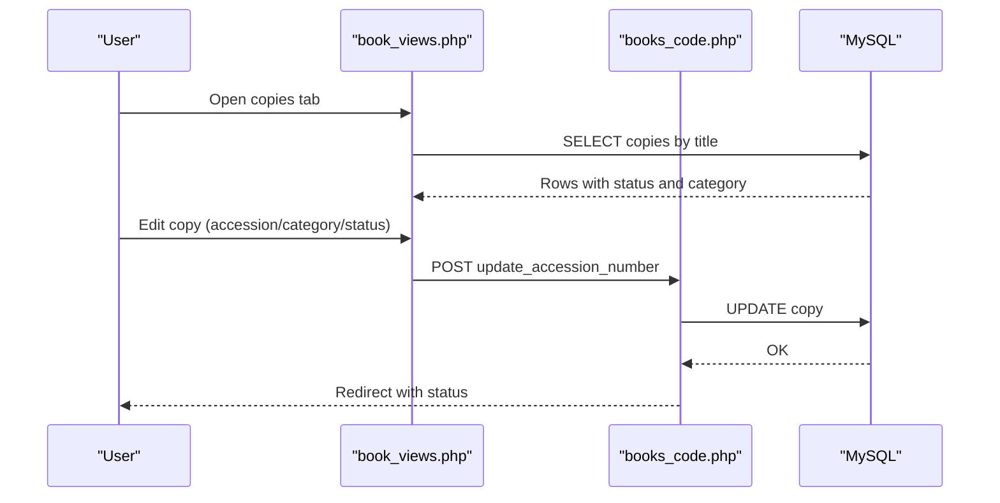
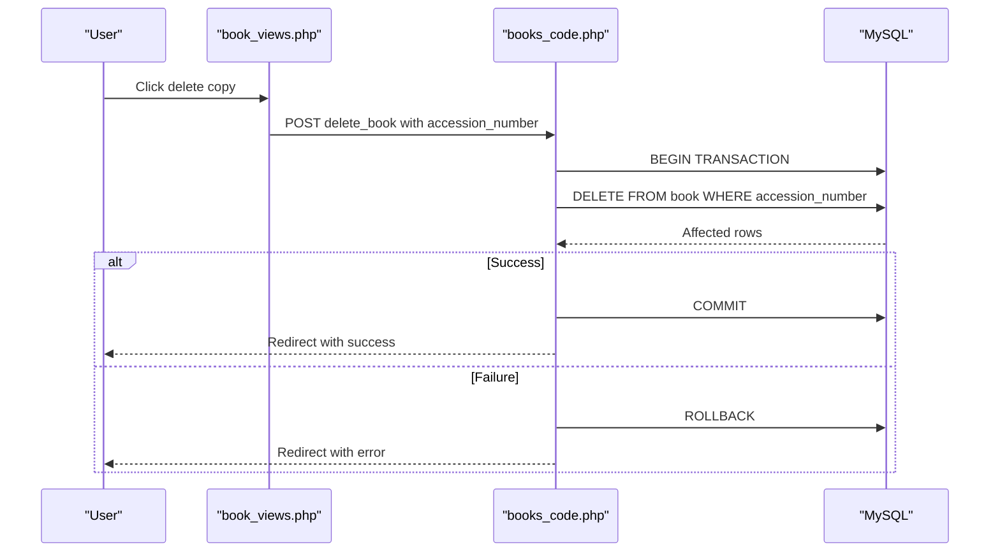
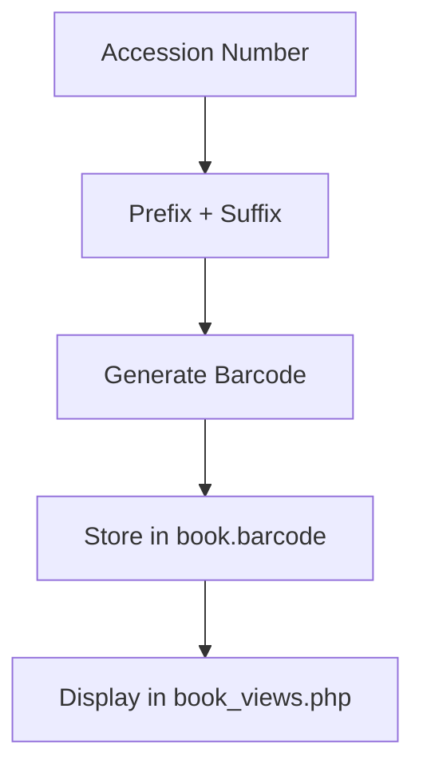
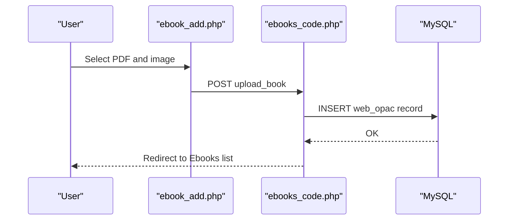
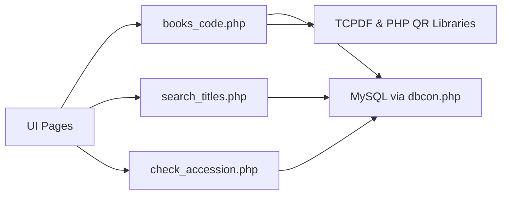

# Book Management System

<cite>
**Referenced Files in This Document**
- [admin/book_add.php](file://admin/book_add.php)
- [admin/books.php](file://admin/books.php)
- [admin/book_edit.php](file://admin/book_edit.php)
- [admin/book_delete.php](file://admin/book_delete.php)
- [admin/books_code.php](file://admin/books_code.php)
- [admin/book_views.php](file://admin/book_views.php)
- [admin/search_titles.php](file://admin/search_titles.php)
- [admin/check_accession.php](file://admin/check_accession.php)
- [admin/config/dbcon.php](file://admin/config/dbcon.php)
- [admin/ebook_add.php](file://admin/ebook_add.php)
- [admin/ebook_edit.php](file://admin/ebook_edit.php)
- [admin/web_opac.php](file://admin/web_opac.php)
</cite>

## Table of Contents
1. [Introduction](#introduction)
2. [Project Structure](#project-structure)
3. [Core Components](#core-components)
4. [Architecture Overview](#architecture-overview)
5. [Detailed Component Analysis](#detailed-component-analysis)
6. [Dependency Analysis](#dependency-analysis)
7. [Performance Considerations](#performance-considerations)
8. [Troubleshooting Guide](#troubleshooting-guide)
9. [Conclusion](#conclusion)

## Introduction
This document describes the complete lifecycle of library collections managed by the Book Management System. It covers physical book registration, digital book management, metadata handling, search and filtering, categorization and inventory, deletion with cascade handling, and barcode/QR integration for physical tracking. The system supports both print books and e-books, with separate workflows for each type.

## Project Structure
The system is organized primarily under the admin directory with supporting assets and libraries:
- Administrative UI pages for managing books and e-books
- Backend handlers for CRUD operations
- Search and validation endpoints
- Database connection configuration
- Barcode and QR generation libraries (TCPDF and PHP QR)

**Diagram sources**
- [admin/books.php:1-268](file://admin/books.php#L1-L268)
- [admin/book_add.php:1-610](file://admin/book_add.php#L1-L610)
- [admin/book_edit.php:1-455](file://admin/book_edit.php#L1-L455)
- [admin/book_views.php:1-394](file://admin/book_views.php#L1-L394)
- [admin/ebook_add.php:1-281](file://admin/ebook_add.php#L1-L281)
- [admin/ebook_edit.php:1-310](file://admin/ebook_edit.php#L1-L310)
- [admin/web_opac.php:1-118](file://admin/web_opac.php#L1-L118)
- [admin/books_code.php:1-319](file://admin/books_code.php#L1-L319)
- [admin/book_delete.php:1-37](file://admin/book_delete.php#L1-L37)
- [admin/search_titles.php:1-38](file://admin/search_titles.php#L1-L38)
- [admin/check_accession.php:1-20](file://admin/check_accession.php#L1-L20)
- [admin/config/dbcon.php:1-19](file://admin/config/dbcon.php#L1-L19)

**Section sources**
- [admin/books.php:1-268](file://admin/books.php#L1-L268)
- [admin/book_add.php:1-610](file://admin/book_add.php#L1-L610)
- [admin/book_edit.php:1-455](file://admin/book_edit.php#L1-L455)
- [admin/book_views.php:1-394](file://admin/book_views.php#L1-L394)
- [admin/ebook_add.php:1-281](file://admin/ebook_add.php#L1-L281)
- [admin/ebook_edit.php:1-310](file://admin/ebook_edit.php#L1-L310)
- [admin/web_opac.php:1-118](file://admin/web_opac.php#L1-L118)
- [admin/books_code.php:1-319](file://admin/books_code.php#L1-L319)
- [admin/book_delete.php:1-37](file://admin/book_delete.php#L1-L37)
- [admin/search_titles.php:1-38](file://admin/search_titles.php#L1-L38)
- [admin/check_accession.php:1-20](file://admin/check_accession.php#L1-L20)
- [admin/config/dbcon.php:1-19](file://admin/config/dbcon.php#L1-L19)

## Core Components
- Physical Book Registration: Adds new print volumes with metadata, images, and multiple accession numbers per title.
- Digital Book Management: Uploads e-books (PDF) and manages online resources via web OPAC.
- Metadata Management: Enforces input sanitization and validation for titles, authors, publishers, and publication dates.
- Search and Filtering: Provides title search suggestions and advanced filters across title, author, subject, and ISBN.
- Inventory and Tracking: Manages copies, statuses (available, missing, damage, storage room), and generates barcodes.
- Deletion and Audit: Supports deletion of individual copies with transactional safety and redirects with status messages.

**Section sources**
- [admin/book_add.php:1-610](file://admin/book_add.php#L1-L610)
- [admin/books_code.php:183-317](file://admin/books_code.php#L183-L317)
- [admin/book_views.php:187-285](file://admin/book_views.php#L187-L285)
- [admin/books.php:44-208](file://admin/books.php#L44-L208)
- [admin/search_titles.php:1-38](file://admin/search_titles.php#L1-L38)
- [admin/check_accession.php:1-20](file://admin/check_accession.php#L1-L20)
- [admin/book_delete.php:1-37](file://admin/book_delete.php#L1-L37)

## Architecture Overview
The system follows a classic MVC-like separation:
- Controllers: PHP handler scripts (e.g., books_code.php) orchestrate operations.
- Views: Blade-like PHP templates render forms and lists (e.g., book_add.php, books.php).
- Data Access: Prepared statements and transactions ensure safe queries against the MySQL database.
- Assets: jQuery, DataTables, SweetAlert, and Bootstrap provide UX enhancements.

**Diagram sources**
- [admin/book_add.php:29-155](file://admin/book_add.php#L29-L155)
- [admin/books_code.php:183-317](file://admin/books_code.php#L183-L317)
- [admin/config/dbcon.php:1-19](file://admin/config/dbcon.php#L1-L19)

**Section sources**
- [admin/book_add.php:1-610](file://admin/book_add.php#L1-L610)
- [admin/books_code.php:1-319](file://admin/books_code.php#L1-L319)
- [admin/config/dbcon.php:1-19](file://admin/config/dbcon.php#L1-L19)

## Detailed Component Analysis

### Physical Book Registration Workflow
- Form collects title, author, ISBN, publisher, copyright date, place of publication, call number, subjects, page, price, and optional image.
- Copy count drives dynamic generation of accession number inputs.
- Duplicate and existence checks prevent conflicting identifiers.
- On submit, the handler validates year, uploads image, and inserts multiple rows with generated barcodes.

**Diagram sources**
- [admin/book_add.php:223-331](file://admin/book_add.php#L223-L331)
- [admin/books_code.php:183-317](file://admin/books_code.php#L183-L317)

**Section sources**
- [admin/book_add.php:1-610](file://admin/book_add.php#L1-L610)
- [admin/books_code.php:183-317](file://admin/books_code.php#L183-L317)

### Metadata Validation and Sanitization
- Title, author, publisher, place of publication, call number, and subjects are validated client-side to prevent HTML injection and enforce formatting.
- Copyright year is restricted to four digits and cannot exceed the current year.
- Image and file type validations ensure acceptable formats.

**Section sources**
- [admin/book_add.php:355-610](file://admin/book_add.php#L355-L610)
- [admin/book_edit.php:205-249](file://admin/book_edit.php#L205-L249)
- [admin/ebook_add.php:103-276](file://admin/ebook_add.php#L103-L276)

### Search and Filtering
- Title search suggests existing titles using AJAX to search_titles.php.
- The main collection view aggregates grouped titles with counts and availability.
- Advanced filters can be extended via the existing search endpoint and table controls.

**Diagram sources**
- [admin/book_add.php:178-221](file://admin/book_add.php#L178-L221)
- [admin/search_titles.php:1-38](file://admin/search_titles.php#L1-L38)

**Section sources**
- [admin/book_add.php:178-221](file://admin/book_add.php#L178-L221)
- [admin/search_titles.php:1-38](file://admin/search_titles.php#L1-L38)
- [admin/books.php:68-135](file://admin/books.php#L68-L135)

### Inventory and Copy Management
- Each title groups multiple copies with aggregated counts and availability.
- The View Book screen displays copies with barcode, status, and location.
- Copy-level editing allows updating accession number, category/location, and remarks/status.

**Diagram sources**
- [admin/book_views.php:187-285](file://admin/book_views.php#L187-L285)
- [admin/books_code.php:141-181](file://admin/books_code.php#L141-L181)

**Section sources**
- [admin/book_views.php:187-285](file://admin/book_views.php#L187-L285)
- [admin/books_code.php:141-181](file://admin/books_code.php#L141-L181)

### Deletion Process and Cascade Handling
- Deleting a single copy uses a transactional delete with redirect and session status.
- Deleting a whole title requires a different route; the current implementation deletes by title/author/isbn combination.

**Diagram sources**
- [admin/book_views.php:360-394](file://admin/book_views.php#L360-L394)
- [admin/books_code.php:27-76](file://admin/books_code.php#L27-L76)

**Section sources**
- [admin/book_views.php:360-394](file://admin/book_views.php#L360-L394)
- [admin/books_code.php:27-76](file://admin/books_code.php#L27-L76)
- [admin/book_delete.php:1-37](file://admin/book_delete.php#L1-L37)

### Barcode and QR Integration
- Barcodes are generated server-side for each copy using a prefix and accession number.
- The system integrates with TCPDF barcode examples and PHP QR Code libraries for generating 1D and 2D codes.
- UI displays barcodes alongside copy details for quick identification.

**Diagram sources**
- [admin/books_code.php:293-298](file://admin/books_code.php#L293-L298)
- [admin/book_views.php:214-215](file://admin/book_views.php#L214-L215)

**Section sources**
- [admin/books_code.php:293-298](file://admin/books_code.php#L293-L298)
- [admin/book_views.php:214-215](file://admin/book_views.php#L214-L215)

### Digital Book Management (E-books and Online Resources)
- E-book upload enforces PDF file type and optional image.
- Editing updates metadata and optionally replaces file/image.
- Web OPAC lists online resources with view/edit/delete actions.

**Diagram sources**
- [admin/ebook_add.php:26-94](file://admin/ebook_add.php#L26-L94)
- [admin/web_opac.php:42-103](file://admin/web_opac.php#L42-L103)

**Section sources**
- [admin/ebook_add.php:1-281](file://admin/ebook_add.php#L1-L281)
- [admin/ebook_edit.php:1-310](file://admin/ebook_edit.php#L1-L310)
- [admin/web_opac.php:1-118](file://admin/web_opac.php#L1-L118)

## Dependency Analysis
- UI depends on jQuery, DataTables, SweetAlert, and Bootstrap assets.
- Handlers depend on prepared statements and transactions for safety.
- Search relies on AJAX endpoints and prepared queries.
- Barcode/QR generation leverages external libraries included in the repository.

**Diagram sources**
- [admin/book_add.php:1-610](file://admin/book_add.php#L1-L610)
- [admin/books_code.php:1-319](file://admin/books_code.php#L1-L319)
- [admin/search_titles.php:1-38](file://admin/search_titles.php#L1-L38)
- [admin/check_accession.php:1-20](file://admin/check_accession.php#L1-L20)
- [admin/config/dbcon.php:1-19](file://admin/config/dbcon.php#L1-L19)

**Section sources**
- [admin/book_add.php:1-610](file://admin/book_add.php#L1-L610)
- [admin/books_code.php:1-319](file://admin/books_code.php#L1-L319)
- [admin/search_titles.php:1-38](file://admin/search_titles.php#L1-L38)
- [admin/check_accession.php:1-20](file://admin/check_accession.php#L1-L20)
- [admin/config/dbcon.php:1-19](file://admin/config/dbcon.php#L1-L19)

## Performance Considerations
- Use prepared statements and transactions to avoid SQL injection and ensure atomicity.
- Indexes on frequently filtered columns (title, author, isbn, accession_number) would improve search and join performance.
- Pagination and server-side DataTables configuration are already in place; ensure backend queries leverage LIMIT/OFFSET appropriately.
- Image upload size limits reduce storage overhead; consider thumbnail generation for listings.

## Troubleshooting Guide
- Accession number conflicts: The system prevents duplicate and existing accession numbers. Resolve by changing the number or correcting duplicates.
- Year validation errors: Copyright year must be a four-digit number not exceeding the current year.
- File type restrictions: Images must be JPG/JPEG/PNG; e-book PDFs must be PDFs.
- Session status messages: After operations, the system redirects with status messages; check session variables for feedback.

**Section sources**
- [admin/books_code.php:202-209](file://admin/books_code.php#L202-L209)
- [admin/books_code.php:253-284](file://admin/books_code.php#L253-L284)
- [admin/check_accession.php:1-20](file://admin/check_accession.php#L1-L20)
- [admin/book_add.php:282-331](file://admin/book_add.php#L282-L331)

## Conclusion
The Book Management System provides a robust foundation for managing both physical and digital library collections. It emphasizes safety through prepared statements and transactions, usability via client-side validation and search, and scalability through modular handlers and libraries. Extending search filters, adding audit trails, and optimizing database indexes will further enhance the system’s capabilities.