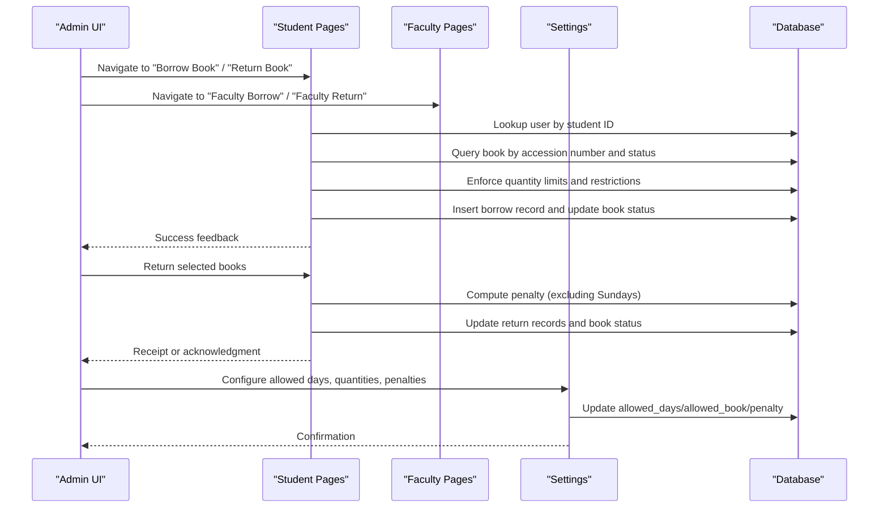
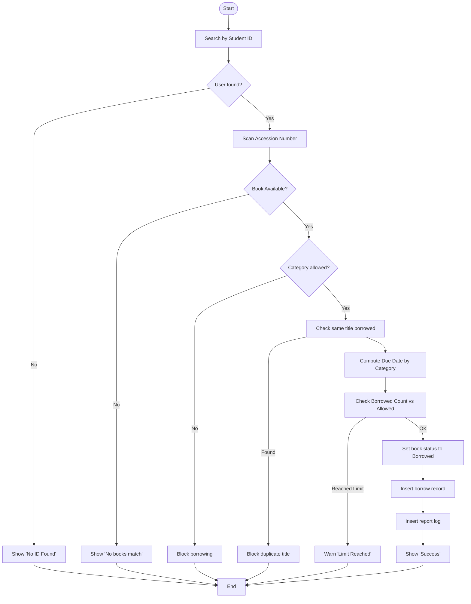
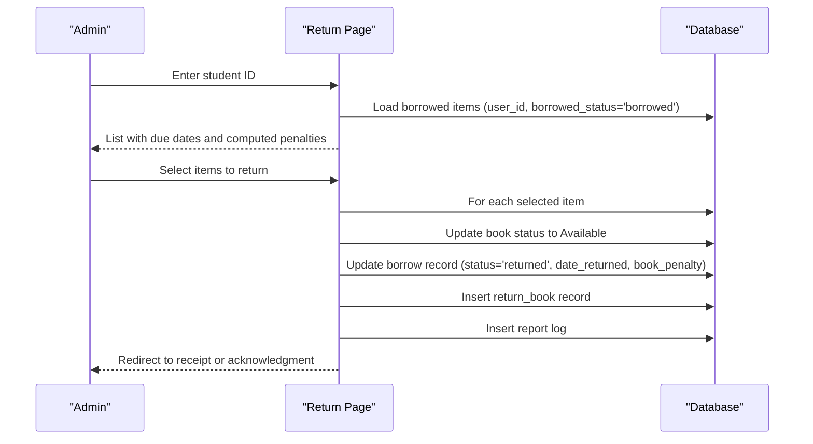
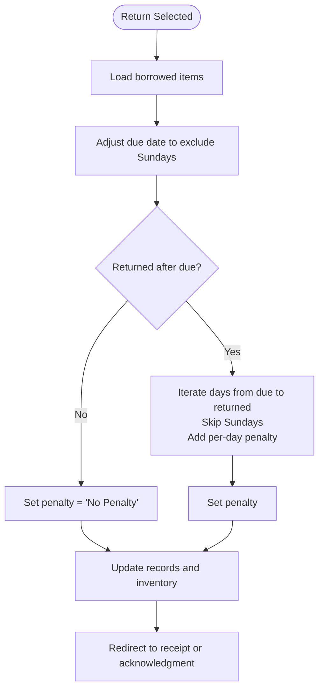
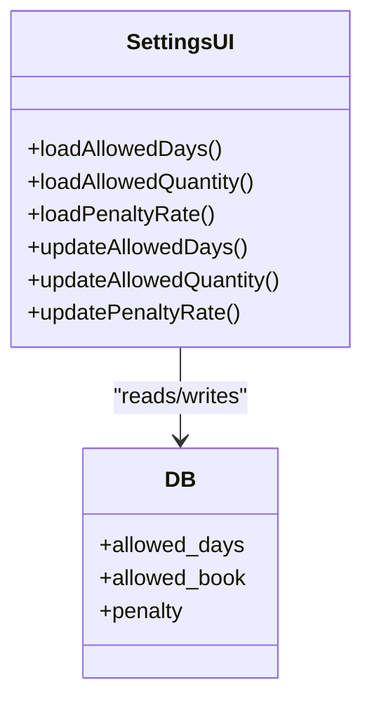
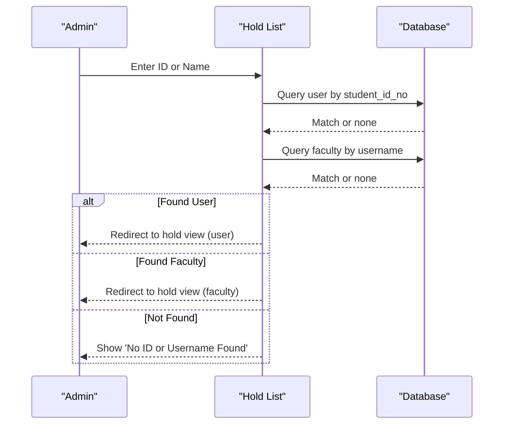
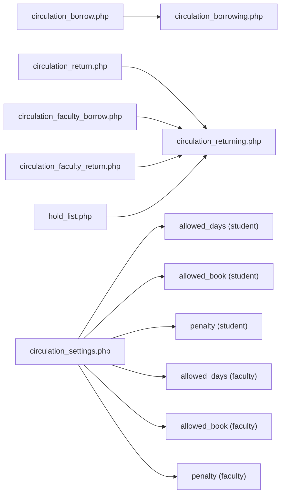

# Circulation Management

<cite>
**Referenced Files in This Document**
- [admin/circulation.php](file://admin/circulation.php)
- [admin/circulation_borrow.php](file://admin/circulation_borrow.php)
- [admin/circulation_borrowing.php](file://admin/circulation_borrowing.php)
- [admin/circulation_return.php](file://admin/circulation_return.php)
- [admin/circulation_returning.php](file://admin/circulation_returning.php)
- [admin/circulation_settings.php](file://admin/circulation_settings.php)
- [admin/circulation_settings_allowed_days_student.php](file://admin/circulation_settings_allowed_days_student.php)
- [admin/circulation_settings_allowed_qntty_student.php](file://admin/circulation_settings_allowed_qntty_student.php)
- [admin/circulation_settings_book_penalty_student.php](file://admin/circulation_settings_book_penalty_student.php)
- [admin/circulation_settings_allowed_days_faculty.php](file://admin/circulation_settings_allowed_days_faculty.php)
- [admin/circulation_settings_allowed_qntty_faculty.php](file://admin/circulation_settings_allowed_qntty_faculty.php)
- [admin/circulation_settings_book_penalty_faculty.php](file://admin/circulation_settings_book_penalty_faculty.php)
- [admin/hold_list.php](file://admin/hold_list.php)
- [admin/circulation_faculty_borrow.php](file://admin/circulation_faculty_borrow.php)
- [admin/circulation_faculty_return.php](file://admin/circulation_faculty_return.php)
</cite>

## Table of Contents
1. [Introduction](#introduction)
2. [Project Structure](#project-structure)
3. [Core Components](#core-components)
4. [Architecture Overview](#architecture-overview)
5. [Detailed Component Analysis](#detailed-component-analysis)
6. [Dependency Analysis](#dependency-analysis)
7. [Performance Considerations](#performance-considerations)
8. [Troubleshooting Guide](#troubleshooting-guide)
9. [Conclusion](#conclusion)

## Introduction
This document describes the complete book lending and returning workflow for students and faculty/staff, including availability checks, quantity limits, due date calculations, penalties, and the holds/reservation system. It also documents circulation settings for allowed borrowing quantities, loan periods, and penalty rates per user category.

## Project Structure
The circulation module is organized under the admin interface with separate entry points for students and faculty/staff, plus shared settings and holds management.

```mermaid
graph TB
subgraph "Admin UI"
CIRC["admin/circulation.php"]
CB["admin/circulation_borrow.php"]
CR["admin/circulation_return.php"]
CS["admin/circulation_settings.php"]
HL["admin/hold_list.php"]
end
subgraph "Student Workflows"
CBR["admin/circulation_borrowing.php"]
CRT["admin/circulation_returning.php"]
end
subgraph "Faculty/Staff Workflows"
CFB["admin/circulation_faculty_borrow.php"]
CFR["admin/circulation_faculty_return.php"]
end
subgraph "Settings"
SAD["admin/circulation_settings_allowed_days_student.php"]
SAQ["admin/circulation_settings_allowed_qntty_student.php"]
SPN["admin/circulation_settings_book_penalty_student.php"]
FAD["admin/circulation_settings_allowed_days_faculty.php"]
FAQ["admin/circulation_settings_allowed_qntty_faculty.php"]
FPN["admin/circulation_settings_book_penalty_faculty.php"]
end
CIRC --> CB
CIRC --> CFB
CB --> CBR
CR --> CRT
CS --> SAD
CS --> SAQ
CS --> SPN
CS --> FAD
CS --> FAQ
CS --> FPN
HL --> |"Search by student ID or faculty name"| CBR
HL --> CFR
```

**Diagram sources**
- [admin/circulation.php:1-91](file://admin/circulation.php#L1-L91)
- [admin/circulation_borrow.php:1-372](file://admin/circulation_borrow.php#L1-L372)
- [admin/circulation_return.php:1-255](file://admin/circulation_return.php#L1-L255)
- [admin/circulation_settings.php:1-63](file://admin/circulation_settings.php#L1-L63)
- [admin/hold_list.php:1-168](file://admin/hold_list.php#L1-L168)
- [admin/circulation_borrowing.php:1-267](file://admin/circulation_borrowing.php#L1-L267)
- [admin/circulation_returning.php:1-270](file://admin/circulation_returning.php#L1-L270)
- [admin/circulation_faculty_borrow.php:1-167](file://admin/circulation_faculty_borrow.php#L1-L167)
- [admin/circulation_faculty_return.php:1-191](file://admin/circulation_faculty_return.php#L1-L191)
- [admin/circulation_settings_allowed_days_student.php:1-104](file://admin/circulation_settings_allowed_days_student.php#L1-L104)
- [admin/circulation_settings_allowed_qntty_student.php:1-103](file://admin/circulation_settings_allowed_qntty_student.php#L1-L103)
- [admin/circulation_settings_book_penalty_student.php:1-103](file://admin/circulation_settings_book_penalty_student.php#L1-L103)
- [admin/circulation_settings_allowed_days_faculty.php:1-102](file://admin/circulation_settings_allowed_days_faculty.php#L1-L102)
- [admin/circulation_settings_allowed_qntty_faculty.php:1-72](file://admin/circulation_settings_allowed_qntty_faculty.php#L1-L72)
- [admin/circulation_settings_book_penalty_faculty.php:1-103](file://admin/circulation_settings_book_penalty_faculty.php#L1-L103)

**Section sources**
- [admin/circulation.php:1-91](file://admin/circulation.php#L1-L91)
- [admin/circulation_settings.php:1-63](file://admin/circulation_settings.php#L1-L63)
- [admin/hold_list.php:1-168](file://admin/hold_list.php#L1-L168)

## Core Components
- Circulation dashboard: Entry point for student and faculty/staff workflows.
- Student borrowing: Search by student ID, book availability check, due date calculation, quantity limit enforcement, and insertion into borrow records.
- Student returning: Select borrowed items, compute penalties excluding Sundays, update inventory and return records, and generate receipts.
- Faculty/staff borrowing and returning: Similar flows tailored to faculty/staff identifiers.
- Settings: Manage allowed days per book, allowed quantity per user, and penalty amount per day for both categories.
- Holds: Search by student ID or faculty name, list current holds, and view hold details.

**Section sources**
- [admin/circulation_borrowing.php:1-267](file://admin/circulation_borrowing.php#L1-L267)
- [admin/circulation_returning.php:1-270](file://admin/circulation_returning.php#L1-L270)
- [admin/circulation_faculty_borrow.php:1-167](file://admin/circulation_faculty_borrow.php#L1-L167)
- [admin/circulation_faculty_return.php:1-191](file://admin/circulation_faculty_return.php#L1-L191)
- [admin/circulation_settings.php:1-63](file://admin/circulation_settings.php#L1-L63)
- [admin/hold_list.php:1-168](file://admin/hold_list.php#L1-L168)

## Architecture Overview
The system uses a presentation layer (PHP/HTML) with embedded logic for user actions and database interactions. Workflows are split by user category with shared settings and holds.

**Diagram sources**
- [admin/circulation_borrowing.php:1-267](file://admin/circulation_borrowing.php#L1-L267)
- [admin/circulation_returning.php:1-270](file://admin/circulation_returning.php#L1-L270)
- [admin/circulation_settings_allowed_days_student.php:1-104](file://admin/circulation_settings_allowed_days_student.php#L1-L104)
- [admin/circulation_settings_allowed_qntty_student.php:1-103](file://admin/circulation_settings_allowed_qntty_student.php#L1-L103)
- [admin/circulation_settings_book_penalty_student.php:1-103](file://admin/circulation_settings_book_penalty_student.php#L1-L103)
- [admin/circulation_settings_allowed_days_faculty.php:1-102](file://admin/circulation_settings_allowed_days_faculty.php#L1-L102)
- [admin/circulation_settings_allowed_qntty_faculty.php:1-72](file://admin/circulation_settings_allowed_qntty_faculty.php#L1-L72)
- [admin/circulation_settings_book_penalty_faculty.php:1-103](file://admin/circulation_settings_book_penalty_faculty.php#L1-L103)

## Detailed Component Analysis

### Student Borrowing Workflow
- Search and redirect: Enter student ID; on success, redirect to the borrowing page.
- Book lookup: Enter accession number; only available books are considered.
- Restrictions: Certain categories are disallowed for borrowing.
- Duplicate prevention: Cannot borrow the same title twice while still borrowed.
- Due date calculation: Varies by category; defaults to allowed days setting.
- Quantity enforcement: Compares current borrowed count against allowed quantity.
- Inventory and history: Updates book status to borrowed, inserts borrow record, logs report.

**Diagram sources**
- [admin/circulation_borrow.php:58-84](file://admin/circulation_borrow.php#L58-L84)
- [admin/circulation_borrowing.php:87-229](file://admin/circulation_borrowing.php#L87-L229)

**Section sources**
- [admin/circulation_borrow.php:58-84](file://admin/circulation_borrow.php#L58-L84)
- [admin/circulation_borrowing.php:87-229](file://admin/circulation_borrowing.php#L87-L229)

### Student Returning Workflow
- Search and load: Enter student ID; load outstanding borrowed items.
- Penalty calculation: Compare returned date with due date; exclude Sundays; accumulate daily penalty.
- Bulk selection: Select multiple items to return.
- Inventory and return records: Update book status to available, insert return records, log report.

**Diagram sources**
- [admin/circulation_returning.php:77-261](file://admin/circulation_returning.php#L77-L261)

**Section sources**
- [admin/circulation_returning.php:77-261](file://admin/circulation_returning.php#L77-L261)

### Faculty/Staff Borrowing and Returning
- Borrowing: Search by first name; redirect to borrowing page; similar validations and due date logic apply.
- Returning: Search by first name; load borrowed items; compute penalties; bulk return with inventory updates.

**Section sources**
- [admin/circulation_faculty_borrow.php:36-54](file://admin/circulation_faculty_borrow.php#L36-L54)
- [admin/circulation_faculty_return.php:41-62](file://admin/circulation_faculty_return.php#L41-L62)
- [admin/circulation_returning.php:77-261](file://admin/circulation_returning.php#L77-L261)

### Penalty Management and Payment Processing
- Penalty calculation: Per diem rate applied for each actual weekday past due date; Sundays excluded.
- Payment processing: Redirect to appropriate receipt page depending on whether penalties were incurred.

**Diagram sources**
- [admin/circulation_returning.php:93-135](file://admin/circulation_returning.php#L93-L135)
- [admin/circulation_returning.php:222-235](file://admin/circulation_returning.php#L222-L235)

**Section sources**
- [admin/circulation_returning.php:93-135](file://admin/circulation_returning.php#L93-L135)
- [admin/circulation_returning.php:222-235](file://admin/circulation_returning.php#L222-L235)

### Circulation Settings
- Allowed days per book: Separate values for students and faculty/staff.
- Allowed quantity per user: Separate limits for students and faculty/staff.
- Penalty per day: Separate rates for students and faculty/staff.
- Editing: Inline modals update database records and refresh settings.

**Diagram sources**
- [admin/circulation_settings_allowed_days_student.php:10-86](file://admin/circulation_settings_allowed_days_student.php#L10-L86)
- [admin/circulation_settings_allowed_qntty_student.php:10-86](file://admin/circulation_settings_allowed_qntty_student.php#L10-L86)
- [admin/circulation_settings_book_penalty_student.php:10-86](file://admin/circulation_settings_book_penalty_student.php#L10-L86)
- [admin/circulation_settings_allowed_days_faculty.php:10-84](file://admin/circulation_settings_allowed_days_faculty.php#L10-L84)
- [admin/circulation_settings_allowed_qntty_faculty.php:10-62](file://admin/circulation_settings_allowed_qntty_faculty.php#L10-L62)
- [admin/circulation_settings_book_penalty_faculty.php:10-86](file://admin/circulation_settings_book_penalty_faculty.php#L10-L86)

**Section sources**
- [admin/circulation_settings.php:24-54](file://admin/circulation_settings.php#L24-L54)
- [admin/circulation_settings_allowed_days_student.php:10-86](file://admin/circulation_settings_allowed_days_student.php#L10-L86)
- [admin/circulation_settings_allowed_qntty_student.php:10-86](file://admin/circulation_settings_allowed_qntty_student.php#L10-L86)
- [admin/circulation_settings_book_penalty_student.php:10-86](file://admin/circulation_settings_book_penalty_student.php#L10-L86)
- [admin/circulation_settings_allowed_days_faculty.php:10-84](file://admin/circulation_settings_allowed_days_faculty.php#L10-L84)
- [admin/circulation_settings_allowed_qntty_faculty.php:10-62](file://admin/circulation_settings_allowed_qntty_faculty.php#L10-L62)
- [admin/circulation_settings_book_penalty_faculty.php:10-86](file://admin/circulation_settings_book_penalty_faculty.php#L10-L86)

### Holds/Reservations
- Search: By student ID (users table) or faculty username (faculty table).
- Listing: Aggregate counts of holds per borrower.
- Viewing: Dedicated view page to inspect and manage individual holds.

**Diagram sources**
- [admin/hold_list.php:40-66](file://admin/hold_list.php#L40-L66)

**Section sources**
- [admin/hold_list.php:40-66](file://admin/hold_list.php#L40-L66)

## Dependency Analysis
- UI pages depend on database queries for user lookup, book availability, and circulation records.
- Borrowing and returning pages rely on settings tables to enforce policy (allowed days, quantities, penalties).
- Holds page integrates with both user and faculty tables for search and reporting.

**Diagram sources**
- [admin/circulation_borrow.php:58-84](file://admin/circulation_borrow.php#L58-L84)
- [admin/circulation_borrowing.php:87-229](file://admin/circulation_borrowing.php#L87-L229)
- [admin/circulation_return.php:51-77](file://admin/circulation_return.php#L51-L77)
- [admin/circulation_returning.php:77-261](file://admin/circulation_returning.php#L77-L261)
- [admin/circulation_settings.php:24-54](file://admin/circulation_settings.php#L24-L54)
- [admin/hold_list.php:40-66](file://admin/hold_list.php#L40-L66)

**Section sources**
- [admin/circulation_borrowing.php:173-181](file://admin/circulation_borrowing.php#L173-L181)
- [admin/circulation_returning.php:237-245](file://admin/circulation_returning.php#L237-L245)

## Performance Considerations
- Use prepared statements for user and borrow queries to prevent SQL injection and improve performance.
- Index frequently queried columns: student_id_no, barcode, user_id, faculty_id, borrow/due dates.
- Avoid repeated timezone adjustments; precompute adjusted due dates server-side when inserting records.
- Paginate long lists (recent borrowed/returned) to reduce DOM size and improve responsiveness.

## Troubleshooting Guide
- Student ID not found during borrowing: Verify ID format and existence in the users table.
- Book not available: Confirm accession number and status field reflects “Available”.
- Duplicate title borrowing: Ensure the same title is not already checked out to the user.
- Quantity limit reached: Review allowed_book settings for the user category.
- No books borrowed to return: Confirm the user has active borrowed records.
- Penalties not calculated: Ensure due dates are properly stored and returned date is after due date; remember Sundays are excluded.
- Faculty/staff search fails: Confirm the first name matches a faculty record.

**Section sources**
- [admin/circulation_borrowing.php:94-98](file://admin/circulation_borrowing.php#L94-L98)
- [admin/circulation_borrowing.php:181-191](file://admin/circulation_borrowing.php#L181-L191)
- [admin/circulation_returning.php:101-113](file://admin/circulation_returning.php#L101-L113)
- [admin/circulation_returning.php:139-147](file://admin/circulation_returning.php#L139-L147)

## Conclusion
The circulation module provides robust workflows for student and faculty/staff book borrowing and returning, with configurable policies for due periods, borrowing limits, and penalties. Holds management supports demand-driven access control. Adhering to the outlined best practices will ensure reliable operation and maintainable code.