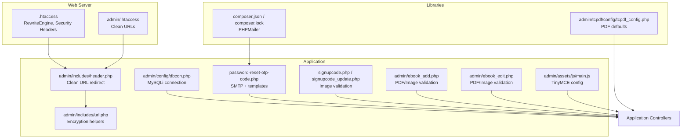
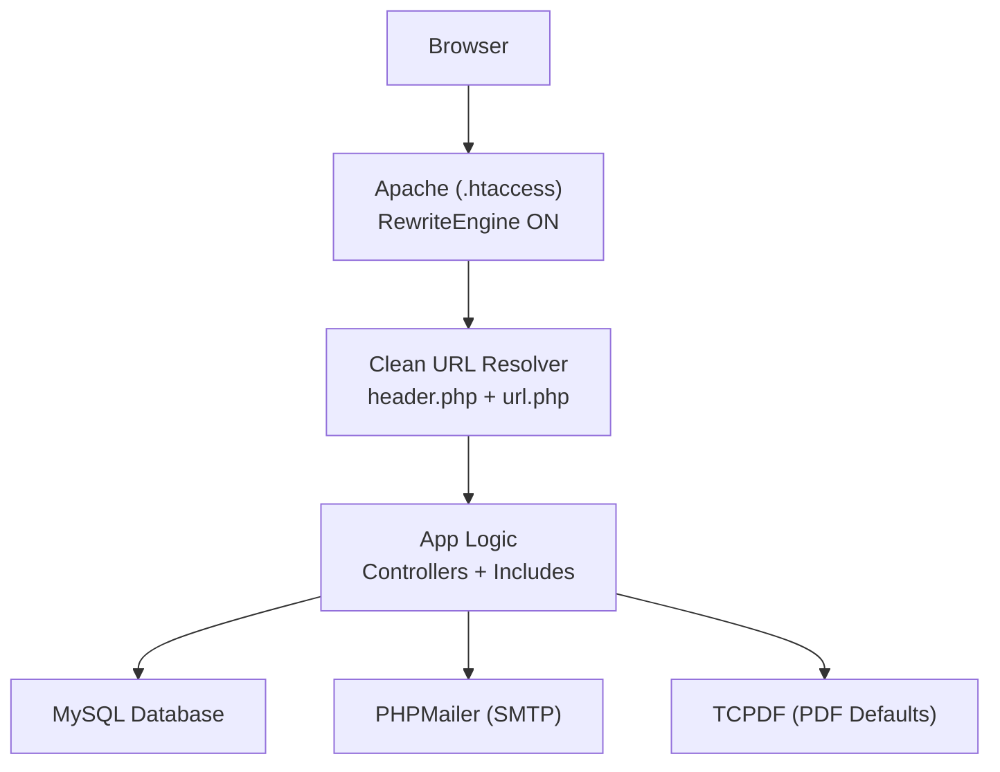
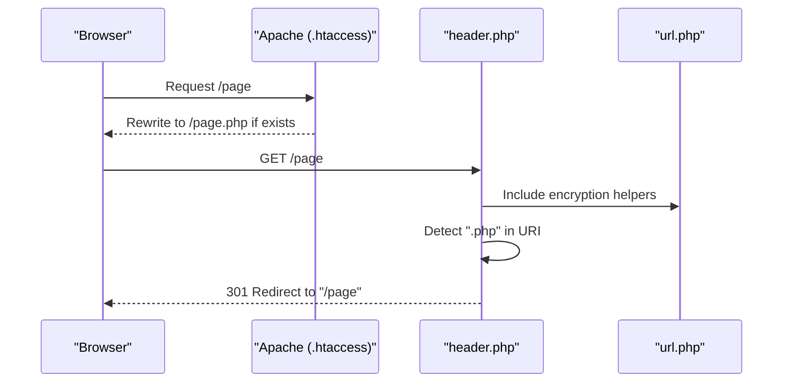
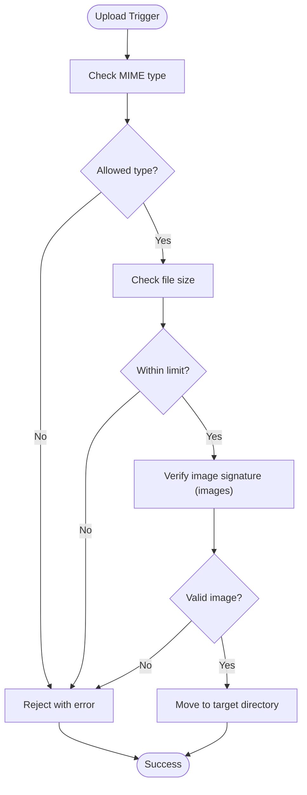
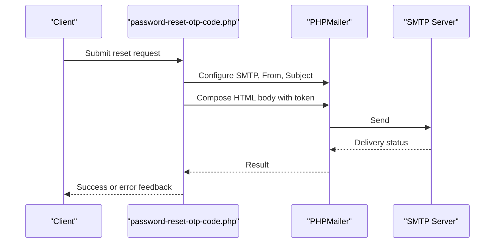
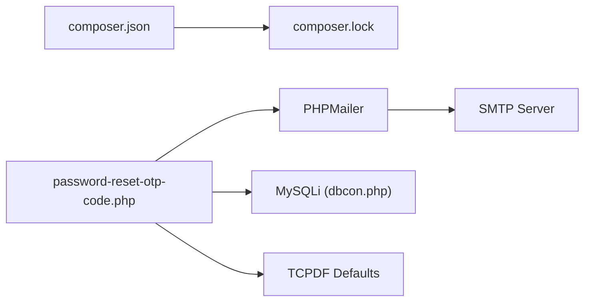

# Configuration and Customization

<cite>
**Referenced Files in This Document**
- [dbcon.php](file://admin/config/dbcon.php)
- [.htaccess](file://.htaccess)
- [admin/.htaccess](file://admin/.htaccess)
- [tcpdf_config.php](file://admin/tcpdf/config/tcpdf_config.php)
- [tcpdf.php](file://admin/tcpdf/tcpdf.php)
- [composer.json](file://composer.json)
- [composer.lock](file://composer.lock)
- [admin/composer.json](file://admin/phpmailer/composer.json)
- [admin/composer.lock](file://admin/phpmailer/composer.lock)
- [header.php](file://admin/includes/header.php)
- [url.php](file://admin/includes/url.php)
- [password-reset-otp-code.php](file://password-reset-otp-code.php)
- [signupcode.php](file://signupcode.php)
- [signupcode_update.php](file://signupcode_update.php)
- [ebook_add.php](file://admin/ebook_add.php)
- [ebook_edit.php](file://admin/ebook_edit.php)
- [admin_add.php](file://admin/admin_add.php)
- [admin_edit.php](file://admin/admin_edit.php)
- [404.php](file://404.php)
- [main.js](file://admin/assets/js/main.js)
</cite>

## Table of Contents
1. [Introduction](#introduction)
2. [Project Structure](#project-structure)
3. [Core Components](#core-components)
4. [Architecture Overview](#architecture-overview)
5. [Detailed Component Analysis](#detailed-component-analysis)
6. [Dependency Analysis](#dependency-analysis)
7. [Performance Considerations](#performance-considerations)
8. [Troubleshooting Guide](#troubleshooting-guide)
9. [Conclusion](#conclusion)
10. [Appendices](#appendices)

## Introduction
This document explains how to configure and customize the system, focusing on:
- Database connectivity and environment-specific settings
- URL rewriting for clean URLs and SEO
- File upload security, validation, and storage
- Email system configuration for SMTP and notification templates
- System customization options (branding, themes, feature toggles)
- Backup and maintenance automation

Where applicable, we map configurations to actual files and provide diagrams that reflect real code behavior.

## Project Structure
Key configuration areas:
- Database: admin/config/dbcon.php
- Web server rewrite and security headers: .htaccess and admin/.htaccess
- PDF generation defaults: admin/tcpdf/config/tcpdf_config.php
- Email delivery: composer-managed PHPMailer with SMTP settings in application code
- Upload validation and storage: per-page validation logic and uploads directory
- Clean URLs and encryption helpers: admin/includes/url.php and admin/includes/header.php
- Maintenance mode page: 404.php
- Rich text editor configuration: admin/assets/js/main.js

**Diagram sources**
- [.htaccess:1-56](file://.htaccess#L1-L56)
- [admin/.htaccess:1-10](file://admin/.htaccess#L1-L10)
- [dbcon.php:1-19](file://admin/config/dbcon.php#L1-L19)
- [url.php:1-22](file://admin/includes/url.php#L1-L22)
- [header.php:1-73](file://admin/includes/header.php#L1-L73)
- [password-reset-otp-code.php:73-110](file://password-reset-otp-code.php#L73-L110)
- [signupcode.php:102-128](file://signupcode.php#L102-L128)
- [signupcode_update.php:49-70](file://signupcode_update.php#L49-L70)
- [ebook_add.php:181-215](file://admin/ebook_add.php#L181-L215)
- [ebook_edit.php:208-242](file://admin/ebook_edit.php#L208-L242)
- [main.js:138-167](file://admin/assets/js/main.js#L138-L167)
- [tcpdf_config.php:1-236](file://admin/tcpdf/config/tcpdf_config.php#L1-L236)
- [composer.json:1-5](file://composer.json#L1-L5)
- [composer.lock:32-55](file://composer.lock#L32-L55)

**Section sources**
- [.htaccess:1-56](file://.htaccess#L1-L56)
- [admin/.htaccess:1-10](file://admin/.htaccess#L1-L10)
- [dbcon.php:1-19](file://admin/config/dbcon.php#L1-L19)
- [url.php:1-22](file://admin/includes/url.php#L1-L22)
- [header.php:1-73](file://admin/includes/header.php#L1-L73)
- [password-reset-otp-code.php:73-110](file://password-reset-otp-code.php#L73-L110)
- [signupcode.php:102-128](file://signupcode.php#L102-L128)
- [signupcode_update.php:49-70](file://signupcode_update.php#L49-L70)
- [ebook_add.php:181-215](file://admin/ebook_add.php#L181-L215)
- [ebook_edit.php:208-242](file://admin/ebook_edit.php#L208-L242)
- [main.js:138-167](file://admin/assets/js/main.js#L138-L167)
- [tcpdf_config.php:1-236](file://admin/tcpdf/config/tcpdf_config.php#L1-L236)
- [composer.json:1-5](file://composer.json#L1-L5)
- [composer.lock:32-55](file://composer.lock#L32-L55)

## Core Components
- Database connection: MySQLi connection initialized once and reused across admin pages.
- URL rewriting: Apache rewrite rules remove .php extensions and route cleanly.
- Encryption helpers: AES-256-CBC utility for URL-safe tokens.
- PDF defaults: TCPDF constants controlling page format, margins, fonts, and security.
- Email system: Composer-managed PHPMailer with SMTP configuration and templated notifications.
- File upload validation: Per-form checks for MIME types, sizes, and allowed extensions.
- Maintenance mode: A dedicated 503-style page for scheduled downtime.

**Section sources**
- [dbcon.php:1-19](file://admin/config/dbcon.php#L1-L19)
- [.htaccess:51-56](file://.htaccess#L51-L56)
- [admin/.htaccess:4-8](file://admin/.htaccess#L4-L8)
- [url.php:2-21](file://admin/includes/url.php#L2-L21)
- [tcpdf_config.php:92-182](file://admin/tcpdf/config/tcpdf_config.php#L92-L182)
- [composer.json:1-5](file://composer.json#L1-L5)
- [composer.lock:32-55](file://composer.lock#L32-L55)
- [password-reset-otp-code.php:73-110](file://password-reset-otp-code.php#L73-L110)
- [signupcode.php:102-128](file://signupcode.php#L102-L128)
- [signupcode_update.php:49-70](file://signupcode_update.php#L49-L70)
- [ebook_add.php:181-215](file://admin/ebook_add.php#L181-L215)
- [ebook_edit.php:208-242](file://admin/ebook_edit.php#L208-L242)
- [404.php:1-107](file://404.php#L1-L107)

## Architecture Overview
The system integrates Apache rewrite rules, PHP configuration, and third-party libraries to deliver a secure, SEO-friendly, and maintainable platform.

**Diagram sources**
- [.htaccess:1-56](file://.htaccess#L1-L56)
- [header.php:1-73](file://admin/includes/header.php#L1-L73)
- [url.php:1-22](file://admin/includes/url.php#L1-L22)
- [dbcon.php:1-19](file://admin/config/dbcon.php#L1-L19)
- [composer.json:1-5](file://composer.json#L1-L5)
- [tcpdf_config.php:1-236](file://admin/tcpdf/config/tcpdf_config.php#L1-L236)

## Detailed Component Analysis

### Database Connection Configuration
- Location: admin/config/dbcon.php
- Behavior:
  - Defines host, username, password, and database name.
  - Establishes a MySQLi connection and terminates on failure.
  - No explicit connection pooling in this file; reuse the connection across scripts.

Recommended environment separation:
- Keep production credentials in dbcon.php.
- Maintain a commented local development block for root credentials.
- Ensure the database user has minimal required privileges.

**Section sources**
- [dbcon.php:1-19](file://admin/config/dbcon.php#L1-L19)

### URL Rewriting and Clean URLs
- Global behavior:
  - Apache .htaccess enforces HSTS, XSS protection, frame options, referrer policy, permissions policy, and cache controls.
  - Rewrite rules remove .php extensions and route to index.php when appropriate.
- Admin area:
  - admin/.htaccess mirrors global behavior for admin routes.
- Application-level redirect:
  - admin/includes/header.php detects .php in REQUEST_URI and issues a 301 redirect to the clean URL.
- Encryption helpers:
  - admin/includes/url.php provides AES-256-CBC encryptor/decryptor for tokens and identifiers.

**Diagram sources**
- [.htaccess:51-56](file://.htaccess#L51-L56)
- [admin/.htaccess:4-8](file://admin/.htaccess#L4-L8)
- [header.php:1-12](file://admin/includes/header.php#L1-L12)
- [url.php:1-22](file://admin/includes/url.php#L1-L22)

**Section sources**
- [.htaccess:1-56](file://.htaccess#L1-L56)
- [admin/.htaccess:1-10](file://admin/.htaccess#L1-L10)
- [header.php:1-12](file://admin/includes/header.php#L1-L12)
- [url.php:2-21](file://admin/includes/url.php#L2-L21)

### File Upload Configuration
- Image uploads (profile images):
  - Validation checks MIME type, size limit (~50 MB), and allowed extensions (JPG, JPEG, PNG).
  - Uses getimagesize() to verify actual image type.
  - Stores uploaded files under uploads/<context>.
- PDF and book image uploads:
  - eBook forms validate PDF MIME/type and image MIME (JPEG, JPG, PNG).
  - Uses client-side and server-side checks to restrict types and filenames.

Security and storage guidelines:
- Validate on both client and server sides.
- Store uploads outside the web root when possible; otherwise, apply .htaccess restrictions.
- Sanitize filenames and enforce strict MIME checks.

**Diagram sources**
- [signupcode.php:102-128](file://signupcode.php#L102-L128)
- [signupcode_update.php:49-70](file://signupcode_update.php#L49-L70)
- [ebook_add.php:181-215](file://admin/ebook_add.php#L181-L215)
- [ebook_edit.php:208-242](file://admin/ebook_edit.php#L208-L242)
- [admin_add.php:255-274](file://admin/admin_add.php#L255-L274)
- [admin_edit.php:247-266](file://admin/admin_edit.php#L247-L266)

**Section sources**
- [signupcode.php:102-128](file://signupcode.php#L102-L128)
- [signupcode_update.php:49-70](file://signupcode_update.php#L49-L70)
- [ebook_add.php:181-215](file://admin/ebook_add.php#L181-L215)
- [ebook_edit.php:208-242](file://admin/ebook_edit.php#L208-L242)
- [admin_add.php:255-274](file://admin/admin_add.php#L255-L274)
- [admin_edit.php:247-266](file://admin/admin_edit.php#L247-L266)

### Email System Configuration (SMTP and Templates)
- Library: PHPMailer (composer-managed).
- SMTP configuration:
  - Defined in application code within the mailer function.
  - Uses TLS and sets From/FromName, Subject, and HTML body.
  - Logs errors via error_log.
- Notification template:
  - Password reset OTP email includes a styled HTML body with a token placeholder and branding image.

Operational notes:
- Ensure environment variables or a secure configuration file stores SMTP credentials.
- Use DKIM/SPF records for deliverability.
- Consider queueing emails for reliability.

**Diagram sources**
- [composer.json:1-5](file://composer.json#L1-L5)
- [composer.lock:32-55](file://composer.lock#L32-L55)
- [password-reset-otp-code.php:73-110](file://password-reset-otp-code.php#L73-L110)

**Section sources**
- [composer.json:1-5](file://composer.json#L1-L5)
- [composer.lock:32-55](file://composer.lock#L32-L55)
- [password-reset-otp-code.php:73-110](file://password-reset-otp-code.php#L73-L110)

### PDF Generation Defaults
- TCPDF constants control page format, orientation, margins, fonts, image scale ratio, and timezone.
- These defaults influence generated reports and documents across the system.

Customization tips:
- Adjust PDF_PAGE_FORMAT and PDF_MARGIN_* for layout.
- Tune PDF_FONT_NAME_MAIN/PDF_FONT_SIZE_MAIN for typography.
- Set K_TCPDF_THROW_EXCEPTION_ERROR to true for stricter error handling in development.

**Section sources**
- [tcpdf_config.php:92-182](file://admin/tcpdf/config/tcpdf_config.php#L92-L182)
- [tcpdf_config.php:229-231](file://admin/tcpdf/config/tcpdf_config.php#L229-L231)
- [tcpdf.php:3367-3421](file://admin/tcpdf/tcpdf.php#L3367-L3421)

### System Customization Options
- Branding and themes:
  - Logo and favicon configured in admin/includes/header.php.
  - CSS assets loaded from admin/assets/css; customize styles for themes.
- Feature toggles:
  - TinyMCE editor is initialized in admin/assets/js/main.js; adjust plugins and toolbar to enable/disable features.
- Encryption:
  - AES-256-CBC helper in admin/includes/url.php supports tokenization and safe URL parameters.

**Section sources**
- [header.php:20-26](file://admin/includes/header.php#L20-L26)
- [main.js:138-167](file://admin/assets/js/main.js#L138-L167)
- [url.php:2-21](file://admin/includes/url.php#L2-L21)

### Backup and Maintenance Configuration
- Maintenance mode page:
  - 404.php displays a maintenance notice with a 503 response and Retry-After header.
  - Use this page during scheduled maintenance windows.
- Recommendations:
  - Place the site under maintenance by temporarily serving the maintenance page.
  - Automate database dumps and asset backups via cron jobs or CI/CD hooks.

**Section sources**
- [404.php:1-107](file://404.php#L1-L107)

## Dependency Analysis
- PHPMailer dependency is declared via composer.json and resolved via composer.lock.
- Application code depends on PHPMailer for email delivery.
- TCPDF constants influence PDF rendering across modules.

**Diagram sources**
- [composer.json:1-5](file://composer.json#L1-L5)
- [composer.lock:32-55](file://composer.lock#L32-L55)
- [password-reset-otp-code.php:73-110](file://password-reset-otp-code.php#L73-L110)
- [dbcon.php:1-19](file://admin/config/dbcon.php#L1-L19)
- [tcpdf_config.php:1-236](file://admin/tcpdf/config/tcpdf_config.php#L1-L236)

**Section sources**
- [composer.json:1-5](file://composer.json#L1-L5)
- [composer.lock:32-55](file://composer.lock#L32-L55)
- [password-reset-otp-code.php:73-110](file://password-reset-otp-code.php#L73-L110)
- [dbcon.php:1-19](file://admin/config/dbcon.php#L1-L19)
- [tcpdf_config.php:1-236](file://admin/tcpdf/config/tcpdf_config.php#L1-L236)

## Performance Considerations
- URL rewriting:
  - Clean URLs reduce bloat and improve caching; ensure static assets are cacheable and dynamic pages are not cached.
- PDF generation:
  - Tune TCPDF margins and fonts to balance readability and file size.
- Email:
  - Use SMTP with persistent connections and queueing for high-volume scenarios.
- Uploads:
  - Validate early and fail fast; compress images server-side to reduce bandwidth and storage.

[No sources needed since this section provides general guidance]

## Troubleshooting Guide
- Database connection fails:
  - Verify host, username, password, and database name in admin/config/dbcon.php.
  - Confirm MySQL service availability and network access.
- Clean URLs not applied:
  - Ensure mod_rewrite is enabled and .htaccess rules are effective.
  - Check admin/includes/header.php redirect logic for .php detection.
- Email delivery issues:
  - Confirm SMTP settings in the mailer function and that error_log captures failures.
  - Validate firewall and TLS requirements.
- Upload rejections:
  - Check MIME type, size limits, and allowed extensions in the relevant form handlers.
  - Ensure uploads directory permissions allow writes.

**Section sources**
- [dbcon.php:13-17](file://admin/config/dbcon.php#L13-L17)
- [.htaccess:51-56](file://.htaccess#L51-L56)
- [header.php:6-11](file://admin/includes/header.php#L6-L11)
- [password-reset-otp-code.php:105-108](file://password-reset-otp-code.php#L105-L108)
- [signupcode.php:102-128](file://signupcode.php#L102-L128)
- [signupcode_update.php:49-70](file://signupcode_update.php#L49-L70)

## Conclusion
This guide consolidates configuration and customization practices across database, URL rewriting, uploads, email, PDF defaults, and maintenance. By leveraging the referenced files and diagrams, teams can tailor the system to their environment while maintaining security, performance, and usability.

[No sources needed since this section summarizes without analyzing specific files]

## Appendices
- Environment-specific settings:
  - Keep production credentials in admin/config/dbcon.php and comment out local overrides.
  - Use separate .htaccess blocks per environment if needed.
- Security hardening:
  - Apply HSTS, XSS protection, and frame options via .htaccess.
  - Enforce secure cookies and disable X-Powered-By.

[No sources needed since this section provides general guidance]