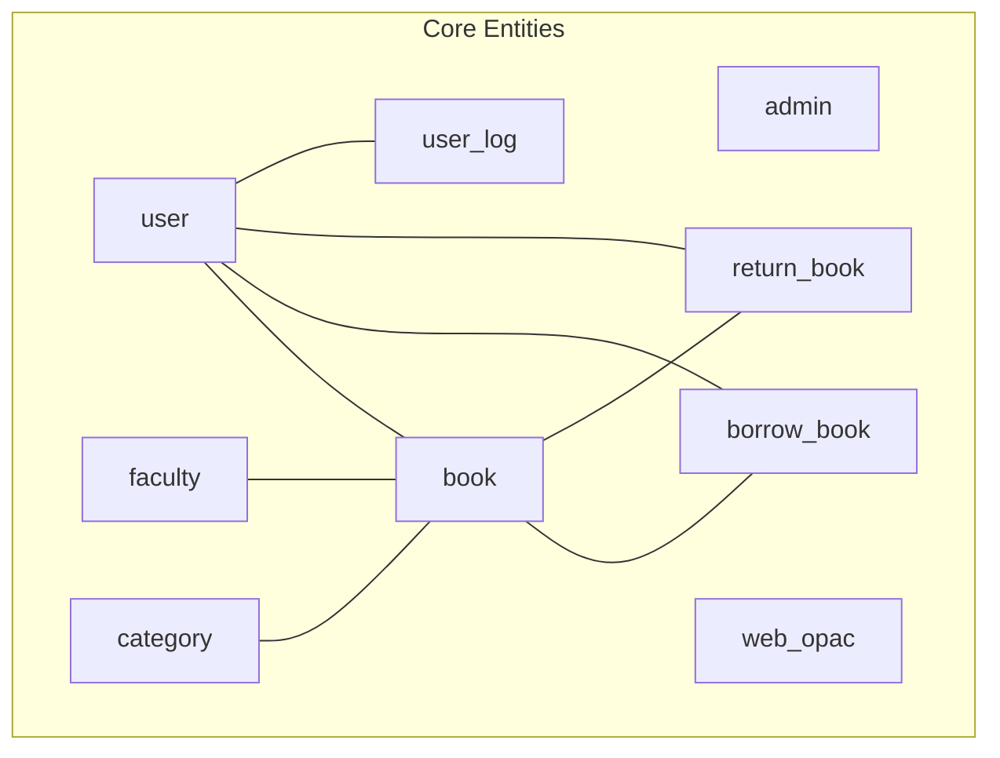
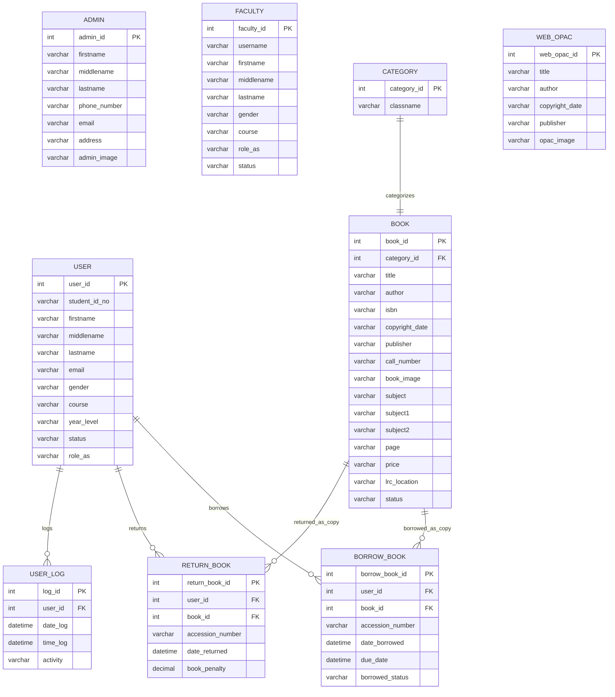
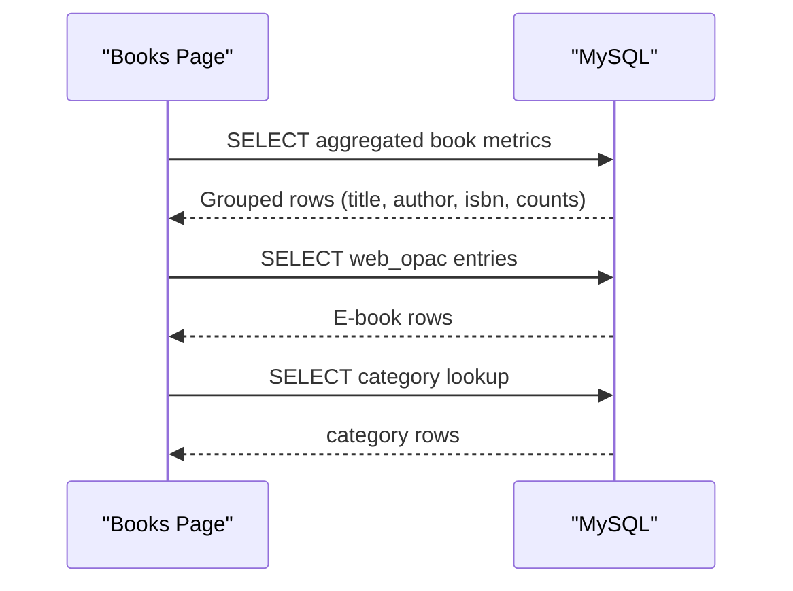
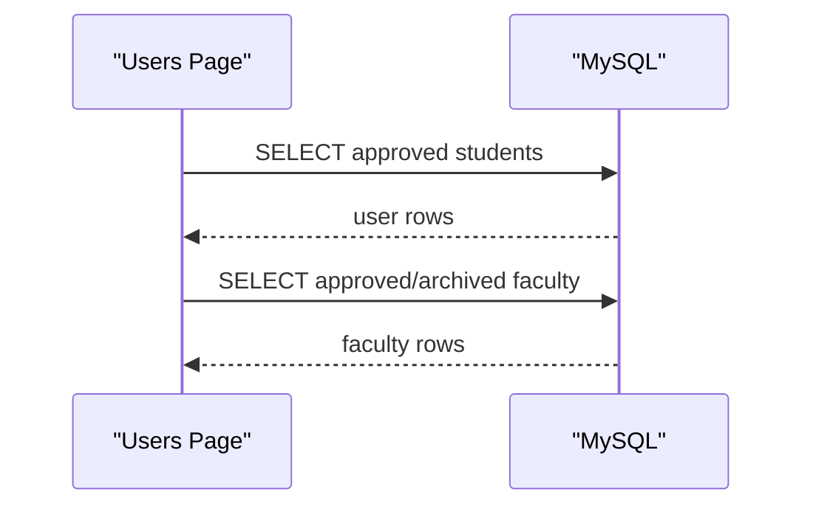
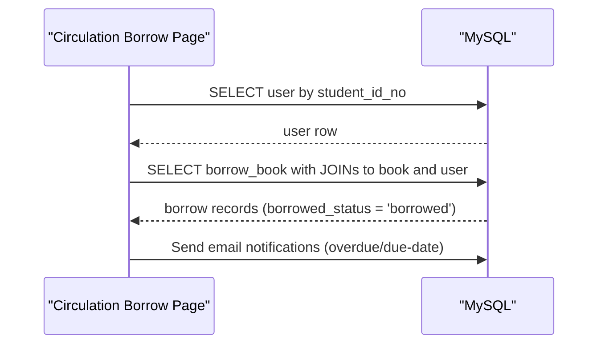

# Database Design

<cite>
**Referenced Files in This Document**
- [dbcon.php](file://admin/config/dbcon.php)
- [admin.php](file://admin/admin.php)
- [books.php](file://admin/books.php)
- [book_add.php](file://admin/book_add.php)
- [users.php](file://admin/users.php)
- [user_student.php](file://admin/user_student.php)
- [user_faculty.php](file://admin/user_faculty.php)
- [circulation.php](file://admin/circulation.php)
- [circulation_borrow.php](file://admin/circulation_borrow.php)
</cite>

## Table of Contents
1. [Introduction](#introduction)
2. [Project Structure](#project-structure)
3. [Core Components](#core-components)
4. [Architecture Overview](#architecture-overview)
5. [Detailed Component Analysis](#detailed-component-analysis)
6. [Dependency Analysis](#dependency-analysis)
7. [Performance Considerations](#performance-considerations)
8. [Troubleshooting Guide](#troubleshooting-guide)
9. [Conclusion](#conclusion)
10. [Appendices](#appendices)

## Introduction
This document presents the database design for the Library Management System. It documents the entity-relationship model, normalized schema, constraints, indexes, and operational patterns observed from the backend code. It also outlines backup and maintenance procedures aligned with the application’s usage.

## Project Structure
The application connects to a MySQL database via a shared connection file. Multiple administrative pages query and manipulate data across users, books, circulation, and related lookup tables. The following diagram maps the primary tables and their relationships as inferred from SQL queries and page logic.

**Diagram sources**
- [dbcon.php:1-19](file://admin/config/dbcon.php#L1-L19)
- [admin.php:43-44](file://admin/admin.php#L43-L44)
- [books.php:70-84](file://admin/books.php#L70-L84)
- [book_add.php:102-120](file://admin/book_add.php#L102-L120)
- [users.php:61-62](file://admin/users.php#L61-L62)
- [user_student.php:67-68](file://admin/user_student.php#L67-L68)
- [user_faculty.php:60-61](file://admin/user_faculty.php#L60-L61)
- [circulation_borrow.php:122-126](file://admin/circulation_borrow.php#L122-L126)

**Section sources**
- [dbcon.php:1-19](file://admin/config/dbcon.php#L1-L19)
- [admin.php:43-44](file://admin/admin.php#L43-L44)
- [books.php:70-84](file://admin/books.php#L70-L84)
- [book_add.php:102-120](file://admin/book_add.php#L102-L120)
- [users.php:61-62](file://admin/users.php#L61-L62)
- [user_student.php:67-68](file://admin/user_student.php#L67-L68)
- [user_faculty.php:60-61](file://admin/user_faculty.php#L60-L61)
- [circulation_borrow.php:122-126](file://admin/circulation_borrow.php#L122-L126)

## Core Components
- Database connection: Centralized in a single file that defines host, credentials, and database name, then opens a mysqli connection used across admin pages.
- Administrative entities:
  - admin: Stores administrator profiles and credentials.
  - user: Student users with personal and academic attributes.
  - faculty: Faculty/staff users with roles and department info.
  - book: Physical/volume-level records with identifiers and metadata.
  - web_opac: E-book catalog entries.
  - category: Lookup table for book categories/locations.
  - borrow_book: Circulation borrowing records linking users to specific book copies.
  - return_book: Return records and penalties.
  - user_log: Attendance/logging records per user.

These components are referenced by numerous pages that issue SELECT, INSERT, UPDATE, and DELETE statements against these tables.

**Section sources**
- [dbcon.php:1-19](file://admin/config/dbcon.php#L1-L19)
- [admin.php:43-44](file://admin/admin.php#L43-L44)
- [books.php:70-84](file://admin/books.php#L70-L84)
- [book_add.php:102-120](file://admin/book_add.php#L102-L120)
- [users.php:61-62](file://admin/users.php#L61-L62)
- [user_student.php:67-68](file://admin/user_student.php#L67-L68)
- [user_faculty.php:60-61](file://admin/user_faculty.php#L60-L61)
- [circulation_borrow.php:122-126](file://admin/circulation_borrow.php#L122-L126)

## Architecture Overview
The system follows a classic relational model with explicit separation of concerns:
- Identity and access: admin, user, faculty tables.
- Catalog and inventory: book, web_opac, category.
- Circulation: borrow_book, return_book.
- Audit and presence: user_log.

**Diagram sources**
- [admin.php:43-44](file://admin/admin.php#L43-L44)
- [books.php:70-84](file://admin/books.php#L70-L84)
- [book_add.php:102-120](file://admin/book_add.php#L102-L120)
- [users.php:61-62](file://admin/users.php#L61-L62)
- [user_student.php:67-68](file://admin/user_student.php#L67-L68)
- [user_faculty.php:60-61](file://admin/user_faculty.php#L60-L61)
- [circulation_borrow.php:122-126](file://admin/circulation_borrow.php#L122-L126)

## Detailed Component Analysis

### Database Connectivity
- Connection parameters and initialization are centralized.
- All admin pages rely on this connection for database operations.

**Section sources**
- [dbcon.php:1-19](file://admin/config/dbcon.php#L1-L19)

### Admin Management
- Lists administrators and supports CRUD operations via dedicated pages.
- Queries reference the admin table.

**Section sources**
- [admin.php:43-44](file://admin/admin.php#L43-L44)

### Book Inventory and E-books
- Books grouped by title/author/isbn with aggregated counts and availability.
- E-books stored separately in web_opac.
- Categories used to classify books by location/class.

**Diagram sources**
- [books.php:70-84](file://admin/books.php#L70-L84)
- [book_add.php:102-120](file://admin/book_add.php#L102-L120)

**Section sources**
- [books.php:70-84](file://admin/books.php#L70-L84)
- [book_add.php:102-120](file://admin/book_add.php#L102-L120)

### Users (Students and Faculty)
- Students and faculty are managed in separate lists with approval and blocking controls.
- Queries filter by status and role.

**Diagram sources**
- [users.php:61-62](file://admin/users.php#L61-L62)
- [user_student.php:67-68](file://admin/user_student.php#L67-L68)
- [user_faculty.php:60-61](file://admin/user_faculty.php#L60-L61)

**Section sources**
- [users.php:61-62](file://admin/users.php#L61-L62)
- [user_student.php:67-68](file://admin/user_student.php#L67-L68)
- [user_faculty.php:60-61](file://admin/user_faculty.php#L60-L61)

### Circulation (Borrowing and Returns)
- Borrowing page searches by student ID and displays recent borrowed records with due-date and overdue reminders.
- Circulation records link users to specific book copies via accession numbers.

**Diagram sources**
- [circulation_borrow.php:63-75](file://admin/circulation_borrow.php#L63-L75)
- [circulation_borrow.php:122-126](file://admin/circulation_borrow.php#L122-L126)

**Section sources**
- [circulation.php:30-36](file://admin/circulation.php#L30-L36)
- [circulation_borrow.php:63-75](file://admin/circulation_borrow.php#L63-L75)
- [circulation_borrow.php:122-126](file://admin/circulation_borrow.php#L122-L126)

### Attendance Logging
- Attendance logs are maintained per user with date/time stamps and activity.

**Section sources**
- [circulation_borrow.php:115-115](file://admin/circulation_borrow.php#L115-L115)

## Dependency Analysis
- All admin pages depend on the shared database connection.
- Business logic is distributed across pages but consistently references the same set of tables.
- Circulation depends on user and book tables; returns depend on the same.

**Diagram sources**
- [dbcon.php:1-19](file://admin/config/dbcon.php#L1-L19)

**Section sources**
- [dbcon.php:1-19](file://admin/config/dbcon.php#L1-L19)

## Performance Considerations
- Aggregation and grouping are used for book listings; ensure appropriate indexes on group-by columns (title, author, isbn) and foreign keys (category_id, book_id, user_id).
- Frequent JOINs in circulation views suggest indexing on join keys and status/date fields.
- Denormalization is evident in book listings that pre-aggregate counts and availability; maintain these aggregates efficiently with triggers or application-side updates to avoid expensive runtime aggregations.

[No sources needed since this section provides general guidance]

## Troubleshooting Guide
- Connection failures: Verify host, username, password, and database name in the connection file.
- Query errors: Review SQL statements in pages that perform SELECT/INSERT/UPDATE/DELETE operations.
- Data anomalies: Confirm referential integrity and cascading behavior for foreign keys.

**Section sources**
- [dbcon.php:13-17](file://admin/config/dbcon.php#L13-L17)

## Conclusion
The Library Management System employs a normalized relational schema centered on users, books, categories, and circulation records. Operational patterns indicate careful use of joins, grouping, and lookup tables. Ensuring proper indexing and maintaining referential integrity will support scalability and reliability.

[No sources needed since this section summarizes without analyzing specific files]

## Appendices

### Data Dictionary

- admin
  - admin_id (PK, integer)
  - firstname (varchar)
  - middlename (varchar)
  - lastname (varchar)
  - phone_number (varchar)
  - email (varchar)
  - address (varchar)
  - admin_image (varchar)

- user
  - user_id (PK, integer)
  - student_id_no (varchar)
  - firstname (varchar)
  - middlename (varchar)
  - lastname (varchar)
  - email (varchar)
  - gender (varchar)
  - course (varchar)
  - year_level (varchar)
  - status (varchar)
  - role_as (varchar)

- faculty
  - faculty_id (PK, integer)
  - username (varchar)
  - firstname (varchar)
  - middlename (varchar)
  - lastname (varchar)
  - gender (varchar)
  - course (varchar)
  - role_as (varchar)
  - status (varchar)

- category
  - category_id (PK, integer)
  - classname (varchar)

- book
  - book_id (PK, integer)
  - category_id (FK to category)
  - title (varchar)
  - author (varchar)
  - isbn (varchar)
  - copyright_date (varchar)
  - publisher (varchar)
  - call_number (varchar)
  - book_image (varchar)
  - subject (varchar)
  - subject1 (varchar)
  - subject2 (varchar)
  - page (varchar)
  - price (varchar)
  - lrc_location (varchar)
  - status (varchar)

- web_opac
  - web_opac_id (PK, integer)
  - title (varchar)
  - author (varchar)
  - copyright_date (varchar)
  - publisher (varchar)
  - opac_image (varchar)

- borrow_book
  - borrow_book_id (PK, integer)
  - user_id (FK to user)
  - book_id (FK to book)
  - accession_number (varchar)
  - date_borrowed (datetime)
  - due_date (datetime)
  - borrowed_status (varchar)

- return_book
  - return_book_id (PK, integer)
  - user_id (FK to user)
  - book_id (FK to book)
  - accession_number (varchar)
  - date_returned (datetime)
  - book_penalty (decimal)

- user_log
  - log_id (PK, integer)
  - user_id (FK to user)
  - date_log (datetime)
  - time_log (datetime)
  - activity (varchar)

### Indexes and Constraints
- Primary Keys: admin_id, user_id, faculty_id, category_id, book_id, web_opac_id, borrow_book_id, return_book_id, user_log_id.
- Foreign Keys: category_id (book), user_id (borrow_book, return_book, user_log).
- Suggested indexes:
  - book(title, author, isbn)
  - book(category_id)
  - borrow_book(user_id, book_id, borrowed_status)
  - return_book(user_id, book_id)
  - user(student_id_no)
  - user_log(user_id, date_log, time_log)

### Sample Queries Observed
- List grouped books with availability and copy counts.
- Retrieve e-books for OPAC.
- Fetch user/faculty records filtered by status and role.
- Search user by student ID for borrowing.
- Join borrow records with user and book for circulation reports.

**Section sources**
- [books.php:70-84](file://admin/books.php#L70-L84)
- [book_add.php:102-120](file://admin/book_add.php#L102-L120)
- [users.php:61-62](file://admin/users.php#L61-L62)
- [user_student.php:67-68](file://admin/user_student.php#L67-L68)
- [user_faculty.php:60-61](file://admin/user_faculty.php#L60-L61)
- [circulation_borrow.php:63-75](file://admin/circulation_borrow.php#L63-L75)
- [circulation_borrow.php:122-126](file://admin/circulation_borrow.php#L122-L126)

### Backup and Maintenance Procedures
- Backups: Schedule regular logical backups of the database using mysqldump or equivalent.
- Integrity checks: Periodically run CHECK TABLE and ANALYZE TABLE for critical tables.
- Index maintenance: Rebuild fragmented indexes and update table statistics.
- Log cleanup: Archive or purge old user_log entries to control growth.
- Monitoring: Track slow queries and missing indexes using slow query logs and EXPLAIN plans.

[No sources needed since this section provides general guidance]