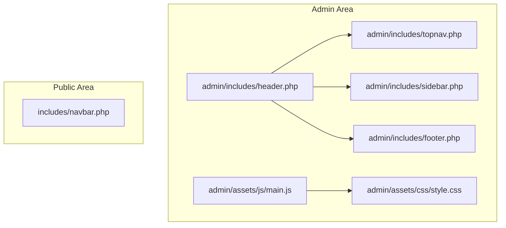
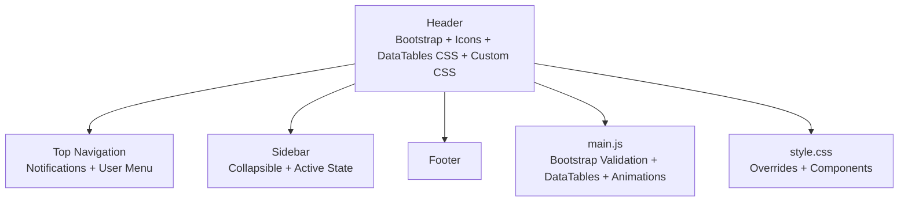
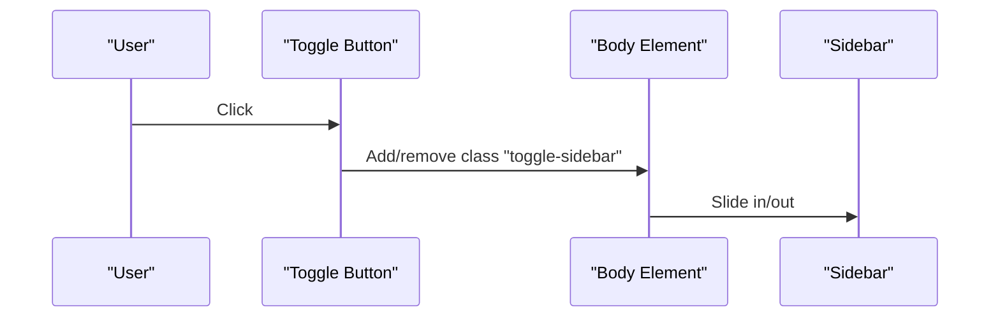
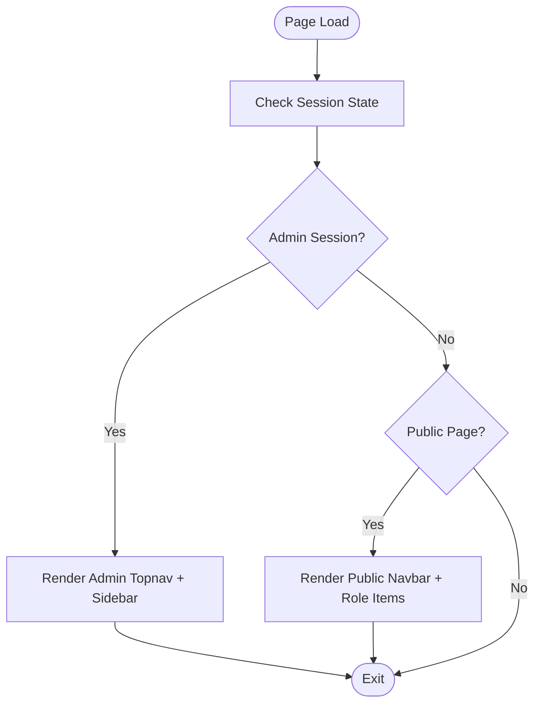
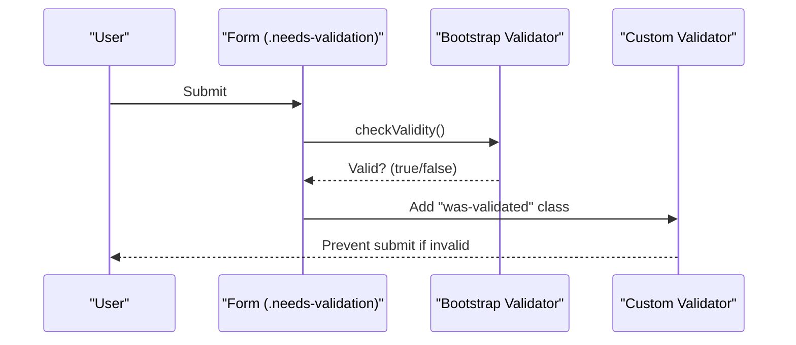
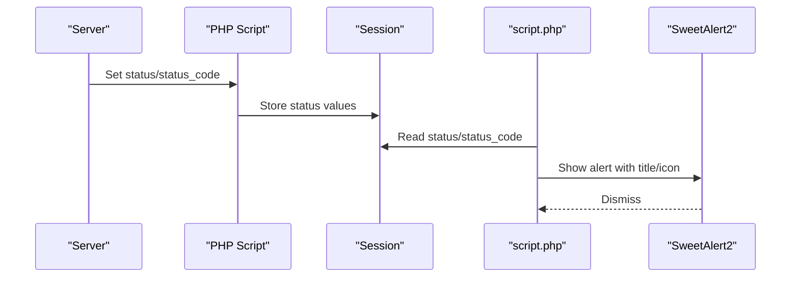
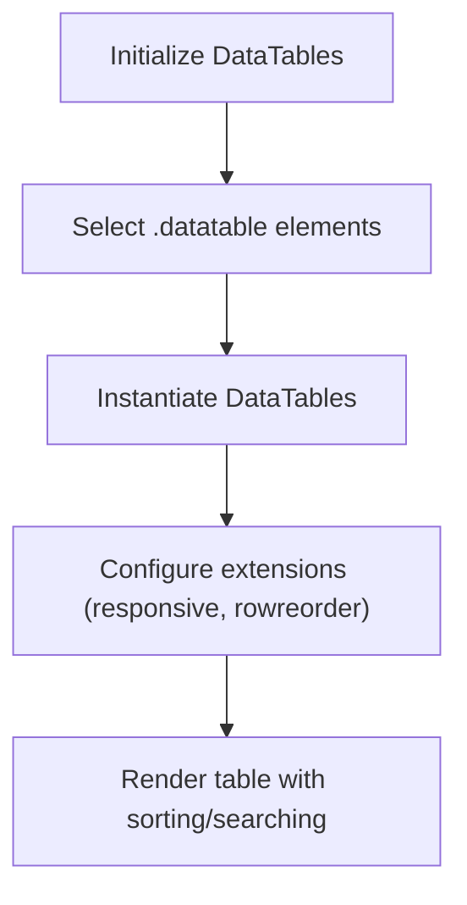
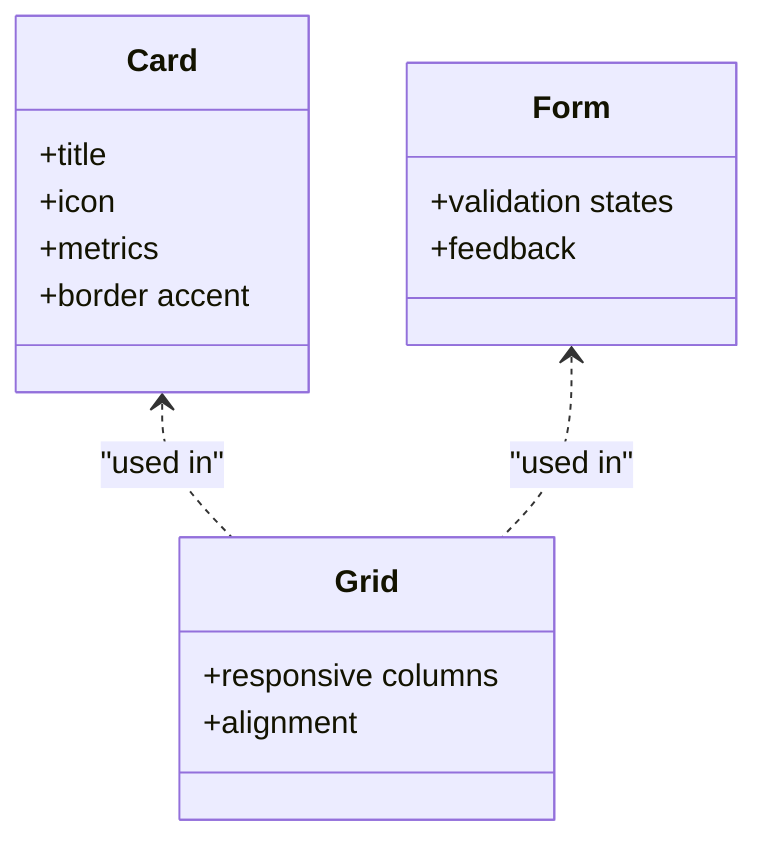
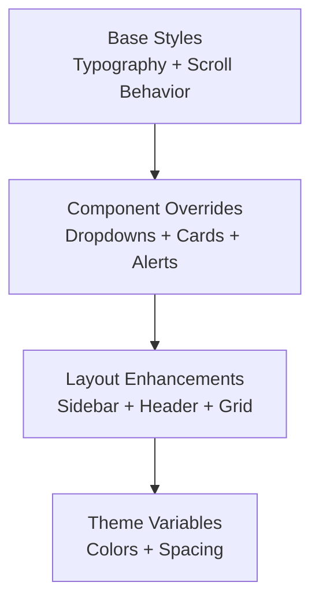
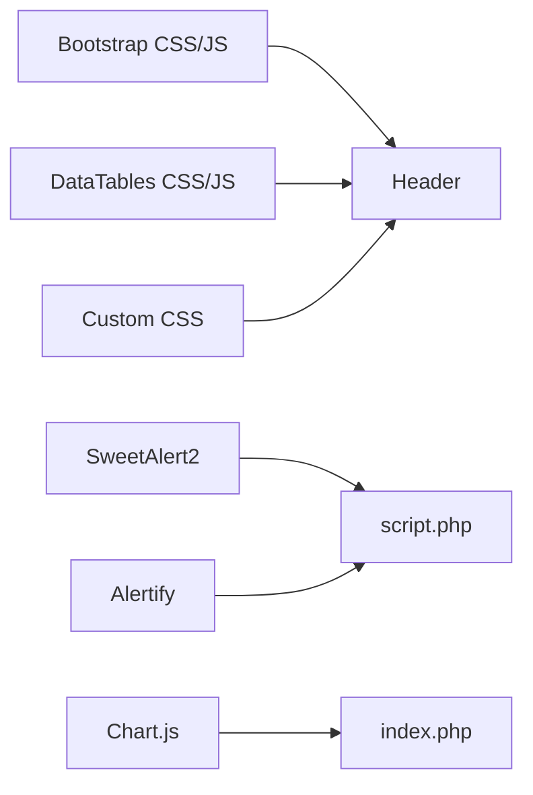

# Frontend Components and UI

<cite>
**Referenced Files in This Document**
- [header.php](file://admin/includes/header.php)
- [sidebar.php](file://admin/includes/sidebar.php)
- [topnav.php](file://admin/includes/topnav.php)
- [footer.php](file://admin/includes/footer.php)
- [navbar.php](file://includes/navbar.php)
- [main.js](file://admin/assets/js/main.js)
- [validation.js](file://admin/assets/js/validation.js)
- [style.css](file://admin/assets/css/style.css)
- [bootstrap.bundle.min.js](file://admin/assets/js/bootstrap.bundle.min.js)
- [jquery.dataTables.min.js](file://admin/assets/js/jquery.dataTables.min.js)
- [index.php](file://admin/index.php)
- [script.php](file://admin/includes/script.php)
</cite>

## Table of Contents
1. [Introduction](#introduction)
2. [Project Structure](#project-structure)
3. [Core Components](#core-components)
4. [Architecture Overview](#architecture-overview)
5. [Detailed Component Analysis](#detailed-component-analysis)
6. [Dependency Analysis](#dependency-analysis)
7. [Performance Considerations](#performance-considerations)
8. [Troubleshooting Guide](#troubleshooting-guide)
9. [Conclusion](#conclusion)

## Introduction
This document describes the frontend components and user interface patterns used across the administrative and public areas of the library system. It covers:
- Responsive navigation with collapsible menus and role-aware visibility
- Form validation using Bootstrap’s built-in validation and custom scripts
- Modal dialogs, alerts, and notifications for user feedback
- DataTables integration for searchable and sortable data displays
- Bootstrap 5 components usage (cards, forms, layout grids)
- Custom CSS styling and theme customization
- Accessibility and cross-browser compatibility considerations

## Project Structure
The frontend is composed of reusable PHP includes for headers, navigation, and footers, paired with JavaScript and CSS assets. The admin area uses a fixed header, collapsible sidebar, and a notification dropdown. The public area provides a responsive navbar with role-aware items.

**Diagram sources**
- [header.php:14-73](file://admin/includes/header.php#L14-L73)
- [sidebar.php:1-70](file://admin/includes/sidebar.php#L1-L70)
- [topnav.php:1-187](file://admin/includes/topnav.php#L1-L187)
- [footer.php:1-8](file://admin/includes/footer.php#L1-L8)
- [main.js:1-274](file://admin/assets/js/main.js#L1-L274)
- [style.css:1-800](file://admin/assets/css/style.css#L1-L800)
- [navbar.php:1-88](file://includes/navbar.php#L1-L88)

**Section sources**
- [header.php:14-73](file://admin/includes/header.php#L14-L73)
- [sidebar.php:1-70](file://admin/includes/sidebar.php#L1-L70)
- [topnav.php:1-187](file://admin/includes/topnav.php#L1-L187)
- [footer.php:1-8](file://admin/includes/footer.php#L1-L8)
- [navbar.php:1-88](file://includes/navbar.php#L1-L88)

## Core Components
- Navigation system
  - Fixed header with toggle button and responsive search bar
  - Collapsible sidebar with active-state highlighting and nested items
  - Top navigation with notifications and user profile dropdown
  - Public responsive navbar with role-aware items and logout flow
- Validation system
  - Bootstrap 5 native validation via needs-validation classes
  - Custom validation script to enforce form validity on submit
- Feedback and dialogs
  - SweetAlert2 for confirmation and status messages
  - Alertify for lightweight alerts
  - Bootstrap’s built-in validation feedback
- Data presentation
  - DataTables for searchable/sortable/paginated tables
  - Charts.js for dashboard visualizations
- Layout and styling
  - Bootstrap 5 grid and components (cards, forms, badges)
  - Custom CSS overrides and theme variables

**Section sources**
- [header.php:17-62](file://admin/includes/header.php#L17-L62)
- [sidebar.php:1-70](file://admin/includes/sidebar.php#L1-L70)
- [topnav.php:1-187](file://admin/includes/topnav.php#L1-L187)
- [main.js:237-249](file://admin/assets/js/main.js#L237-L249)
- [validation.js:1-25](file://admin/assets/js/validation.js#L1-L25)
- [script.php:41-55](file://admin/includes/script.php#L41-L55)
- [jquery.dataTables.min.js:1-192](file://admin/assets/js/jquery.dataTables.min.js#L1-L192)
- [style.css:34-86](file://admin/assets/css/style.css#L34-L86)

## Architecture Overview
The admin pages share a common layout:
- Header includes Bootstrap CSS, icons, DataTables CSS, and custom styles
- Sidebar provides navigation with active highlighting
- Top navigation renders notifications and user menu
- Footer provides branding
- Scripts include Bootstrap bundle, DataTables, SweetAlert2, and initialization logic

**Diagram sources**
- [header.php:17-62](file://admin/includes/header.php#L17-L62)
- [topnav.php:1-187](file://admin/includes/topnav.php#L1-L187)
- [sidebar.php:1-70](file://admin/includes/sidebar.php#L1-L70)
- [footer.php:1-8](file://admin/includes/footer.php#L1-L8)
- [main.js:237-249](file://admin/assets/js/main.js#L237-L249)
- [style.css:34-86](file://admin/assets/css/style.css#L34-L86)

## Detailed Component Analysis

### Responsive Navigation System
- Fixed header with toggle button controls sidebar visibility
- Collapsible sidebar with nested items and active-state indicators
- Top navigation dropdowns for notifications and user actions
- Public navbar with role-aware items and logout flow

**Diagram sources**
- [header.php:17-28](file://admin/includes/header.php#L17-L28)
- [main.js:37-41](file://admin/assets/js/main.js#L37-L41)
- [style.css:529-578](file://admin/assets/css/style.css#L529-L578)

**Section sources**
- [header.php:17-28](file://admin/includes/header.php#L17-L28)
- [sidebar.php:1-70](file://admin/includes/sidebar.php#L1-L70)
- [topnav.php:1-187](file://admin/includes/topnav.php#L1-L187)
- [main.js:37-41](file://admin/assets/js/main.js#L37-L41)
- [style.css:529-578](file://admin/assets/css/style.css#L529-L578)

### Role-Based Visibility and Access Control
- Admin area uses session-based checks to render notifications and dropdown menus
- Public navbar conditionally renders items based on authentication state and role
- Logout handled via form submission to a central endpoint

**Diagram sources**
- [topnav.php:12-17](file://admin/includes/topnav.php#L12-L17)
- [navbar.php:1-88](file://includes/navbar.php#L1-L88)

**Section sources**
- [topnav.php:12-17](file://admin/includes/topnav.php#L12-L17)
- [navbar.php:1-88](file://includes/navbar.php#L1-L88)

### Form Validation System
- Bootstrap 5 native validation via needs-validation classes and was-validated feedback
- Custom script to intercept form submission and enforce validity
- Initialization of Bootstrap components and validation on load

**Diagram sources**
- [validation.js:1-25](file://admin/assets/js/validation.js#L1-L25)
- [main.js:237-249](file://admin/assets/js/main.js#L237-L249)

**Section sources**
- [validation.js:1-25](file://admin/assets/js/validation.js#L1-L25)
- [main.js:237-249](file://admin/assets/js/main.js#L237-L249)

### Modal Dialogs, Alerts, and Notifications
- SweetAlert2 integration for confirmation and status messages
- Alertify for lightweight alerts
- Notification dropdown in top navigation aggregates counts and items
- Session-based status messages rendered into SweetAlert2

**Diagram sources**
- [script.php:41-55](file://admin/includes/script.php#L41-L55)

**Section sources**
- [script.php:41-55](file://admin/includes/script.php#L41-L55)
- [topnav.php:20-44](file://admin/includes/topnav.php#L20-L44)

### DataTables Integration
- DataTables initialized on elements with a specific class
- Includes row reorder and responsive extensions
- Bootstrap 5 styling integrated with DataTables CSS

**Diagram sources**
- [main.js:254-257](file://admin/assets/js/main.js#L254-L257)
- [jquery.dataTables.min.js:1-192](file://admin/assets/js/jquery.dataTables.min.js#L1-L192)
- [header.php:43-47](file://admin/includes/header.php#L43-L47)

**Section sources**
- [main.js:254-257](file://admin/assets/js/main.js#L254-L257)
- [jquery.dataTables.min.js:1-192](file://admin/assets/js/jquery.dataTables.min.js#L1-L192)
- [header.php:43-47](file://admin/includes/header.php#L43-L47)

### Bootstrap 5 Components Usage
- Cards for dashboard metrics with icons and borders
- Forms with validation states and custom styling
- Grid layout for responsive dashboards and charts
- Utilities for spacing, alignment, and typography

**Diagram sources**
- [style.css:207-242](file://admin/assets/css/style.css#L207-L242)
- [style.css:34-86](file://admin/assets/css/style.css#L34-L86)
- [index.php:42-406](file://admin/index.php#L42-L406)

**Section sources**
- [style.css:207-242](file://admin/assets/css/style.css#L207-L242)
- [style.css:34-86](file://admin/assets/css/style.css#L34-L86)
- [index.php:42-406](file://admin/index.php#L42-L406)

### Custom CSS Styling and Theme Customization
- Root-level smooth scrolling and base typography
- Overrides for dropdowns, cards, alerts, and breadcrumbs
- Sidebar and header responsive behavior
- Theme variables via CSS custom properties and Bootstrap classes

**Diagram sources**
- [style.css:1-30](file://admin/assets/css/style.css#L1-L30)
- [style.css:91-170](file://admin/assets/css/style.css#L91-L170)
- [style.css:529-578](file://admin/assets/css/style.css#L529-L578)

**Section sources**
- [style.css:1-30](file://admin/assets/css/style.css#L1-L30)
- [style.css:91-170](file://admin/assets/css/style.css#L91-L170)
- [style.css:529-578](file://admin/assets/css/style.css#L529-L578)

### Accessibility and Cross-Browser Compatibility
- Semantic HTML and ARIA attributes for navigation and modals
- Focus management for dropdowns and modals
- Responsive breakpoints and viewport meta tag for mobile
- Cross-browser support via Bootstrap 5 and polyfills included in the bundle

**Section sources**
- [header.php:18-21](file://admin/includes/header.php#L18-L21)
- [bootstrap.bundle.min.js:1-7](file://admin/assets/js/bootstrap.bundle.min.js#L1-L7)

## Dependency Analysis
The admin pages depend on:
- Bootstrap 5 for layout, components, and JavaScript plugins
- DataTables for advanced table features
- SweetAlert2 and Alertify for user feedback
- Chart.js for dashboard visualizations
- Custom CSS for theming and overrides

**Diagram sources**
- [header.php:17-62](file://admin/includes/header.php#L17-L62)
- [script.php:17-31](file://admin/includes/script.php#L17-L31)
- [jquery.dataTables.min.js:1-192](file://admin/assets/js/jquery.dataTables.min.js#L1-L192)
- [index.php:216-236](file://admin/index.php#L216-L236)

**Section sources**
- [header.php:17-62](file://admin/includes/header.php#L17-L62)
- [script.php:17-31](file://admin/includes/script.php#L17-L31)
- [jquery.dataTables.min.js:1-192](file://admin/assets/js/jquery.dataTables.min.js#L1-L192)
- [index.php:216-236](file://admin/index.php#L216-L236)

## Performance Considerations
- Lazy-load heavy assets (charts, modals) only when needed
- Minimize DOM updates during scroll and resize events
- Use DataTables pagination and server-side processing for large datasets
- Defer non-critical scripts until after initial render

## Troubleshooting Guide
- Forms not validating: ensure forms have the validation class and the custom validator is loaded
- DataTables not rendering: verify the selector and that DataTables scripts are included
- Modals not opening: confirm Bootstrap’s modal plugin is present and initialized
- Notifications not appearing: check session status values and SweetAlert2 initialization

**Section sources**
- [validation.js:1-25](file://admin/assets/js/validation.js#L1-L25)
- [main.js:254-257](file://admin/assets/js/main.js#L254-L257)
- [script.php:41-55](file://admin/includes/script.php#L41-L55)

## Conclusion
The frontend leverages Bootstrap 5 for responsive layout and components, integrates DataTables for robust data handling, and employs SweetAlert2 and Alertify for user feedback. The navigation system is role-aware and responsive, with collapsible sidebar and notification dropdowns. Custom CSS provides consistent theming and overrides for enhanced UX. Following the guidelines above ensures maintainability, accessibility, and cross-browser compatibility.