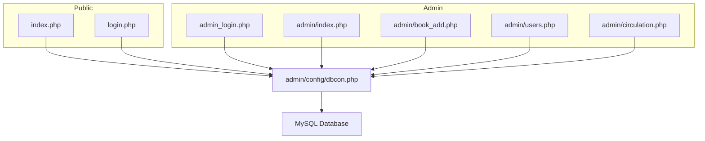
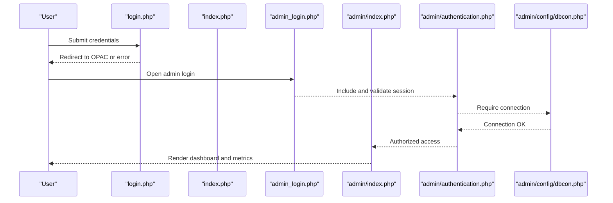
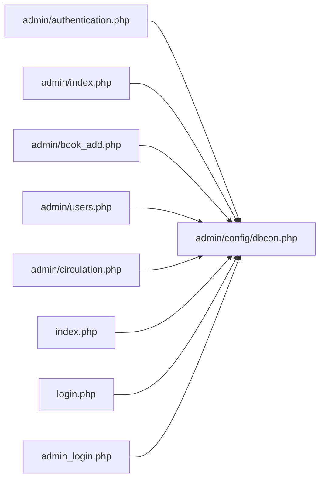

# Getting Started

<cite>
**Referenced Files in This Document**
- [admin/config/dbcon.php](file://admin/config/dbcon.php)
- [composer.json](file://composer.json)
- [admin/index.php](file://admin/index.php)
- [admin/authentication.php](file://admin/authentication.php)
- [admin/includes/sidebar.php](file://admin/includes/sidebar.php)
- [admin/includes/header.php](file://admin/includes/header.php)
- [index.php](file://index.php)
- [login.php](file://login.php)
- [admin_login.php](file://admin_login.php)
- [admin/book_add.php](file://admin/book_add.php)
- [admin/users.php](file://admin/users.php)
- [admin/circulation.php](file://admin/circulation.php)
</cite>

## Table of Contents
1. [Introduction](#introduction)
2. [Project Structure](#project-structure)
3. [Core Components](#core-components)
4. [Architecture Overview](#architecture-overview)
5. [Detailed Component Analysis](#detailed-component-analysis)
6. [Dependency Analysis](#dependency-analysis)
7. [Performance Considerations](#performance-considerations)
8. [Troubleshooting Guide](#troubleshooting-guide)
9. [Conclusion](#conclusion)
10. [Appendices](#appendices)

## Introduction
This guide helps you install and start using the Library Management System. It covers environment prerequisites, database setup, configuration, initial administration setup, and quick-start workflows for adding books, registering users, and processing borrowing transactions.

## Project Structure
The system is organized into:
- Frontend public area for library patrons (search, browse, OPAC-like views)
- Admin backend for librarians/staff (dashboard, collections, users, circulation, reports)
- Shared includes for headers, navigation, and scripts
- Database connection configuration under admin/config
- Composer-managed third-party libraries (PHPMailer)

**Diagram sources**
- [index.php:1-174](file://index.php#L1-L174)
- [login.php:1-121](file://login.php#L1-L121)
- [admin_login.php:1-107](file://admin_login.php#L1-L107)
- [admin/index.php:1-414](file://admin/index.php#L1-L414)
- [admin/book_add.php:1-610](file://admin/book_add.php#L1-L610)
- [admin/users.php:1-345](file://admin/users.php#L1-L345)
- [admin/circulation.php:1-91](file://admin/circulation.php#L1-L91)
- [admin/config/dbcon.php:1-19](file://admin/config/dbcon.php#L1-L19)

**Section sources**
- [index.php:1-174](file://index.php#L1-L174)
- [login.php:1-121](file://login.php#L1-L121)
- [admin_login.php:1-107](file://admin_login.php#L1-L107)
- [admin/index.php:1-414](file://admin/index.php#L1-L414)
- [admin/book_add.php:1-610](file://admin/book_add.php#L1-L610)
- [admin/users.php:1-345](file://admin/users.php#L1-L345)
- [admin/circulation.php:1-91](file://admin/circulation.php#L1-L91)
- [admin/config/dbcon.php:1-19](file://admin/config/dbcon.php#L1-L19)

## Core Components
- Database connectivity: centralized in admin/config/dbcon.php
- Admin authentication and session enforcement: admin/authentication.php
- Public OPAC/search: index.php
- Admin dashboard: admin/index.php
- Navigation: admin/includes/sidebar.php
- Page scaffolding: admin/includes/header.php

Key responsibilities:
- dbcon.php establishes MySQL connection and exits on failure
- authentication.php enforces admin sessions and role checks
- index.php provides patron-facing search and browsing
- admin/index.php renders admin metrics and charts
- sidebar.php drives admin menu navigation
- header.php injects styles/scripts and enforces clean URLs

**Section sources**
- [admin/config/dbcon.php:1-19](file://admin/config/dbcon.php#L1-L19)
- [admin/authentication.php:1-28](file://admin/authentication.php#L1-L28)
- [index.php:1-174](file://index.php#L1-L174)
- [admin/index.php:1-414](file://admin/index.php#L1-L414)
- [admin/includes/sidebar.php:1-70](file://admin/includes/sidebar.php#L1-L70)
- [admin/includes/header.php:1-73](file://admin/includes/header.php#L1-L73)

## Architecture Overview
High-level flow:
- Public users access login.php, then index.php for OPAC
- Admin users access admin_login.php, then admin/index.php for dashboard
- All admin pages include admin/authentication.php to enforce session and role
- Database queries are executed via the shared admin/config/dbcon.php connection

**Diagram sources**
- [login.php:1-121](file://login.php#L1-L121)
- [index.php:1-174](file://index.php#L1-L174)
- [admin_login.php:1-107](file://admin_login.php#L1-L107)
- [admin/index.php:1-414](file://admin/index.php#L1-L414)
- [admin/authentication.php:1-28](file://admin/authentication.php#L1-L28)
- [admin/config/dbcon.php:1-19](file://admin/config/dbcon.php#L1-L19)

## Detailed Component Analysis

### System Requirements
- PHP runtime
  - The project uses MySQLi procedural style and prepared statements. Ensure your PHP version supports these features.
- MySQL database
  - The system connects to a MySQL database using mysqli_connect and executes SELECT/INSERT/UPDATE statements.
- Web server
  - Apache or Nginx serving static and dynamic PHP pages
- PHP extensions
  - mysqli for database connectivity
  - GD or imagick for image handling (used in forms and uploads)
  - openssl for secure communications (when sending mail)
  - curl for external integrations (optional)
- Composer dependencies
  - phpmailer/phpmailer ^6.9 is required for email features

Notes:
- The codebase uses mysqli_connect and mysqli_* functions; ensure mysqli extension is enabled.
- Prepared statements are used in several admin scripts (e.g., admin/add_account.php), indicating PDO or MySQLi ext support is sufficient.
- Ensure upload directories exist and are writable for images and documents.

**Section sources**
- [admin/config/dbcon.php:1-19](file://admin/config/dbcon.php#L1-L19)
- [composer.json:1-6](file://composer.json#L1-L6)
- [admin/book_add.php:1-610](file://admin/book_add.php#L1-L610)

### Installation Steps
1. Environment setup
   - Install a web server (Apache/Nginx) and PHP with mysqli, GD, openssl, curl
   - Enable short_open_tag if needed by your deployment (not required by the code shown)
2. Database setup
   - Create a MySQL database and user with appropriate privileges
   - Update admin/config/dbcon.php with host, username, password, and database name
3. Application deployment
   - Place project files under your web server’s document root
   - Ensure permissions allow writing to uploads/* directories if you plan to upload images
4. Composer dependencies
   - Run composer install to fetch phpmailer/phpmailer per composer.json
5. Initial configuration
   - Confirm admin/config/dbcon.php connection details
   - Verify base URLs and redirects in includes/header.php and related files

Verification:
- Visit admin_login.php to ensure admin pages load and authentication works
- Visit index.php to confirm public OPAC loads

**Section sources**
- [admin/config/dbcon.php:1-19](file://admin/config/dbcon.php#L1-L19)
- [composer.json:1-6](file://composer.json#L1-L6)
- [admin/includes/header.php:1-73](file://admin/includes/header.php#L1-L73)

### Initial Admin Setup
- Default login credentials
  - The admin login page is present and protected by authentication. There is no embedded default admin credential in the codebase; configure your admin accounts via the admin interface after initial setup.
- Accessing admin
  - Navigate to admin_login.php
  - After successful login, admin pages require admin/authentication.php, which enforces session and role checks

Note:
- If you encounter redirect loops or “Login to Access Dashboard,” ensure sessions are working and cookies are accepted by the browser.

**Section sources**
- [admin_login.php:1-107](file://admin_login.php#L1-L107)
- [admin/authentication.php:1-28](file://admin/authentication.php#L1-L28)

### Basic System Navigation and Dashboard Overview
- Admin dashboard
  - After logging in, admin/index.php displays:
    - Totals for titles, volumes, students, faculty/staff, borrowed books, overdue books
    - Fines collected for the month
    - Charts for top library users (students/faculty/staff) and monthly attendance
- Navigation sidebar
  - Use admin/includes/sidebar.php to move between:
    - Dashboard
    - Book Collection (add/view/edit books)
    - Users (manage students and faculty/staff)
    - Attendance
    - Circulation (borrow/return)
    - Reports
    - Archived items
    - Block Users

**Section sources**
- [admin/index.php:1-414](file://admin/index.php#L1-L414)
- [admin/includes/sidebar.php:1-70](file://admin/includes/sidebar.php#L1-L70)

### Quick Start Examples

#### Add a Book
1. Go to Admin → Book Collection → Add Book
2. Fill in metadata (title, author, ISBN, publisher, copyright year, publication place, call number)
3. Enter number of copies and unique accession numbers
4. Optionally upload a cover image
5. Submit the form

Outcome:
- New records are inserted into the collection; duplicates are prevented by validation and database checks.

**Section sources**
- [admin/book_add.php:1-610](file://admin/book_add.php#L1-L610)

#### Register a User
1. Go to Admin → Users → Students or Faculty/Staff
2. Use the respective management screens to add or approve users
3. Approve pending registrations as needed

Outcome:
- Approved users can log in via the public login page.

**Section sources**
- [admin/users.php:1-345](file://admin/users.php#L1-L345)

#### Process a Book Borrowing Transaction
1. Go to Admin → Circulation
2. Select Borrow Book (Student or Faculty/Staff)
3. Enter user identifier and book details
4. Confirm checkout and due date
5. On return, use Return Book (Student or Faculty/Staff) to record returns and penalties if applicable

Outcome:
- Borrowing records are created and tracked; overdue books are highlighted on the dashboard.

**Section sources**
- [admin/circulation.php:1-91](file://admin/circulation.php#L1-L91)

## Dependency Analysis
- Database connectivity
  - admin/config/dbcon.php centralizes mysqli connection and terminates on failure
- Admin session enforcement
  - admin/authentication.php requires session presence and restricts access to Admin/Staff roles
- Public OPAC
  - index.php includes dbcon.php and enforces session for authenticated users
- Admin UI scaffolding
  - admin/includes/header.php injects CSS/JS and enforces clean URLs by redirecting .php extensions

**Diagram sources**
- [admin/authentication.php:1-28](file://admin/authentication.php#L1-L28)
- [admin/config/dbcon.php:1-19](file://admin/config/dbcon.php#L1-L19)
- [admin/index.php:1-414](file://admin/index.php#L1-L414)
- [admin/book_add.php:1-610](file://admin/book_add.php#L1-L610)
- [admin/users.php:1-345](file://admin/users.php#L1-L345)
- [admin/circulation.php:1-91](file://admin/circulation.php#L1-L91)
- [index.php:1-174](file://index.php#L1-L174)
- [login.php:1-121](file://login.php#L1-L121)
- [admin_login.php:1-107](file://admin_login.php#L1-L107)

**Section sources**
- [admin/config/dbcon.php:1-19](file://admin/config/dbcon.php#L1-L19)
- [admin/authentication.php:1-28](file://admin/authentication.php#L1-L28)
- [admin/index.php:1-414](file://admin/index.php#L1-L414)
- [admin/book_add.php:1-610](file://admin/book_add.php#L1-L610)
- [admin/users.php:1-345](file://admin/users.php#L1-L345)
- [admin/circulation.php:1-91](file://admin/circulation.php#L1-L91)
- [index.php:1-174](file://index.php#L1-L174)
- [login.php:1-121](file://login.php#L1-L121)
- [admin_login.php:1-107](file://admin_login.php#L1-L107)

## Performance Considerations
- Use prepared statements consistently (already used in admin scripts) to prevent SQL injection and improve performance for repeated queries.
- Index frequently filtered columns (e.g., title, author, status, due_date) in the database for faster OPAC searches and circulation reports.
- Minimize heavy queries on dashboard rendering; pagination and limits are already applied for charts and counts.
- Keep uploads directory organized and periodically prune unused images.

## Troubleshooting Guide
- Cannot connect to database
  - Verify host, username, password, and database name in admin/config/dbcon.php
  - Ensure mysqli extension is enabled and the database service is reachable
- Admin page shows “Login to Access Dashboard”
  - Confirm session cookie handling and browser support for cookies
  - Check that admin/authentication.php runs before rendering admin pages
- Public OPAC not loading
  - Ensure index.php includes admin/config/dbcon.php and handles session checks
  - Check for .php extension redirects in admin/includes/header.php
- Admin login page appears but submits fail
  - Review CAPTCHA keys and network accessibility
  - Confirm server-side validation and session handling

**Section sources**
- [admin/config/dbcon.php:1-19](file://admin/config/dbcon.php#L1-L19)
- [admin/authentication.php:1-28](file://admin/authentication.php#L1-L28)
- [admin/includes/header.php:1-73](file://admin/includes/header.php#L1-L73)
- [index.php:1-174](file://index.php#L1-L174)
- [admin_login.php:1-107](file://admin_login.php#L1-L107)

## Conclusion
You now have the essentials to install the Library Management System, configure the database and environment, set up admin access, and perform core tasks like adding books, managing users, and processing borrow/return transactions. Use the admin dashboard for insights and the sidebar to navigate features.

## Appendices

### Appendix A: Public OPAC Overview
- Purpose: Browse and search the library collection
- Features: Search bar, thumbnail browsing, book details, patron login

**Section sources**
- [index.php:1-174](file://index.php#L1-L174)
- [login.php:1-121](file://login.php#L1-L121)