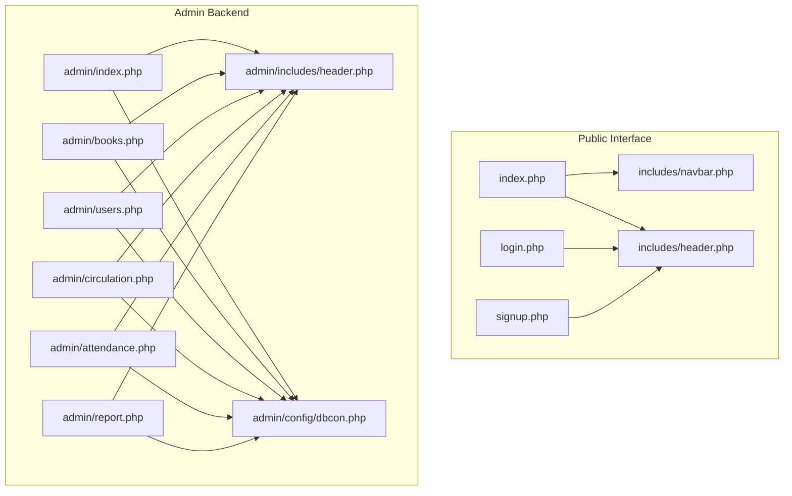
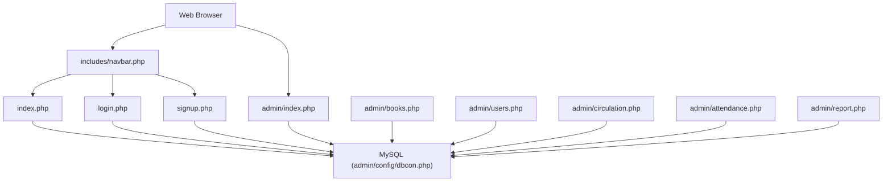
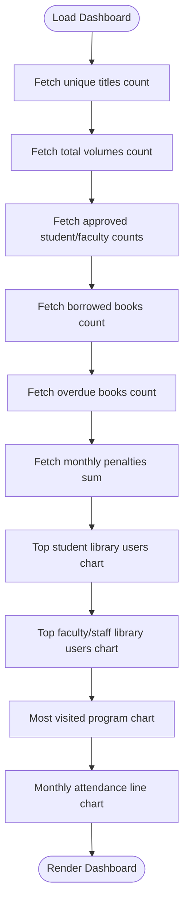
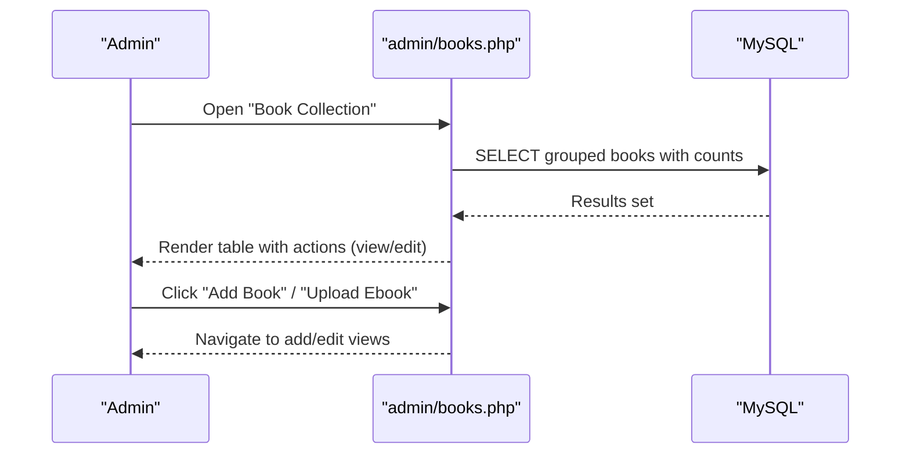
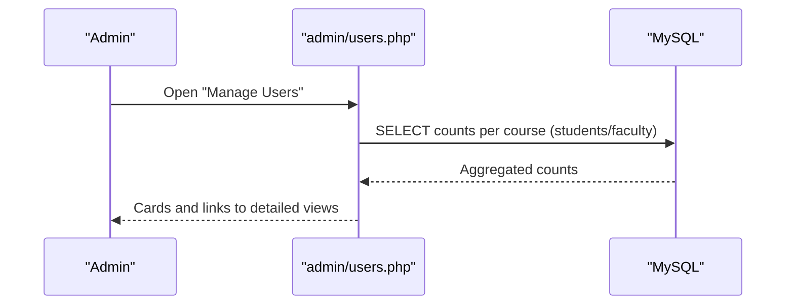
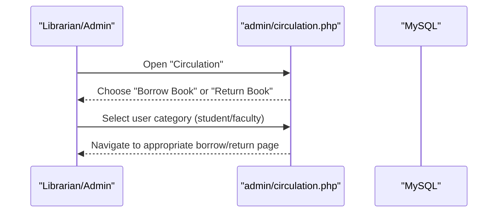
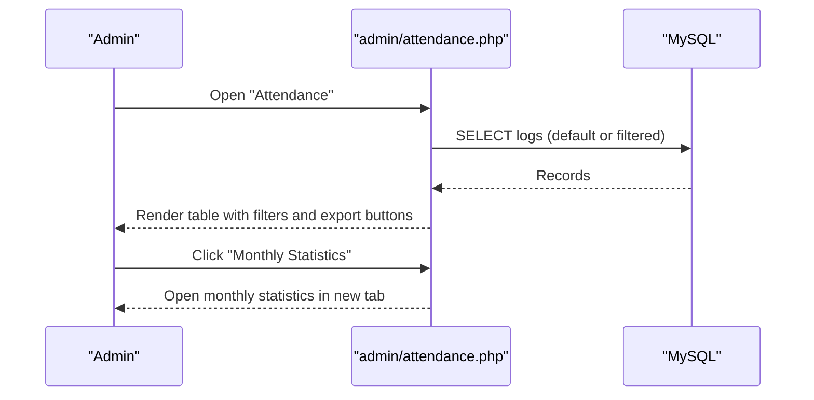
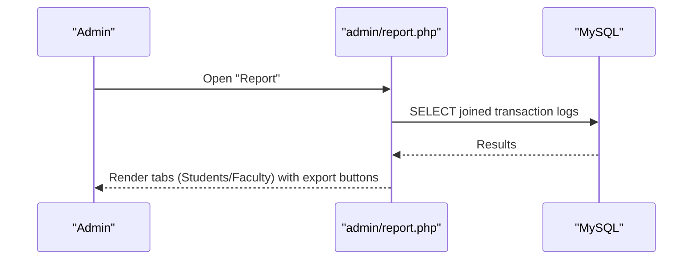
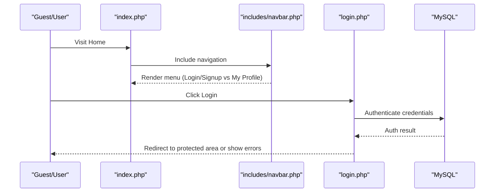
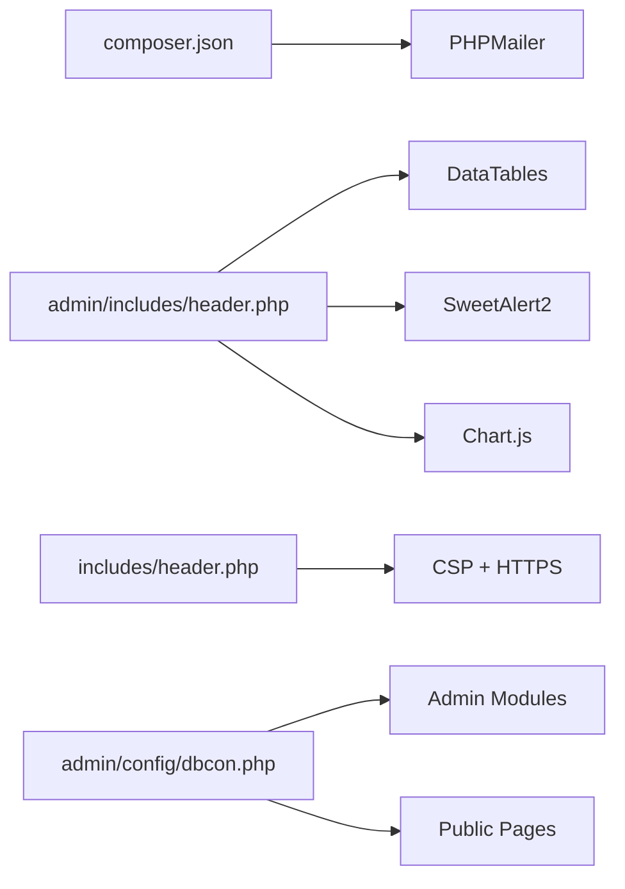

# Project Overview

<cite>
**Referenced Files in This Document**
- [admin/index.php](file://admin/index.php)
- [index.php](file://index.php)
- [admin/config/dbcon.php](file://admin/config/dbcon.php)
- [composer.json](file://composer.json)
- [admin/includes/header.php](file://admin/includes/header.php)
- [admin/books.php](file://admin/books.php)
- [admin/users.php](file://admin/users.php)
- [admin/circulation.php](file://admin/circulation.php)
- [admin/attendance.php](file://admin/attendance.php)
- [admin/report.php](file://admin/report.php)
- [login.php](file://login.php)
- [signup.php](file://signup.php)
- [includes/navbar.php](file://includes/navbar.php)
- [includes/header.php](file://includes/header.php)
</cite>

## Table of Contents
1. [Introduction](#introduction)
2. [Project Structure](#project-structure)
3. [Core Components](#core-components)
4. [Architecture Overview](#architecture-overview)
5. [Detailed Component Analysis](#detailed-component-analysis)
6. [Dependency Analysis](#dependency-analysis)
7. [Performance Considerations](#performance-considerations)
8. [Troubleshooting Guide](#troubleshooting-guide)
9. [Conclusion](#conclusion)

## Introduction
This document presents a comprehensive overview of the Library Management System for Madridejos Community College’s Learning Resource Center (LRC). The system provides a dual-interface architecture:
- Administrative backend for librarians and administrators to manage collections, users, circulation, attendance, reports, and analytics.
- Public frontend for students and faculty to browse, search, and access library resources.

Key stakeholders:
- Administrators and librarians: Manage users, books, circulation, attendance, and generate reports.
- Students and faculty/staff: Search and view books, manage holds, and access e-resources via the public interface.

Core capabilities:
- Book collection management (physical and digital/e-books)
- User registration and profiles
- Circulation operations (borrowing and returning)
- Attendance tracking and analytics
- Reporting and fine/punishment tracking
- Public OPAC-style discovery interface

Technology stack overview:
- Backend: PHP with MySQL database
- Frontend: Bootstrap 5, jQuery, and integrated third-party libraries (DataTables, SweetAlert2, Chart.js, TCPDF, PHPMailer)
- Security and UX: HTTPS enforcement, Content Security Policy, client-side validations, and responsive UI

## Project Structure
The repository is organized into:
- admin/: Administrative backend with dashboards, forms, and management modules
- assets/, includes/, phpmailer/, phpqrcode/, qrcode/, uploads/: Shared frontend assets, reusable includes, mailer, QR generation, and uploaded media
- Root pages: Public landing, login, signup, OPAC, and static pages

**Diagram sources**
- [index.php:1-174](file://index.php#L1-L174)
- [login.php:1-121](file://login.php#L1-L121)
- [signup.php:1-800](file://signup.php#L1-L800)
- [includes/navbar.php:1-88](file://includes/navbar.php#L1-L88)
- [includes/header.php:1-77](file://includes/header.php#L1-L77)
- [admin/index.php:1-414](file://admin/index.php#L1-L414)
- [admin/includes/header.php:1-73](file://admin/includes/header.php#L1-L73)
- [admin/books.php:1-268](file://admin/books.php#L1-L268)
- [admin/users.php:1-345](file://admin/users.php#L1-L345)
- [admin/circulation.php:1-91](file://admin/circulation.php#L1-L91)
- [admin/attendance.php:1-234](file://admin/attendance.php#L1-L234)
- [admin/report.php:1-171](file://admin/report.php#L1-L171)
- [admin/config/dbcon.php:1-19](file://admin/config/dbcon.php#L1-L19)

**Section sources**
- [admin/index.php:1-414](file://admin/index.php#L1-L414)
- [index.php:1-174](file://index.php#L1-L174)
- [admin/config/dbcon.php:1-19](file://admin/config/dbcon.php#L1-L19)
- [composer.json:1-6](file://composer.json#L1-L6)
- [admin/includes/header.php:1-73](file://admin/includes/header.php#L1-L73)
- [admin/books.php:1-268](file://admin/books.php#L1-L268)
- [admin/users.php:1-345](file://admin/users.php#L1-L345)
- [admin/circulation.php:1-91](file://admin/circulation.php#L1-L91)
- [admin/attendance.php:1-234](file://admin/attendance.php#L1-L234)
- [admin/report.php:1-171](file://admin/report.php#L1-L171)
- [login.php:1-121](file://login.php#L1-L121)
- [signup.php:1-800](file://signup.php#L1-L800)
- [includes/navbar.php:1-88](file://includes/navbar.php#L1-L88)
- [includes/header.php:1-77](file://includes/header.php#L1-L77)

## Core Components
- Database connectivity: Centralized MySQL connection via admin/config/dbcon.php
- Admin dashboard: Overview of books, borrowers, overdue items, penalties, and user engagement charts
- Collections management: Books and e-books listing, viewing, editing, and uploading
- Users management: Student and faculty/staff dashboards with program-wise counts
- Circulation: Borrow and return operations for students and faculty/staff
- Attendance: Daily logs with filtering, export, and monthly statistics
- Reporting: Transaction logs and penalty reports
- Public OPAC: Browse and search interface for patrons

**Section sources**
- [admin/index.php:6-188](file://admin/index.php#L6-L188)
- [admin/books.php:70-135](file://admin/books.php#L70-L135)
- [admin/users.php:28-326](file://admin/users.php#L28-L326)
- [admin/circulation.php:24-77](file://admin/circulation.php#L24-L77)
- [admin/attendance.php:84-131](file://admin/attendance.php#L84-L131)
- [admin/report.php:56-113](file://admin/report.php#L56-L113)
- [index.php:60-139](file://index.php#L60-L139)

## Architecture Overview
The system follows a layered PHP/MySQL architecture with a clear separation between public and administrative interfaces. The public interface relies on session-based authentication to route users appropriately and integrates with shared includes for consistent navigation and styling. The admin backend leverages DataTables for data presentation, Chart.js for analytics, and TCPDF for PDF generation.

**Diagram sources**
- [includes/navbar.php:1-88](file://includes/navbar.php#L1-L88)
- [index.php:1-174](file://index.php#L1-L174)
- [login.php:1-121](file://login.php#L1-L121)
- [signup.php:1-800](file://signup.php#L1-L800)
- [admin/index.php:1-414](file://admin/index.php#L1-L414)
- [admin/books.php:1-268](file://admin/books.php#L1-L268)
- [admin/users.php:1-345](file://admin/users.php#L1-L345)
- [admin/circulation.php:1-91](file://admin/circulation.php#L1-L91)
- [admin/attendance.php:1-234](file://admin/attendance.php#L1-L234)
- [admin/report.php:1-171](file://admin/report.php#L1-L171)
- [admin/config/dbcon.php:1-19](file://admin/config/dbcon.php#L1-L19)

## Detailed Component Analysis

### Administrative Dashboard
The admin dashboard aggregates key metrics and charts:
- Counts for titles, volumes, students, faculty/staff, borrowed/unreturned books, and total penalties
- Charts for top library users (students and faculty/staff) and most visited programs

**Diagram sources**
- [admin/index.php:6-188](file://admin/index.php#L6-L188)

**Section sources**
- [admin/index.php:6-188](file://admin/index.php#L6-L188)

### Collections Management (Books and Ebooks)
The collections module supports:
- Listing grouped by title with copy availability
- Viewing and editing individual titles
- Uploading and managing e-books

**Diagram sources**
- [admin/books.php:70-135](file://admin/books.php#L70-L135)

**Section sources**
- [admin/books.php:1-268](file://admin/books.php#L1-L268)

### Users Management
The users module provides:
- Separate dashboards for students and faculty/staff
- Program-wise counts and quick navigation to detailed lists

**Diagram sources**
- [admin/users.php:60-326](file://admin/users.php#L60-L326)

**Section sources**
- [admin/users.php:1-345](file://admin/users.php#L1-L345)

### Circulation Operations
Circulation supports:
- Borrowing and returning for students and faculty/staff
- Dedicated workflows for each user category

**Diagram sources**
- [admin/circulation.php:24-77](file://admin/circulation.php#L24-L77)

**Section sources**
- [admin/circulation.php:1-91](file://admin/circulation.php#L1-L91)

### Attendance Tracking
The attendance module:
- Filters logs by date range
- Provides export/print capabilities
- Generates monthly statistics via a dedicated modal flow

**Diagram sources**
- [admin/attendance.php:84-131](file://admin/attendance.php#L84-L131)

**Section sources**
- [admin/attendance.php:1-234](file://admin/attendance.php#L1-L234)

### Reporting and Analytics
Reporting includes:
- Transaction logs for students and faculty/staff
- Penalty reports with export/print options

**Diagram sources**
- [admin/report.php:56-113](file://admin/report.php#L56-L113)

**Section sources**
- [admin/report.php:1-171](file://admin/report.php#L1-L171)

### Public OPAC and User Workflow
The public interface enables:
- Secure navigation with HTTPS enforcement and CSP
- Session-based routing for logged-in users
- Search and browsing of book collections
- Access to e-resources and notifications

**Diagram sources**
- [index.php:1-174](file://index.php#L1-L174)
- [includes/navbar.php:1-88](file://includes/navbar.php#L1-L88)
- [login.php:1-121](file://login.php#L1-L121)
- [includes/header.php:13-16](file://includes/header.php#L13-L16)

**Section sources**
- [index.php:1-174](file://index.php#L1-L174)
- [includes/navbar.php:1-88](file://includes/navbar.php#L1-L88)
- [login.php:1-121](file://login.php#L1-L121)
- [includes/header.php:13-16](file://includes/header.php#L13-L16)

## Dependency Analysis
- Database layer: All admin modules depend on admin/config/dbcon.php for database connection
- Frontend libraries: Both admin and public interfaces rely on Bootstrap 5, jQuery, SweetAlert2, and DataTables
- Third-party integrations: PHPMailer for email, TCPDF for PDF generation, Chart.js for analytics
- Security headers: includes/header.php enforces HTTPS and sets CSP

**Diagram sources**
- [composer.json:1-6](file://composer.json#L1-L6)
- [admin/includes/header.php:43-62](file://admin/includes/header.php#L43-L62)
- [includes/header.php:35-36](file://includes/header.php#L35-L36)
- [admin/config/dbcon.php:1-19](file://admin/config/dbcon.php#L1-L19)

**Section sources**
- [composer.json:1-6](file://composer.json#L1-L6)
- [admin/includes/header.php:43-62](file://admin/includes/header.php#L43-L62)
- [includes/header.php:35-36](file://includes/header.php#L35-L36)
- [admin/config/dbcon.php:1-19](file://admin/config/dbcon.php#L1-L19)

## Performance Considerations
- Database queries: Grouped and aggregated queries in the dashboard reduce redundant joins; ensure proper indexing on frequently filtered columns (e.g., due_date, status, role).
- Frontend rendering: DataTables with responsive and row reorder features improve usability; consider server-side processing for very large datasets.
- Asset delivery: CDN-hosted libraries reduce latency; bundle and minify custom scripts/styles for production.
- Caching: Implement browser caching for static assets and consider server-side caching for dashboard summaries.
- Security: Enforce HTTPS and CSP headers to prevent mixed-content and XSS risks.

## Troubleshooting Guide
Common issues and resolutions:
- Database connection failures: Verify host, username, password, and database name in admin/config/dbcon.php
- Authentication lockouts: Review lockout logic and session variables in login.php
- CORS/CSP errors: Confirm CSP directives and HTTPS redirection in includes/header.php
- DataTables export/print failures: Ensure required CDN assets are loaded and modal triggers are present

**Section sources**
- [admin/config/dbcon.php:1-19](file://admin/config/dbcon.php#L1-L19)
- [login.php:26-61](file://login.php#L26-L61)
- [includes/header.php:13-16](file://includes/header.php#L13-L16)
- [admin/attendance.php:162-224](file://admin/attendance.php#L162-L224)

## Conclusion
The Library Management System delivers a robust, secure, and user-friendly platform tailored for Madridejos Community College’s LRC. Its dual-interface design ensures efficient administration while providing a seamless discovery experience for patrons. The modular backend, combined with modern frontend libraries and strong security practices, positions the system for scalability and maintainability.