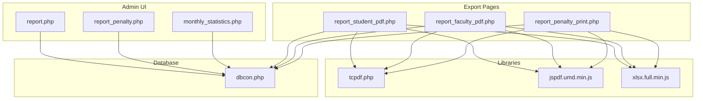
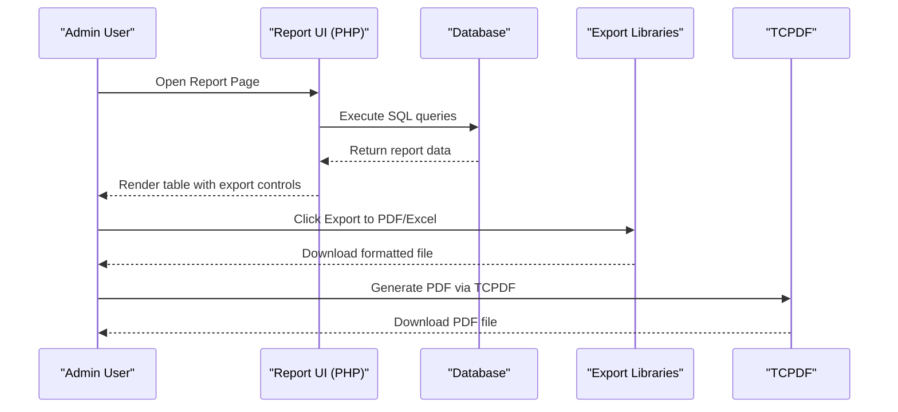
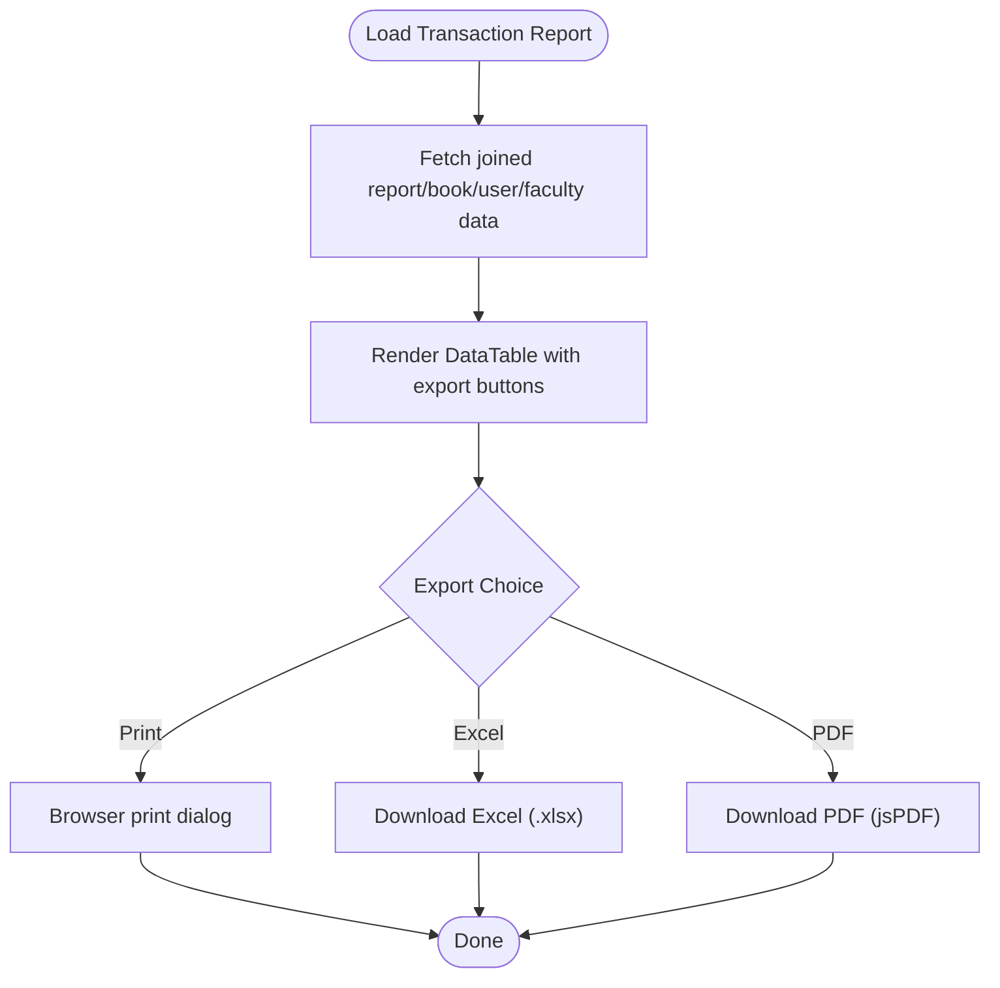
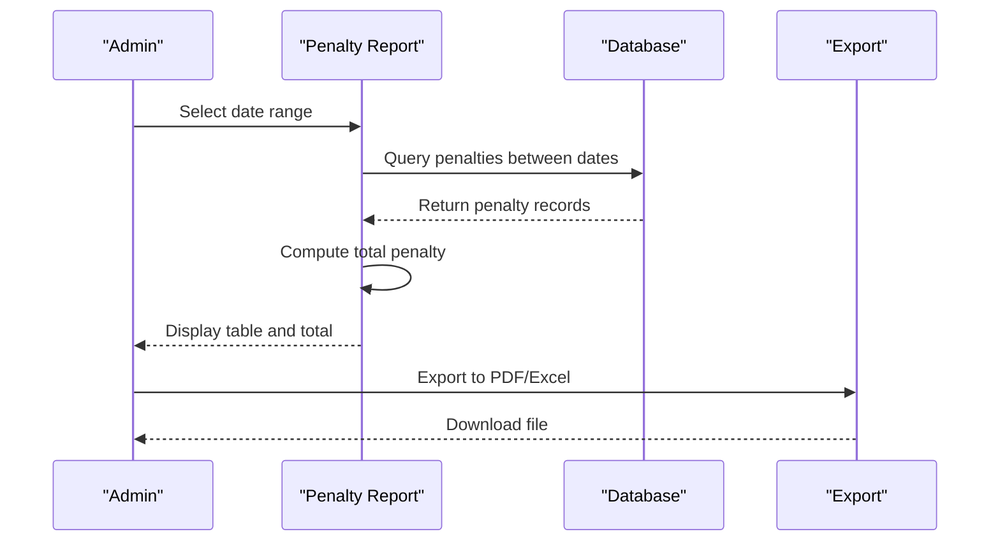
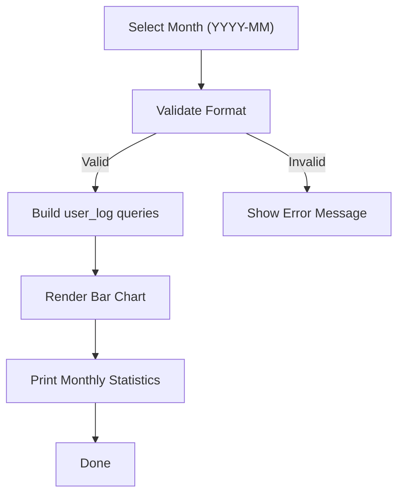
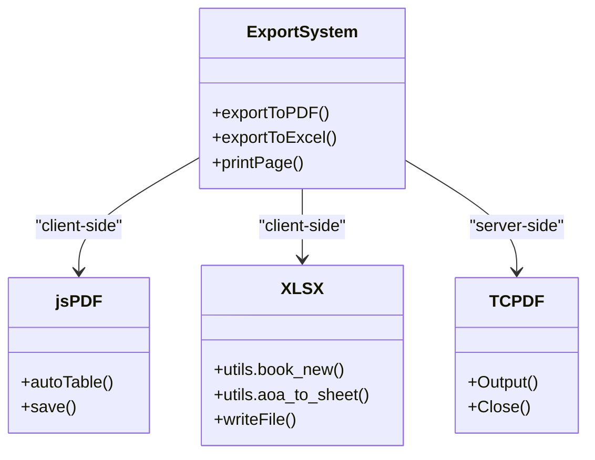
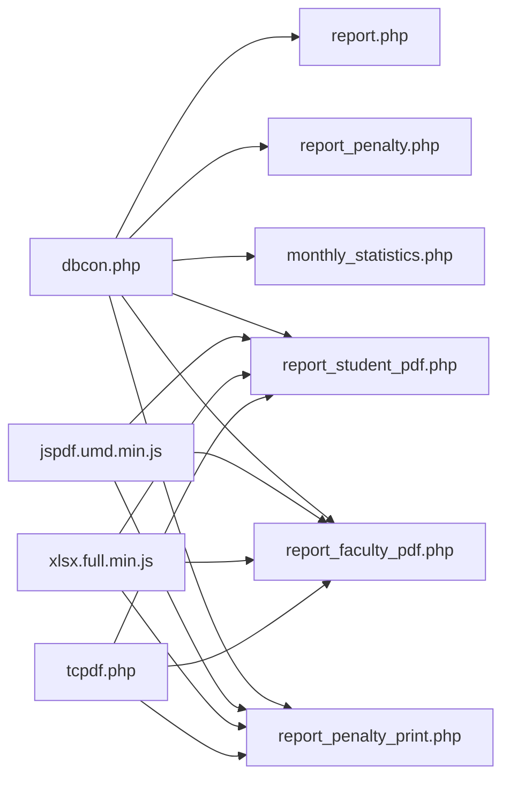

# Reporting and Analytics

<cite>
**Referenced Files in This Document**
- [report.php](file://admin/report.php)
- [report_penalty.php](file://admin/report_penalty.php)
- [monthly_statistics.php](file://admin/monthly_statistics.php)
- [report_student_pdf.php](file://admin/report_student_pdf.php)
- [report_faculty_pdf.php](file://admin/report_faculty_pdf.php)
- [report_penalty_print.php](file://admin/report_penalty_print.php)
- [dbcon.php](file://admin/config/dbcon.php)
- [tcpdf.php](file://admin/tcpdf/tcpdf.php)
- [jspdf.umd.min.js](file://admin/assets/js/jspdf.umd.min.js)
- [xlsx.full.min.js](file://admin/assets/js/xlsx.full.min.js)
</cite>

## Table of Contents
1. [Introduction](#introduction)
2. [Project Structure](#project-structure)
3. [Core Components](#core-components)
4. [Architecture Overview](#architecture-overview)
5. [Detailed Component Analysis](#detailed-component-analysis)
6. [Dependency Analysis](#dependency-analysis)
7. [Performance Considerations](#performance-considerations)
8. [Troubleshooting Guide](#troubleshooting-guide)
9. [Conclusion](#conclusion)

## Introduction
This document provides comprehensive reporting and analytics documentation for the library system. It covers transaction reports (borrowing history, return records, overdue tracking), penalty reports (fine calculations, payment history, outstanding balances), monthly statistics (usage analytics, popular titles, user activity trends), and export capabilities (PDF generation with TCPDF, print-friendly layouts, Excel exports). The system integrates client-side export libraries (jsPDF, SheetJS) and server-side PDF generation via TCPDF for robust reporting workflows.

## Project Structure
The reporting system is organized primarily under the admin directory with modular PHP pages for each report type, shared database connection configuration, and client-side libraries for export functionality. The structure supports:
- Transaction reports for students and faculty
- Penalty reports with date-range filtering
- Monthly statistics dashboards with charts
- Export to PDF and Excel
- Print-friendly layouts

**Diagram sources**
- [report.php:1-171](file://admin/report.php#L1-L171)
- [report_penalty.php:1-179](file://admin/report_penalty.php#L1-L179)
- [monthly_statistics.php:1-174](file://admin/monthly_statistics.php#L1-L174)
- [report_student_pdf.php:1-168](file://admin/report_student_pdf.php#L1-L168)
- [report_faculty_pdf.php:1-186](file://admin/report_faculty_pdf.php#L1-L186)
- [report_penalty_print.php:1-168](file://admin/report_penalty_print.php#L1-L168)
- [dbcon.php:1-19](file://admin/config/dbcon.php#L1-L19)
- [tcpdf.php:1-200](file://admin/tcpdf/tcpdf.php#L1-L200)
- [jspdf.umd.min.js:1-87](file://admin/assets/js/jspdf.umd.min.js#L1-L87)
- [xlsx.full.min.js](file://admin/assets/js/xlsx.full.min.js)

**Section sources**
- [report.php:1-171](file://admin/report.php#L1-L171)
- [report_penalty.php:1-179](file://admin/report_penalty.php#L1-L179)
- [monthly_statistics.php:1-174](file://admin/monthly_statistics.php#L1-L174)
- [report_student_pdf.php:1-168](file://admin/report_student_pdf.php#L1-L168)
- [report_faculty_pdf.php:1-186](file://admin/report_faculty_pdf.php#L1-L186)
- [report_penalty_print.php:1-168](file://admin/report_penalty_print.php#L1-L168)
- [dbcon.php:1-19](file://admin/config/dbcon.php#L1-L19)

## Core Components
- Transaction Reports: Consolidated view of borrowing and returning activities for students and faculty, with tabular data and export controls.
- Penalty Reports: Fine tracking filtered by date range, displaying penalties, recipients, and totals.
- Monthly Statistics: Usage analytics with charts and print-friendly layouts.
- Export System: Client-side export to PDF/Excel and server-side PDF generation via TCPDF.
- Print Layouts: Dedicated print pages with print button and print-specific CSS.

**Section sources**
- [report.php:34-122](file://admin/report.php#L34-L122)
- [report_penalty.php:38-130](file://admin/report_penalty.php#L38-L130)
- [monthly_statistics.php:68-143](file://admin/monthly_statistics.php#L68-L143)
- [report_student_pdf.php:53-168](file://admin/report_student_pdf.php#L53-L168)
- [report_faculty_pdf.php:53-186](file://admin/report_faculty_pdf.php#L53-L186)
- [report_penalty_print.php:53-168](file://admin/report_penalty_print.php#L53-L168)

## Architecture Overview
The reporting architecture combines PHP-driven data retrieval, client-side export libraries, and server-side PDF generation. The UI leverages DataTables with export buttons for quick exports, while dedicated print/export pages provide more control and formatting.

**Diagram sources**
- [report.php:135-165](file://admin/report.php#L135-L165)
- [report_penalty.php:143-172](file://admin/report_penalty.php#L143-L172)
- [report_student_pdf.php:123-160](file://admin/report_student_pdf.php#L123-L160)
- [report_faculty_pdf.php:125-178](file://admin/report_faculty_pdf.php#L125-L178)
- [report_penalty_print.php:123-160](file://admin/report_penalty_print.php#L123-L160)
- [tcpdf.php:7647-7683](file://admin/tcpdf/tcpdf.php#L7647-L7683)

## Detailed Component Analysis

### Transaction Reports (All Users)
- Purpose: Display borrowing and returning activities for students and faculty.
- Data Sources: Joined report, book, and user/faculty tables.
- UI Controls: DataTables with export buttons (print, Excel, PDF, copy).
- Filtering: Tabs for Students and Faculty; sorting by date transaction.

**Diagram sources**
- [report.php:44-122](file://admin/report.php#L44-L122)
- [report.php:135-165](file://admin/report.php#L135-L165)

**Section sources**
- [report.php:24-122](file://admin/report.php#L24-L122)

### Penalty Reports
- Purpose: Track penalties, filter by date range, compute totals.
- Data Sources: return_book joined with book and user tables.
- UI Controls: Date range filter (From Date, To Date), total penalty summary, export controls.
- Calculations: Sum of penalties within selected date range.

**Diagram sources**
- [report_penalty.php:66-88](file://admin/report_penalty.php#L66-L88)
- [report_penalty.php:143-172](file://admin/report_penalty.php#L143-L172)

**Section sources**
- [report_penalty.php:38-130](file://admin/report_penalty.php#L38-L130)

### Monthly Statistics
- Purpose: Visualize user activity by course and total logs for a given month.
- Data Sources: user_log with date range filtering.
- UI Controls: Canvas-based bar chart, print button, print-specific CSS.
- Metrics: Course-wise counts and total logs for the selected month.

**Diagram sources**
- [monthly_statistics.php:6-11](file://admin/monthly_statistics.php#L6-L11)
- [monthly_statistics.php:23-50](file://admin/monthly_statistics.php#L23-L50)
- [monthly_statistics.php:80-126](file://admin/monthly_statistics.php#L80-L126)

**Section sources**
- [monthly_statistics.php:6-174](file://admin/monthly_statistics.php#L6-L174)

### Export System and Print Layouts
- Client-Side Exports:
  - jsPDF: Auto-table generation for printable tables.
  - SheetJS (XLSX): Convert HTML tables to Excel spreadsheets.
- Server-Side PDF Generation:
  - TCPDF: Robust PDF creation without external binaries.
- Print Layouts:
  - Dedicated pages with print buttons and print-specific CSS to hide UI elements.

**Diagram sources**
- [report_student_pdf.php:123-160](file://admin/report_student_pdf.php#L123-L160)
- [report_faculty_pdf.php:125-178](file://admin/report_faculty_pdf.php#L125-L178)
- [report_penalty_print.php:123-160](file://admin/report_penalty_print.php#L123-L160)
- [tcpdf.php:7647-7683](file://admin/tcpdf/tcpdf.php#L7647-L7683)

**Section sources**
- [report_student_pdf.php:53-168](file://admin/report_student_pdf.php#L53-L168)
- [report_faculty_pdf.php:53-186](file://admin/report_faculty_pdf.php#L53-L186)
- [report_penalty_print.php:53-168](file://admin/report_penalty_print.php#L53-L168)
- [tcpdf.php:1-200](file://admin/tcpdf/tcpdf.php#L1-L200)

## Dependency Analysis
- Database Connectivity: Centralized connection via dbcon.php.
- Client Libraries: jsPDF and XLSX loaded on export pages.
- PDF Engine: TCPDF included for server-side PDF generation.
- UI Framework: DataTables with Buttons extension for export controls.

**Diagram sources**
- [dbcon.php:1-19](file://admin/config/dbcon.php#L1-L19)
- [report.php:133-171](file://admin/report.php#L133-L171)
- [report_penalty.php:133-179](file://admin/report_penalty.php#L133-L179)
- [monthly_statistics.php:1-174](file://admin/monthly_statistics.php#L1-L174)
- [report_student_pdf.php:1-168](file://admin/report_student_pdf.php#L1-L168)
- [report_faculty_pdf.php:1-186](file://admin/report_faculty_pdf.php#L1-L186)
- [report_penalty_print.php:1-168](file://admin/report_penalty_print.php#L1-L168)
- [tcpdf.php:1-200](file://admin/tcpdf/tcpdf.php#L1-L200)

**Section sources**
- [dbcon.php:1-19](file://admin/config/dbcon.php#L1-L19)
- [report.php:133-171](file://admin/report.php#L133-L171)
- [report_penalty.php:133-179](file://admin/report_penalty.php#L133-L179)
- [monthly_statistics.php:1-174](file://admin/monthly_statistics.php#L1-L174)
- [report_student_pdf.php:1-168](file://admin/report_student_pdf.php#L1-L168)
- [report_faculty_pdf.php:1-186](file://admin/report_faculty_pdf.php#L1-L186)
- [report_penalty_print.php:1-168](file://admin/report_penalty_print.php#L1-L168)
- [tcpdf.php:1-200](file://admin/tcpdf/tcpdf.php#L1-L200)

## Performance Considerations
- Pagination and Sorting: DataTables handles client-side pagination and sorting; ensure database queries are indexed appropriately for large datasets.
- Export Size: Large exports may impact memory usage; consider server-side export generation for heavy reports.
- Charts Rendering: Monthly statistics rely on client-side chart rendering; limit dataset size for responsive performance.
- Database Queries: Use date-range filters and appropriate joins to minimize result sets.

## Troubleshooting Guide
- Connection Issues: Verify database credentials and connectivity in dbcon.php.
- Export Failures:
  - Client-side exports require proper DOM structure; ensure tables are rendered before exporting.
  - Server-side PDF generation depends on TCPDF availability and permissions.
- Print Layout Problems: Confirm print-specific CSS is applied and print media queries are functioning.

**Section sources**
- [dbcon.php:1-19](file://admin/config/dbcon.php#L1-L19)
- [report_student_pdf.php:36-50](file://admin/report_student_pdf.php#L36-L50)
- [report_faculty_pdf.php:36-50](file://admin/report_faculty_pdf.php#L36-L50)
- [report_penalty_print.php:36-50](file://admin/report_penalty_print.php#L36-L50)

## Conclusion
The reporting and analytics system provides comprehensive transaction and penalty tracking, monthly usage insights, and flexible export options. By combining client-side export libraries with server-side PDF generation, administrators can efficiently produce professional reports tailored to their needs. Proper indexing, filtered queries, and print-friendly layouts ensure reliable performance and usability across report types.