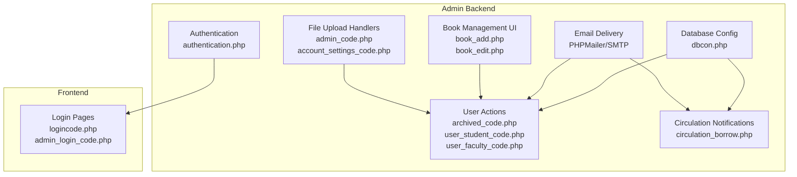
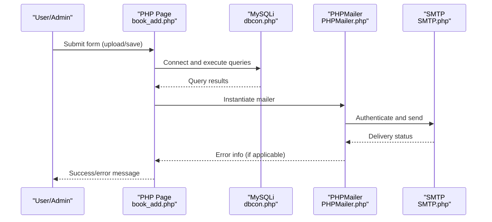
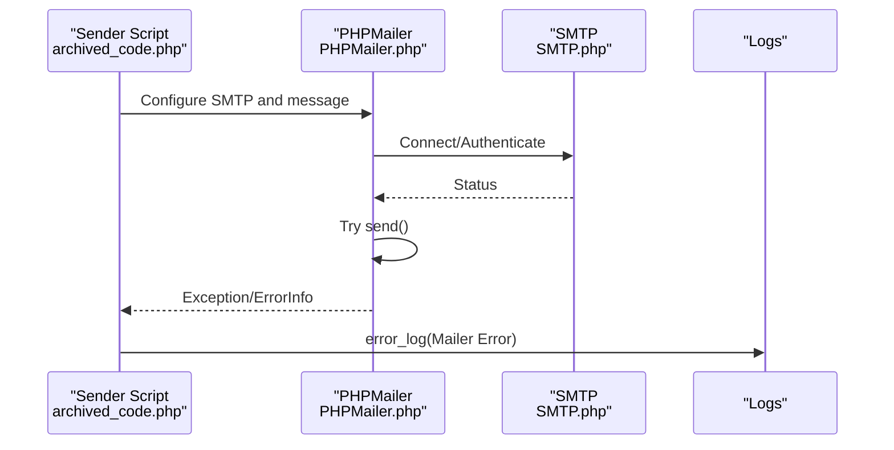
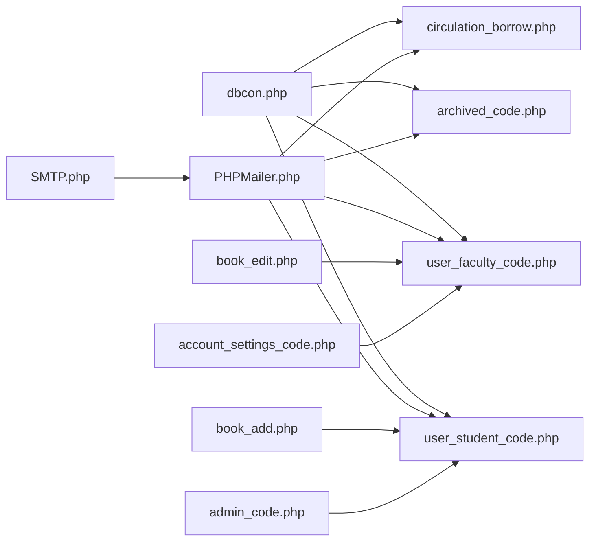

# Troubleshooting and Maintenance

<cite>
**Referenced Files in This Document**
- [dbcon.php](file://admin/config/dbcon.php)
- [PHPMailer.php](file://admin/phpmailer/vendor/phpmailer/phpmailer/src/PHPMailer.php)
- [SMTP.php](file://admin/phpmailer/vendor/phpmailer/phpmailer/src/SMTP.php)
- [archived_code.php](file://admin/archived_code.php)
- [user_student_code.php](file://admin/user_student_code.php)
- [user_faculty_code.php](file://admin/user_faculty_code.php)
- [circulation_borrow.php](file://admin/circulation_borrow.php)
- [book_add.php](file://admin/book_add.php)
- [book_edit.php](file://admin/book_edit.php)
- [admin_code.php](file://admin/admin_code.php)
- [account_settings_code.php](file://admin/account_settings_code.php)
- [authentication.php](file://admin/authentication.php)
- [logincode.php](file://logincode.php)
- [admin_login_code.php](file://admin_login_code.php)
</cite>

## Table of Contents
1. [Introduction](#introduction)
2. [Project Structure](#project-structure)
3. [Core Components](#core-components)
4. [Architecture Overview](#architecture-overview)
5. [Detailed Component Analysis](#detailed-component-analysis)
6. [Dependency Analysis](#dependency-analysis)
7. [Performance Considerations](#performance-considerations)
8. [Troubleshooting Guide](#troubleshooting-guide)
9. [Backup and Recovery](#backup-and-recovery)
10. [Preventive Maintenance and Health Monitoring](#preventive-maintenance-and-health-monitoring)
11. [Conclusion](#conclusion)

## Introduction
This document provides comprehensive troubleshooting and maintenance guidance for the Library System. It covers common error scenarios (database connectivity, file upload issues, email delivery), debugging techniques via error logging and system messages, maintenance tasks (database optimization, log rotation, cleanup), performance monitoring and optimization strategies for high-traffic periods, backup and recovery procedures, and preventive maintenance schedules with health monitoring recommendations.

## Project Structure
The system is organized into:
- Admin backend with configuration, authentication, email sending, and CRUD operations
- Frontend pages for users and public access
- Upload directories for images and documents
- Third-party libraries for email (PHPMailer) and QR code generation

**Diagram sources**
- [dbcon.php:1-19](file://admin/config/dbcon.php#L1-L19)
- [authentication.php:1-5](file://admin/authentication.php#L1-L5)
- [PHPMailer.php:408-409](file://admin/phpmailer/vendor/phpmailer/phpmailer/src/PHPMailer.php#L408-L409)
- [SMTP.php:133-134](file://admin/phpmailer/vendor/phpmailer/phpmailer/src/SMTP.php#L133-L134)
- [archived_code.php:12-34](file://admin/archived_code.php#L12-L34)
- [user_student_code.php:14-36](file://admin/user_student_code.php#L14-L36)
- [user_faculty_code.php:14-36](file://admin/user_faculty_code.php#L14-L36)
- [circulation_borrow.php:141-201](file://admin/circulation_borrow.php#L141-L201)
- [book_add.php:29-155](file://admin/book_add.php#L29-L155)
- [book_edit.php:39-136](file://admin/book_edit.php#L39-L136)
- [admin_code.php:60-82](file://admin/admin_code.php#L60-L82)
- [account_settings_code.php:35-38](file://admin/account_settings_code.php#L35-L38)
- [logincode.php:1-10](file://logincode.php#L1-L10)
- [admin_login_code.php:1-50](file://admin_login_code.php#L1-L50)

**Section sources**
- [dbcon.php:1-19](file://admin/config/dbcon.php#L1-L19)
- [book_add.php:29-155](file://admin/book_add.php#L29-L155)
- [book_edit.php:39-136](file://admin/book_edit.php#L39-L136)
- [admin_code.php:60-82](file://admin/admin_code.php#L60-L82)
- [account_settings_code.php:35-38](file://admin/account_settings_code.php#L35-L38)

## Core Components
- Database connectivity: centralized in the admin configuration file
- Email delivery: implemented via PHPMailer with SMTP and error logging
- Authentication: session-based with session regeneration on successful login
- File upload: validated and moved to designated upload directories
- Circulation notifications: automated overdue/due reminders via email

Key implementation references:
- Database connection and failure handling
- Email sending with error logging
- Session management and login flow
- File upload validation and movement

**Section sources**
- [dbcon.php:11-17](file://admin/config/dbcon.php#L11-L17)
- [PHPMailer.php:408-409](file://admin/phpmailer/vendor/phpmailer/phpmailer/src/PHPMailer.php#L408-L409)
- [SMTP.php:275-283](file://admin/phpmailer/vendor/phpmailer/phpmailer/src/SMTP.php#L275-L283)
- [authentication.php:1-5](file://admin/authentication.php#L1-L5)
- [logincode.php:1-10](file://logincode.php#L1-L10)
- [admin_login_code.php:40-50](file://admin_login_code.php#L40-L50)
- [admin_code.php:60-82](file://admin/admin_code.php#L60-L82)
- [account_settings_code.php:35-38](file://admin/account_settings_code.php#L35-L38)

## Architecture Overview
The system follows a layered approach:
- Presentation layer: HTML forms and pages (e.g., book management UI)
- Business logic layer: PHP scripts handling actions (user approvals, notifications, uploads)
- Data access layer: MySQLi connection and prepared statements
- Communication layer: SMTP-based email delivery with error logging

**Diagram sources**
- [book_add.php:29-155](file://admin/book_add.php#L29-L155)
- [dbcon.php:11-17](file://admin/config/dbcon.php#L11-L17)
- [PHPMailer.php:408-409](file://admin/phpmailer/vendor/phpmailer/phpmailer/src/PHPMailer.php#L408-L409)
- [SMTP.php:275-283](file://admin/phpmailer/vendor/phpmailer/phpmailer/src/SMTP.php#L275-L283)

## Detailed Component Analysis

### Database Connectivity
Common issues:
- Incorrect host, credentials, or database name
- Network timeouts or service downtime
- Connection exhaustion under load

Diagnostics:
- Verify connection parameters and availability
- Check server logs for connection errors
- Monitor MySQL process list during peak hours

Mitigations:
- Use persistent connections judiciously
- Implement retry logic with exponential backoff
- Scale MySQL resources or offload read queries

**Section sources**
- [dbcon.php:3-17](file://admin/config/dbcon.php#L3-L17)

### Email Delivery (PHPMailer)
Common issues:
- SMTP authentication failure
- TLS handshake errors
- Rate limiting or spam filters
- Missing or invalid recipients

Diagnostics:
- Inspect error logs for Mailer Error entries
- Validate SMTP settings and credentials
- Test connectivity to SMTP host/port

Mitigations:
- Use app-specific passwords or OAuth tokens
- Implement queueing and throttling
- Add retry with backoff and dead-letter handling

**Diagram sources**
- [archived_code.php:12-34](file://admin/archived_code.php#L12-L34)
- [PHPMailer.php:903-912](file://admin/phpmailer/vendor/phpmailer/phpmailer/src/PHPMailer.php#L903-L912)
- [SMTP.php:275-283](file://admin/phpmailer/vendor/phpmailer/phpmailer/src/SMTP.php#L275-L283)

**Section sources**
- [archived_code.php:12-34](file://admin/archived_code.php#L12-L34)
- [user_student_code.php:14-36](file://admin/user_student_code.php#L14-L36)
- [user_faculty_code.php:14-36](file://admin/user_faculty_code.php#L14-L36)
- [circulation_borrow.php:141-201](file://admin/circulation_borrow.php#L141-L201)
- [PHPMailer.php:408-409](file://admin/phpmailer/vendor/phpmailer/phpmailer/src/PHPMailer.php#L408-L409)
- [SMTP.php:133-134](file://admin/phpmailer/vendor/phpmailer/phpmailer/src/SMTP.php#L133-L134)

### File Uploads
Common issues:
- Unsupported file types
- Exceeded upload limits
- Destination write permissions
- Duplicate filenames

Diagnostics:
- Validate MIME types and extensions
- Check upload_max_filesize and post_max_size
- Confirm directory permissions and disk space

Mitigations:
- Enforce strict whitelist of allowed types
- Sanitize filenames and store hashed paths
- Implement quotas and cleanup policies

**Section sources**
- [book_add.php:134-138](file://admin/book_add.php#L134-L138)
- [book_add.php:264-279](file://admin/book_add.php#L264-L279)
- [book_edit.php:100-102](file://admin/book_edit.php#L100-L102)
- [admin_code.php:60-82](file://admin/admin_code.php#L60-L82)
- [account_settings_code.php:35-38](file://admin/account_settings_code.php#L35-L38)

### Authentication and Sessions
Common issues:
- Session fixation
- CSRF/XSS in login flow
- Weak session storage

Diagnostics:
- Review session regeneration after login
- Audit headers and cookie flags
- Monitor login attempts and IP blocking

Mitigations:
- Regenerate session IDs upon login
- Use HTTPS-only cookies and secure flags
- Implement rate limiting and two-factor if feasible

**Section sources**
- [authentication.php:1-5](file://admin/authentication.php#L1-L5)
- [logincode.php:1-10](file://logincode.php#L1-L10)
- [admin_login_code.php:40-50](file://admin_login_code.php#L40-L50)

## Dependency Analysis
- Email subsystem depends on PHPMailer and SMTP transport
- User action handlers depend on database connectivity and email
- File upload handlers depend on upload directories and validation logic
- Authentication depends on sessions and login scripts

**Diagram sources**
- [dbcon.php:11-17](file://admin/config/dbcon.php#L11-L17)
- [user_student_code.php:14-36](file://admin/user_student_code.php#L14-L36)
- [user_faculty_code.php:14-36](file://admin/user_faculty_code.php#L14-L36)
- [archived_code.php:12-34](file://admin/archived_code.php#L12-L34)
- [circulation_borrow.php:141-201](file://admin/circulation_borrow.php#L141-L201)
- [PHPMailer.php:408-409](file://admin/phpmailer/vendor/phpmailer/phpmailer/src/PHPMailer.php#L408-L409)
- [SMTP.php:275-283](file://admin/phpmailer/vendor/phpmailer/phpmailer/src/SMTP.php#L275-L283)
- [book_add.php:29-155](file://admin/book_add.php#L29-L155)
- [book_edit.php:39-136](file://admin/book_edit.php#L39-L136)
- [admin_code.php:60-82](file://admin/admin_code.php#L60-L82)
- [account_settings_code.php:35-38](file://admin/account_settings_code.php#L35-L38)

**Section sources**
- [dbcon.php:11-17](file://admin/config/dbcon.php#L11-L17)
- [PHPMailer.php:408-409](file://admin/phpmailer/vendor/phpmailer/phpmailer/src/PHPMailer.php#L408-L409)
- [SMTP.php:275-283](file://admin/phpmailer/vendor/phpmailer/phpmailer/src/SMTP.php#L275-L283)
- [user_student_code.php:14-36](file://admin/user_student_code.php#L14-L36)
- [user_faculty_code.php:14-36](file://admin/user_faculty_code.php#L14-L36)
- [archived_code.php:12-34](file://admin/archived_code.php#L12-L34)
- [circulation_borrow.php:141-201](file://admin/circulation_borrow.php#L141-L201)
- [book_add.php:29-155](file://admin/book_add.php#L29-L155)
- [book_edit.php:39-136](file://admin/book_edit.php#L39-L136)
- [admin_code.php:60-82](file://admin/admin_code.php#L60-L82)
- [account_settings_code.php:35-38](file://admin/account_settings_code.php#L35-L38)

## Performance Considerations
- Database
  - Index high-frequency lookup columns (e.g., user identifiers, book accessions)
  - Use prepared statements to reduce parsing overhead
  - Monitor slow queries and query execution plans
- Email
  - Batch and queue notifications; avoid synchronous sends during peak hours
  - Use dedicated SMTP relay or cloud provider for throughput
- File uploads
  - Offload large media to CDN or blob storage
  - Compress images and enforce size limits
- Sessions
  - Use shared session storage (e.g., Redis) for multi-instance deployments
  - Regenerate session IDs after privilege changes

[No sources needed since this section provides general guidance]

## Troubleshooting Guide

### Database Connection Failures
Symptoms:
- Immediate connection errors on page load
- Queries fail with connection-related errors

Steps:
- Verify host, username, password, and database name
- Check network reachability to MySQL server
- Confirm MySQL service status and resource limits

Evidence in code:
- Connection attempt and immediate termination on failure

**Section sources**
- [dbcon.php:11-17](file://admin/config/dbcon.php#L11-L17)

### Email Delivery Problems
Symptoms:
- Users report missing notifications
- Error logs show Mailer Error entries

Steps:
- Review error logs for specific SMTP errors
- Validate sender credentials and SMTP settings
- Test sending to a known-good address

Evidence in code:
- Catch blocks logging Mailer Error via error_log
- SMTP debug output routed to error_log

**Section sources**
- [archived_code.php:31-33](file://admin/archived_code.php#L31-L33)
- [user_student_code.php:33-35](file://admin/user_student_code.php#L33-L35)
- [user_faculty_code.php:33-35](file://admin/user_faculty_code.php#L33-L35)
- [circulation_borrow.php:199-201](file://admin/circulation_borrow.php#L199-L201)
- [circulation_borrow.php:264-266](file://admin/circulation_borrow.php#L264-L266)
- [PHPMailer.php:903-912](file://admin/phpmailer/vendor/phpmailer/phpmailer/src/PHPMailer.php#L903-L912)
- [SMTP.php:275-283](file://admin/phpmailer/vendor/phpmailer/phpmailer/src/SMTP.php#L275-L283)

### File Upload Issues
Symptoms:
- Uploads fail silently or with generic errors
- Images not appearing after submission

Steps:
- Confirm allowed MIME types and extensions
- Check destination directory permissions and available disk space
- Validate form encoding and file size limits

Evidence in code:
- Validation of image types and movement to upload directories
- Hidden inputs for existing images and sanitization

**Section sources**
- [book_add.php:134-138](file://admin/book_add.php#L134-L138)
- [book_add.php:264-279](file://admin/book_add.php#L264-L279)
- [book_edit.php:100-102](file://admin/book_edit.php#L100-L102)
- [admin_code.php:60-82](file://admin/admin_code.php#L60-L82)
- [account_settings_code.php:35-38](file://admin/account_settings_code.php#L35-L38)

### Authentication and Session Problems
Symptoms:
- Login redirects without success
- Session timeout or loss of privileges

Steps:
- Verify session regeneration after login
- Check HTTPS enforcement and secure cookie flags
- Review login attempt logs and rate-limiting

Evidence in code:
- Session start and regeneration on successful login
- Session-based authentication guard

**Section sources**
- [authentication.php:1-5](file://admin/authentication.php#L1-L5)
- [logincode.php:1-10](file://logincode.php#L1-L10)
- [admin_login_code.php:40-50](file://admin_login_code.php#L40-L50)

## Backup and Recovery
- Database
  - Schedule regular logical backups (mysqldump) with timestamps
  - Store offsite or in secure cloud storage
  - Test restore procedures periodically
- Files
  - Back up upload directories (images, PDFs) regularly
  - Version control non-sensitive configuration files
- Recovery
  - Document restore steps for DB and uploads
  - Validate restored data integrity and application connectivity

[No sources needed since this section provides general guidance]

## Preventive Maintenance and Health Monitoring
- Daily
  - Review error logs for email and database errors
  - Monitor disk usage for uploads and logs
- Weekly
  - Optimize database tables and prune old records
  - Rotate and compress logs
- Monthly
  - Audit user accounts and inactive profiles
  - Review email deliverability metrics and bounce rates
- Quarterly
  - Re-index database tables and update statistics
  - Update third-party libraries (PHPMailer, QR code)

[No sources needed since this section provides general guidance]

## Conclusion
By following the diagnostics and mitigation strategies outlined here—covering database connectivity, email delivery, file uploads, authentication, and operational hygiene—you can maintain system reliability, improve performance during high-traffic periods, and ensure robust recovery and preventive maintenance.