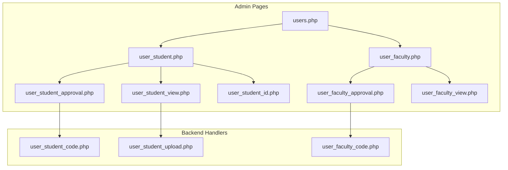
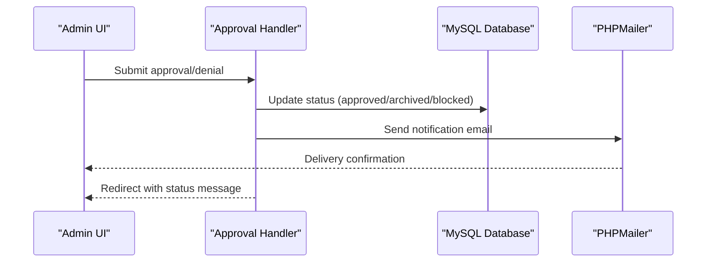
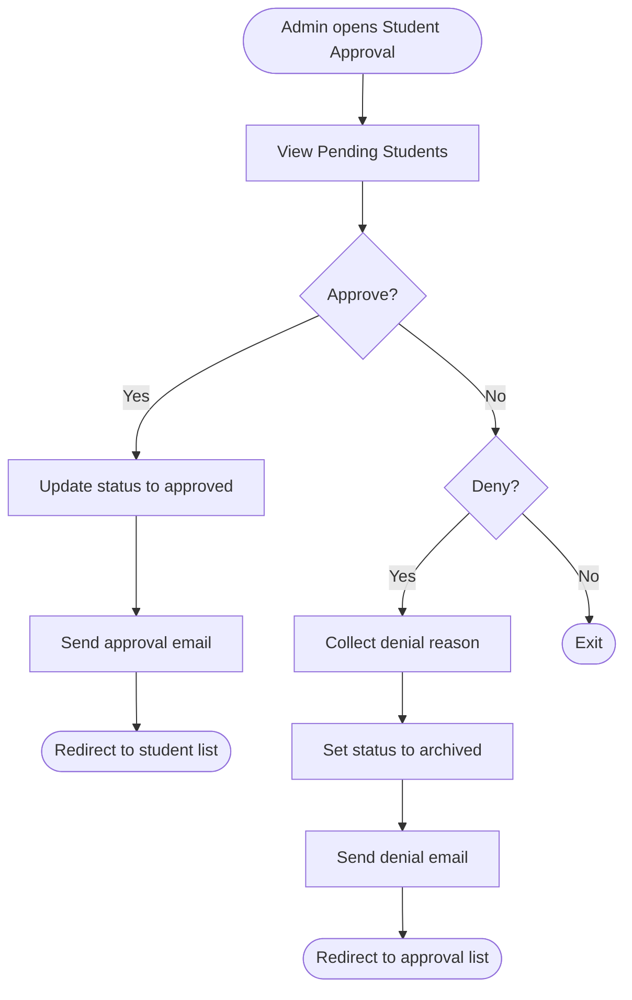
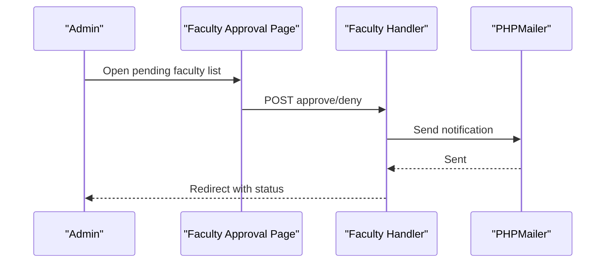
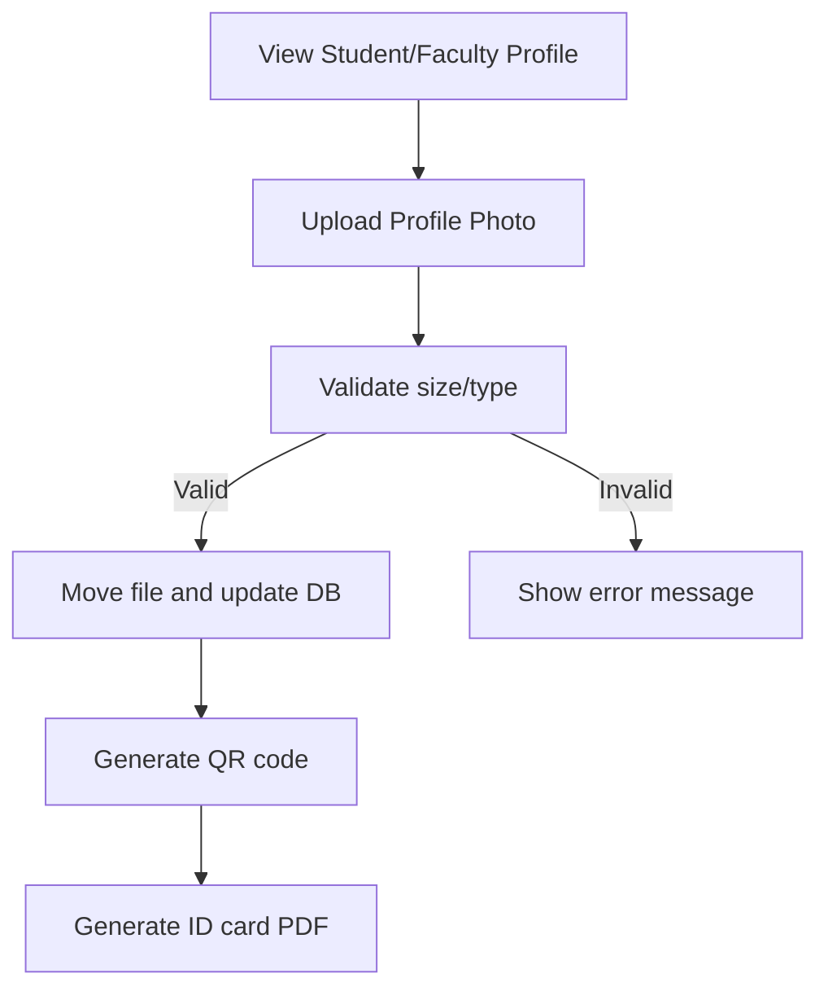
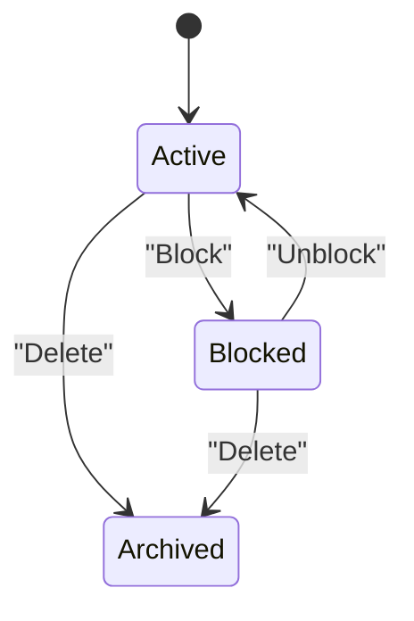
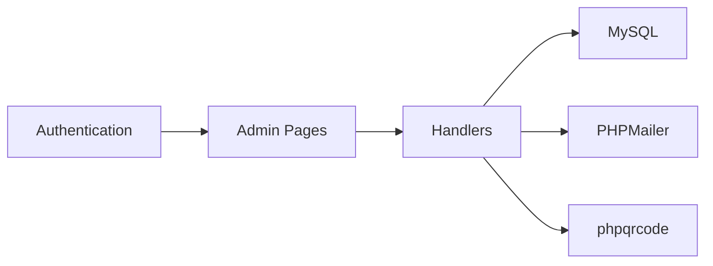

# User Management System

<cite>
**Referenced Files in This Document**
- [admin/users.php](file://admin/users.php)
- [admin/user_student.php](file://admin/user_student.php)
- [admin/user_faculty.php](file://admin/user_faculty.php)
- [admin/user_student_approval.php](file://admin/user_student_approval.php)
- [admin/user_faculty_approval.php](file://admin/user_faculty_approval.php)
- [admin/user_student_code.php](file://admin/user_student_code.php)
- [admin/user_faculty_code.php](file://admin/user_faculty_code.php)
- [admin/user_student_code_block.php](file://admin/user_student_code_block.php)
- [admin/user_faculty_code_block.php](file://admin/user_faculty_code_block.php)
- [admin/user_student_upload.php](file://admin/user_student_upload.php)
- [admin/user_student_view.php](file://admin/user_student_view.php)
- [admin/user_faculty_view.php](file://admin/user_faculty_view.php)
- [admin/user_student_id.php](file://admin/user_student_id.php)
</cite>

## Table of Contents
1. [Introduction](#introduction)
2. [Project Structure](#project-structure)
3. [Core Components](#core-components)
4. [Architecture Overview](#architecture-overview)
5. [Detailed Component Analysis](#detailed-component-analysis)
6. [Dependency Analysis](#dependency-analysis)
7. [Performance Considerations](#performance-considerations)
8. [Troubleshooting Guide](#troubleshooting-guide)
9. [Conclusion](#conclusion)

## Introduction
This document describes the complete user management system for the library resource center, covering the full lifecycle from user registration to account management. It explains the student and faculty/staff registration processes, ID verification workflows, approval mechanisms, profile management, blocking/unblocking procedures, mass registration capabilities, and mobile number verification for enhanced account security.

## Project Structure
The user management system is organized under the admin directory with dedicated pages for managing students and faculty, approval workflows, profile viewing/editing, QR code generation for ID cards, and upload handling for profile photos.

**Diagram sources**
- [admin/users.php:1-345](file://admin/users.php#L1-L345)
- [admin/user_student.php:1-412](file://admin/user_student.php#L1-L412)
- [admin/user_faculty.php:1-371](file://admin/user_faculty.php#L1-L371)
- [admin/user_student_approval.php:1-178](file://admin/user_student_approval.php#L1-L178)
- [admin/user_faculty_approval.php:1-170](file://admin/user_faculty_approval.php#L1-L170)
- [admin/user_student_view.php:1-191](file://admin/user_student_view.php#L1-L191)
- [admin/user_faculty_view.php:1-181](file://admin/user_faculty_view.php#L1-L181)
- [admin/user_student_id.php:1-241](file://admin/user_student_id.php#L1-L241)
- [admin/user_student_code.php:1-576](file://admin/user_student_code.php#L1-L576)
- [admin/user_faculty_code.php:1-573](file://admin/user_faculty_code.php#L1-L573)
- [admin/user_student_upload.php:1-56](file://admin/user_student_upload.php#L1-L56)

**Section sources**
- [admin/users.php:1-345](file://admin/users.php#L1-L345)
- [admin/user_student.php:1-412](file://admin/user_student.php#L1-L412)
- [admin/user_faculty.php:1-371](file://admin/user_faculty.php#L1-L371)

## Core Components
- Student Management: Listing, editing, blocking/unblocking, deleting, and generating student library IDs.
- Faculty/Staff Management: Similar operations tailored for faculty and staff profiles.
- Approval Workflows: Pending account approvals with denial reasons and notifications.
- Profile Management: Viewing and updating personal information, photo uploads, and QR code generation.
- ID Generation: Printable student ID cards with embedded QR codes.

**Section sources**
- [admin/user_student.php:1-412](file://admin/user_student.php#L1-L412)
- [admin/user_faculty.php:1-371](file://admin/user_faculty.php#L1-L371)
- [admin/user_student_approval.php:1-178](file://admin/user_student_approval.php#L1-L178)
- [admin/user_faculty_approval.php:1-170](file://admin/user_faculty_approval.php#L1-L170)
- [admin/user_student_view.php:1-191](file://admin/user_student_view.php#L1-L191)
- [admin/user_faculty_view.php:1-181](file://admin/user_faculty_view.php#L1-L181)
- [admin/user_student_id.php:1-241](file://admin/user_student_id.php#L1-L241)

## Architecture Overview
The system follows a classic MVC-like separation:
- Presentation Layer: PHP pages render HTML and collect user actions.
- Control Layer: Backend handlers process forms and manage state transitions.
- Data Access: MySQL queries update and retrieve user/faculty records.
- Notifications: PHPMailer sends email notifications for approval/denial/block/unblock/delete actions.
- Assets: QR code generation via phpqrcode and profile image uploads to server storage.

**Diagram sources**
- [admin/user_student_code.php:38-219](file://admin/user_student_code.php#L38-L219)
- [admin/user_faculty_code.php:38-219](file://admin/user_faculty_code.php#L38-L219)

## Detailed Component Analysis

### Student Registration and Approval Workflow
- Pending Student List: Displays students awaiting approval with profile thumbnails and actions.
- Approval Actions: Approve or deny with a reason; denial archives the record and notifies the user.
- Email Notifications: Automated emails for approval, denial, blocking, unblocking, and deletion.
- Blocking/Unblocking: Updates status and sends notifications.
- Deletion: Removes the user and resets related MS account usage flag.

**Diagram sources**
- [admin/user_student_approval.php:42-93](file://admin/user_student_approval.php#L42-L93)
- [admin/user_student_code.php:38-134](file://admin/user_student_code.php#L38-L134)

**Section sources**
- [admin/user_student_approval.php:1-178](file://admin/user_student_approval.php#L1-L178)
- [admin/user_student_code.php:1-576](file://admin/user_student_code.php#L1-L576)

### Faculty/Staff Registration and Approval Workflow
- Pending Faculty List: Displays faculty/staff awaiting approval with department info.
- Approval/Denial: Mirrors student workflow with separate handler.
- Notifications: Approval, denial, blocking, unblocking, and deletion emails.
- Blocking/Unblocking: Status updates and notifications.

**Diagram sources**
- [admin/user_faculty_approval.php:45-90](file://admin/user_faculty_approval.php#L45-L90)
- [admin/user_faculty_code.php:38-134](file://admin/user_faculty_code.php#L38-L134)

**Section sources**
- [admin/user_faculty_approval.php:1-170](file://admin/user_faculty_approval.php#L1-L170)
- [admin/user_faculty_code.php:1-573](file://admin/user_faculty_code.php#L1-L573)

### User Profile Management
- Viewing Profiles: Detailed tabs for personal and contact information.
- Photo Uploads: Drag-and-drop style click-to-upload with validation for size/type.
- QR Code Generation: On edits, generates QR code and stores filename in database.
- ID Card Printing: Generates printable student ID with photo, details, and QR code.

**Diagram sources**
- [admin/user_student_view.php:45-59](file://admin/user_student_view.php#L45-L59)
- [admin/user_student_upload.php:5-48](file://admin/user_student_upload.php#L5-L48)
- [admin/user_student_code.php:524-536](file://admin/user_student_code.php#L524-L536)
- [admin/user_student_id.php:195-232](file://admin/user_student_id.php#L195-L232)

**Section sources**
- [admin/user_student_view.php:1-191](file://admin/user_student_view.php#L1-L191)
- [admin/user_faculty_view.php:1-181](file://admin/user_faculty_view.php#L1-L181)
- [admin/user_student_upload.php:1-56](file://admin/user_student_upload.php#L1-L56)
- [admin/user_student_code.php:497-550](file://admin/user_student_code.php#L497-L550)
- [admin/user_student_id.php:1-241](file://admin/user_student_id.php#L1-L241)

### User Blocking/Unblocking and Deactivation
- Blocking: Sets status to blocked and sends notification email.
- Unblocking: Restores status to approved and sends notification.
- Deletion: Removes user and resets MS account usage flag, then notifies.

**Diagram sources**
- [admin/user_student_code.php:221-303](file://admin/user_student_code.php#L221-L303)
- [admin/user_student_code.php:305-387](file://admin/user_student_code.php#L305-L387)
- [admin/user_student_code.php:389-495](file://admin/user_student_code.php#L389-L495)

**Section sources**
- [admin/user_student_code.php:221-387](file://admin/user_student_code.php#L221-L387)
- [admin/user_faculty_code.php:221-388](file://admin/user_faculty_code.php#L221-L388)

### Mass Upload System for Bulk Registration
- Current Implementation: The system supports individual profile photo uploads per user via upload handlers.
- Bulk Registration: No explicit bulk CSV import handler was identified in the analyzed files. If required, a new handler would need to be implemented to parse uploads and insert records in batch, ensuring validation and duplicate checks.

**Section sources**
- [admin/user_student_upload.php:1-56](file://admin/user_student_upload.php#L1-L56)

### Mobile Number Verification System
- Presence: Mobile numbers are stored in user profiles and displayed in views.
- Verification Mechanism: No OTP or verification flow was found in the analyzed files. To implement verification, integrate an OTP generator and storage of verification tokens with expiration and validation logic.

**Section sources**
- [admin/user_student_view.php:153-154](file://admin/user_student_view.php#L153-L154)
- [admin/user_faculty_view.php:143-146](file://admin/user_faculty_view.php#L143-L146)

## Dependency Analysis
- Authentication: All admin pages include authentication checks before rendering.
- Database: Uses a shared connection variable for queries across handlers.
- External Libraries: PHPMailer for SMTP email delivery; phpqrcode for QR code generation.
- Frontend: Bootstrap, DataTables, SweetAlert2 for UX enhancements.

**Diagram sources**
- [admin/user_student_code.php:1-12](file://admin/user_student_code.php#L1-L12)
- [admin/user_faculty_code.php:1-12](file://admin/user_faculty_code.php#L1-L12)

**Section sources**
- [admin/user_student_code.php:1-36](file://admin/user_student_code.php#L1-L36)
- [admin/user_faculty_code.php:1-36](file://admin/user_faculty_code.php#L1-L36)

## Performance Considerations
- Image Upload Validation: Enforce size and MIME-type checks client-side and server-side to reduce bandwidth and storage overhead.
- QR Code Generation: Generate QR codes only on edits to avoid unnecessary processing.
- Database Queries: Use prepared statements consistently to prevent SQL injection and improve performance.
- Pagination/Filtering: Utilize DataTables server-side processing for large datasets to minimize payload sizes.

## Troubleshooting Guide
- Email Delivery Failures: Verify SMTP credentials and network connectivity; review error logs for PHPMailer exceptions.
- Upload Issues: Confirm upload directory permissions and supported MIME types; check file size limits.
- Approval/Denial Errors: Ensure proper POST parameters and session handling; validate user existence before updates.
- QR Code Problems: Confirm phpqrcode installation and write permissions for the qrcodes directory.

**Section sources**
- [admin/user_student_code.php:14-36](file://admin/user_student_code.php#L14-L36)
- [admin/user_student_upload.php:9-26](file://admin/user_student_upload.php#L9-L26)
- [admin/user_student_code.php:552-574](file://admin/user_student_code.php#L552-L574)

## Conclusion
The user management system provides comprehensive controls for student and faculty accounts, robust approval workflows, profile management, and ID generation. Enhancements such as a bulk registration handler and mobile number verification would further strengthen the platform’s scalability and security.